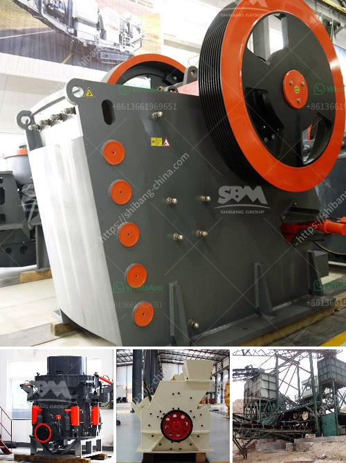

<h3>جزء من مطحنة الأسطوانة</h3>
مطحنة الأسطوانة هي أحد الأدوات الرئيسية التي تستخدم في عملية طحن الحبوب والبذور. تتألف المطحنة من جزئين رئيسيين: الجزء الثابت والجزء المتحرك.

يعد الجزء الثابت من المطحنة الأسطوانة العليا، وهي عادةً مصنوعة من الفولاذ أو الحديد، وتشتمل على فتحات صغيرة على طول سطحها. هذه الفتحات الصغيرة تتيح مرور الحبوب المطحونة وتحكم في حجم الجسيمات النهائية المطلوبة. يتم تعديل فتحات الأسطوانة العليا بما يتناسب مع نوع الحبوب التي يتم طحنها.

وفيما يتعلق بالجزء المتحرك من المطحنة، يتكون عادةً من عدد من الأسطوانات الرأسية المرتبة بشكل متتالي. يتم تشغيل هذه الأسطوانات بواسطة محرك كهربائي يدور بسرعة محددة. تعمل الأسطوانات المتحركة على طحن الحبوب المارة عبر فتحات الأسطوانة العليا. عندما تمر الحبوب في الفتحات، يتم تقسيمها إلى جسيمات صغيرة ويتم طحنها على سطح الجزء الثابت.

يمتاز جزء المطحنة المتحرك بعدة خواص هامة. على سبيل المثال، يعد تشغيله بسرعة عالية إحدى المزايا الرئيسية للمطاحن بالأسطوانة، حيث يمكن أن تنتج سرعات الأسطوانات المتحركة حبيبات مطحونة بنعومة عالية. كما يسمح الجزء المتحرك بتعديل الفجوة بين الأسطوانات المرتبطة، مما يؤثر على حجم الحبوب النهائية. تلعب هذه الميزة دورًا هامًا في تحديد نعومة الطحين المطحون.

في النهاية، تعد مطاحن الأسطوانة بشكل عام أدوات حاسمة في صناعة الطحين والعديد من الصناعات الأخرى التي تتطلب عمليات طحن دقيقة. وتطورت التكنولوجيا المتعلقة بمطاحن الأسطوانة على مر السنين، حيث تم تحسينها لتحقيق كفاءة أعلى وتوفير كميات أكبر من الطحين المطحون بنعومة جيدة.
<h3>Contact us</h3><ul><li><strong>Whatsapp:&nbsp;<a href="https://wa.me/8613661969651">+8613661969651</a></strong></li><li><a href="https://swt.shibang-china.com/?git&amp;zhl&amp;جزء من مطحنة الأسطوانة"><strong>Online Service(chat now)</strong></a></li></ul><h3>Related</h3><ul><li><a href='آلة طحن الرمل السيليكا.md'>آلة طحن الرمل السيليكا</a></li><li><a href='آلات غسيل الفحم.md'>آلات غسيل الفحم</a></li><li><a href='آلة طحن الكالسايت للبيع.md'>آلة طحن الكالسايت للبيع</a></li><li><a href='كم عدد شركات تصنيع كسارات الفك في الهند.md'>كم عدد شركات تصنيع كسارات الفك في الهند</a></li><li><a href='كسارة محمولة للكوبالت.md'>كسارة محمولة للكوبالت</a></li></ul>