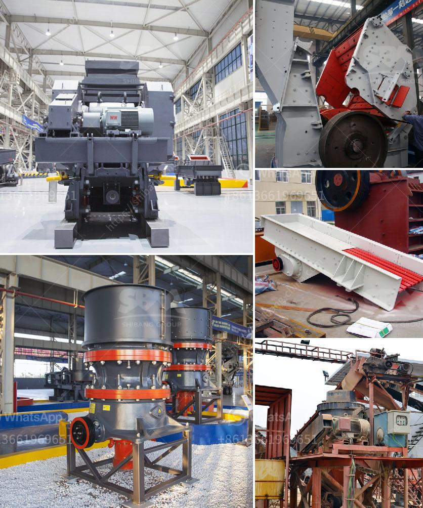

<h3>جزء من مطحنة الكرة ومبدأ عمله</h3>
تعتبر مطحنة الكرة واحدة من أهم المعدات في صناعة البناء والتعدين والكيميائية وغيرها من الصناعات الأخرى. تستخدم هذه المطاحن لسحق المواد الخام إلى جسيمات أصغر حجماً، مما يسهل عملية استخلاص المواد القيمة منها وتحسين خواصها الفيزيائية والكيميائية.

يتكون الجزء الرئيسي من مطحنة الكرة من أسطوانة كبيرة مصنوعة من الفولاذ، وداخل الأسطوانة مليء بكرات صلبة القوام و معدنية بحجم مختلف. هذه الكرات تدور داخل الأسطوانة وتعمل على سحق المواد الخام الموجودة بها. الكرات تعمل بفضل ميلان الأسطوانة عندما يتم تشغيلها بواسطة محرك كهربائي.

يتم تغذية المواد الخام إلى داخل الأسطوانة عن طريق فتحة تغذية توجد في الجزء العلوي من المطحنة. وعندما تدخل المواد الخام داخل الاسطوانة، تتحرك الكرات بسرعة عالية وتبدأ بسحق المواد الخام عبر الاحتكاك والصدمة معها. كلما تم تدوير الأسطوانة، زادت سرعة الكرات والاحتكاك مع المواد الخام، مما يؤدي إلى سحقها بشكل أكبر وتقليل حجمها.

بالإضافة إلى العملية السحق، تعمل مطاحن الكرة أيضًا على خلط المواد الخام وتلاطمها بشكل جيد. هذا يساعد في توزيع المواد بشكل متجانس وتجنب تكتلها. كما يؤدي التلاطم المستمر للكرات أثناء عمل المطحنة إلى توليد الطاقة الكهربائية التي تساعد على تحريك الكرات وسحق المواد الخام بشكل أفضل.

يجب ذكر أنه يتم التحكم في حجم الكرات وسرعة الأسطوانة وطول المطحنة بواسطة المشغلين لتحقيق أداء مثالي. كما يجب الاهتمام بمسألة الصيانة الدورية للمطاحن حتى تظل تعمل بكفاءة عالية وفعالية.

المطحنة الكروية هي تقنية مهمة جداً في صناعة التعدين وغيرها، حيث تساهم في تحسين كفاءة العمليات واستغلال المواد الخام بشكل أفضل، وتحسين جودة المنتجات النهائية. إنها تعتبر جزءًا أساسيًا من العديد من الصناعات الحديثة وتسهم في تحسين الحياة المعيشية للبشر وتطور المجتمعات.
<h3>Contact us</h3><ul><li><strong>Whatsapp:&nbsp;<a href="https://wa.me/8613661969651">+8613661969651</a></strong></li><li><a href="https://swt.shibang-china.com/?git&amp;zhl&amp;جزء من مطحنة الكرة ومبدأ عمله"><strong>Online Service(chat now)</strong></a></li></ul><h3>Related</h3><ul><li><a href='كتالوج كسارة الفك بوزولانا.md'>كتالوج كسارة الفك بوزولانا</a></li><li><a href='حجر الكسارة للبيع.md'>حجر الكسارة للبيع</a></li><li><a href='الآلات المستخدمة في تصنيع الأسمنت.md'>الآلات المستخدمة في تصنيع الأسمنت</a></li><li><a href='شاشة اهتزاز للشبكة 14 شاشة اهتزاز.md'>شاشة اهتزاز للشبكة 14 شاشة اهتزاز</a></li><li><a href='معدات تعدين الذهب على نطاق صغير للبيع في مزاد.md'>معدات تعدين الذهب على نطاق صغير للبيع في مزاد</a></li></ul>