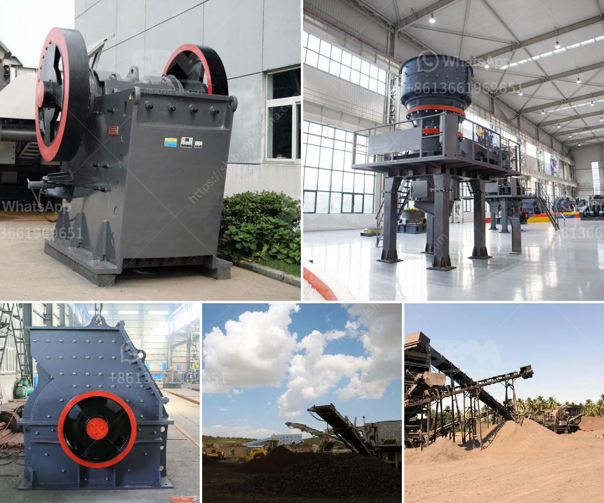

<h3>جميع نماذج كسارة البازلت</h3>
تتواجد كسارة البازلت بعدة أشكال وأحجام، وتعتبر هذه الكسارة جزءًا هامًا في صناعة البناء والإنشاءات. تهدف كسارات البازلت إلى سحق البازلت، وهو صخر بركاني مظهره غالبًا أسود اللون ويتميز بقوته وصلابته، لإنتاج مختلف المنتجات المطلوبة في مجال الإنشاءات المختلفة.

تتميز كسارة البازلت بأنها تعمل بالضغط والاحتكاك أو بوضع الصخور بين قطعتين متحركتين، مما يسمح للصخور بالانفصال وتحويلها إلى قطع صغيرة أو حصى أو حتى رمل بحجم محدد حسب احتياجات العملاء. تتميز كسارات البازلت أيضًا بأن معظمها محمولة ويمكن نقلها بسهولة من موقع إلى آخر.

تتواجد نماذج كسارة البازلت بأحجام مختلفة تتراوح من الصغيرة إلى الكبيرة. النموذج الصغير للكسارة عادة ما يستخدم في مشاريع البناء الصغيرة والأعمال الفنية المنزلية. وهي تعمل بواسطة محرك صغير يعمل بالكهرباء أو الديزل، وتحتوي على حاوية تستخدم لوضع البازلت ومكنسة لنقل البازلت المكسور إلى مكان المطلوب.

بالمقابل، يوجد النموذج الكبير لكسارة البازلت الذي يستخدم في مشاريع البناء الكبيرة والمصانع الصناعية. يعمل هذا النموذج بالطاقة الهيدروليكية ويستخدم للتعامل مع كميات كبيرة من البازلت بكفاءة وسرعة عالية. يحتوي النموذج الكبير على ماكينات وأنظمة إضافية لغرض تحسين كفاءة العمل وتعزيز الأداء.

يتم استخدام نماذج كسارة البازلت في مشاريع البناء المدني مثل الطرق والجسور، وفي صناعات الإسمنت والخرسانة والأسفلت. فمن خلال كسارة البازلت يتم إنتاج حصى البازلت التي توفر مواد بناء متينة ومتجانسة تستخدم في العديد من التطبيقات الهامة.

وفي الختام، تعتبر كسارة البازلت جزءًا أساسيًا في عملية إنتاج مواد البناء والتشييد. من خلال تكسير البازلت، يتم الحصول على منتجات عالية الجودة والمتينة التي تلبي احتياجات صناعة البناء المتنوعة.
<h3>Contact us</h3><ul><li><strong>Whatsapp:&nbsp;<a href="https://wa.me/8613661969651">+8613661969651</a></strong></li><li><a href="https://swt.shibang-china.com/?git&amp;zhl&amp;جميع نماذج كسارة البازلت"><strong>Online Service(chat now)</strong></a></li></ul><h3>Related</h3><ul><li><a href='شركة تصنيع آلة كسارة الحجر.md'>شركة تصنيع آلة كسارة الحجر</a></li><li><a href='سعر الشاشة الاهتزازية في الهند.md'>سعر الشاشة الاهتزازية في الهند</a></li><li><a href='آلات تصنيع كتل الجبس في إيطاليا.md'>آلات تصنيع كتل الجبس في إيطاليا</a></li><li><a href='تكلفة الكسارة المستعملة للجرانيت.md'>تكلفة الكسارة المستعملة للجرانيت</a></li><li><a href='مصنع خام الكروم الكامل.md'>مصنع خام الكروم الكامل</a></li></ul>