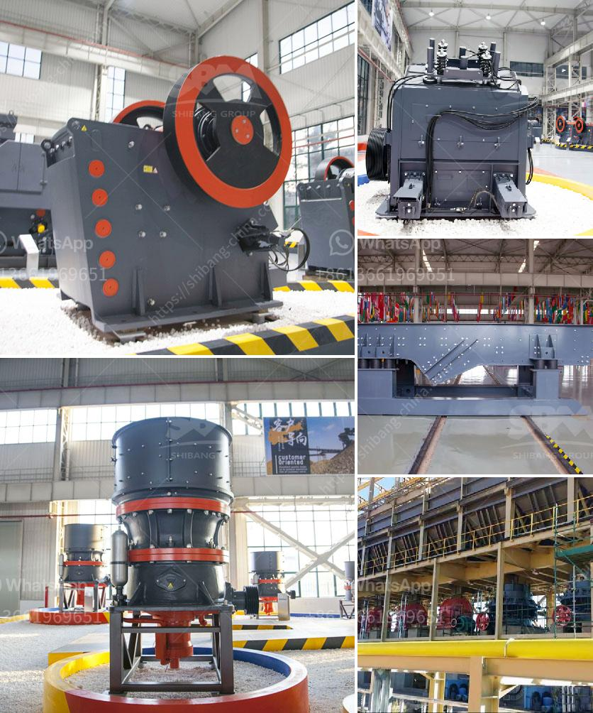

<h3>جهاز استشعار المعادن لسير الناقل</h3>
جهاز استشعار المعادن لسير الناقل هو جهاز مهم يستخدم في العديد من الصناعات مثل التعدين والتصنيع والتعبئة والتغليف. يتم تثبيت الجهاز على سير الناقل للكشف عن العناصر المعدنية الموجودة في المنتجات. يعمل الجهاز من خلال إصدار إشارات كهربائية عندما يتم الكشف عن مواد معدنية.

تتكون أجهزة الكشف عن المعادن المستخدمة في سير الناقل من عناصر مهمة تشمل الملف الكهرومغناطيسي ودائرة الاستشعار ونظام الإشارة. يتكون الملف الكهرومغناطيسي من لفات ملفوفة حول هيكل من مواد غير موصلة. وتولد اللفات مجالاً مغناطيسياً عند تمرير التيار الكهربائي فيها.

عندما يتم تشغيل السير الناقل وتتقدم المواد العملاقة على السير، يتم تمريرها تحت الملف الكهرومغناطيسي. تحدث تغييرات في مجال المغناطيسية عندما يتم الكشف عن وجود معادن في المواد. هذه التغييرات يتم اكتشافها بواسطة دائرة الاستشعار التي تستلم إشارة كهربائية من الملف الكهرومغناطيسي.

تتلقى دائرة الاستشعار إشارة من الملف الكهرومغناطيسي وتقوم بتحليلها للكشف عن وجود المعادن. إذا تم الكشف عن وجود معدن، يتم إرسال إشارة إلى نظام الإشارة الذي يعمل على تنبيه المشغل بوجود معدن غير مرغوب فيه. يمكن للمشغل استخدام هذه المعلومات لإيقاف السير الناقل أو اتخاذ تدابير أخرى لإزالة المعدن.

تعتبر أجهزة استشعار المعادن لسير الناقل بمثابة حلول فعالة للكشف عن المعادن في المنتجات. تساعد هذه الأجهزة على زيادة كفاءة الإنتاج وتجنب تلف المعدات الأخرى بسبب وجود المعادن. بالإضافة إلى ذلك، فإن استخدام هذه الأجهزة يساعد في منع حدوث حوادث وإصابات للعمال نتيجة للمعادن القريبة من سير الناقل.

بالاعتماد على تقنياتها المتقدمة، فإن أجهزة استشعار المعادن لسير الناقل تعطي نتائج دقيقة وموثوقة في الكشف عن المعادن. وبالتالي، فإن استخدام هذه الأجهزة يعتبر ضرورة في العديد من الصناعات التي تتطلب تداول المواد المعدنية عن طريق سير الناقل.
<h3>Contact us</h3><ul><li><strong>Whatsapp:&nbsp;<a href="https://wa.me/8613661969651">+8613661969651</a></strong></li><li><a href="https://swt.shibang-china.com/?git&amp;zhl&amp;جهاز استشعار المعادن لسير الناقل"><strong>Online Service(chat now)</strong></a></li></ul><h3>Related</h3><ul><li><a href='مصنع الإسمنت بسعة 100 طن في الهند.md'>مصنع الإسمنت بسعة 100 طن في الهند</a></li><li><a href='حدود اهتزاز مطحنة الكرة.md'>حدود اهتزاز مطحنة الكرة</a></li><li><a href='جهاز استشعار المعادن لسير الناقل.md'>جهاز استشعار المعادن لسير الناقل</a></li><li><a href='كسارة محمولة في السويد.md'>كسارة محمولة في السويد</a></li><li><a href='كسارة الذهب في جنوب أفريقيا.md'>كسارة الذهب في جنوب أفريقيا</a></li></ul>