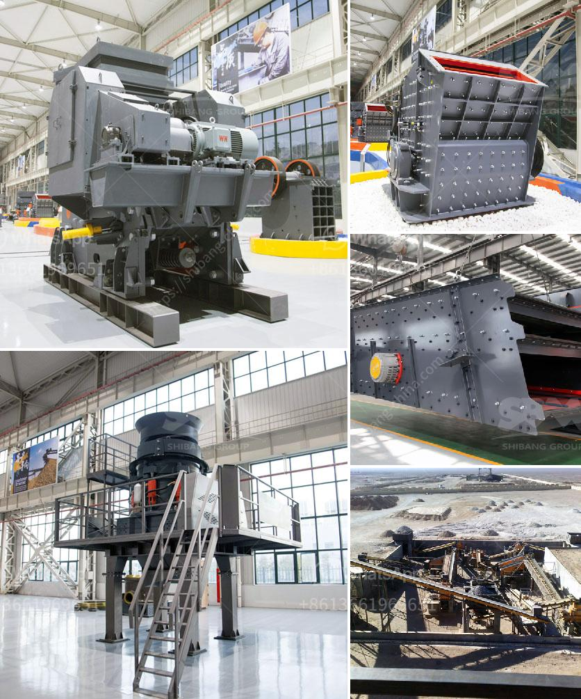

<h3>جهاز كسر الصخور في جنوب أفريقيا</h3>
يعتبر جهاز كسر الصخور من أهم الأدوات المستخدمة في عمليات التعدين وتحطيم الصخور في جنوب أفريقيا. يتم استخدامه بشكل واسع في صناعة التعدين والبناء لتحطيم الصخور الكبيرة وتحويلها إلى قطع صغيرة قابلة للتنقل والتعامل.

يتكون جهاز كسر الصخور من عدة أجزاء رئيسية، بما في ذلك هيكل قوي يحمي المحرك والأجزاء الداخلية الحساسة من الضرر. يتم تشغيله بواسطة محرك قوي يستخدم الطاقة الكهربائية أو الهيدروليكية لتشغيل الآلية المسؤولة عن تكسير الصخور.

تتميز جهاز كسر الصخور في جنوب أفريقيا بالقدرة على تكسير الصخور الصلبة بشكل فعال وسريع. يتم تصميم الأجزاء الداخلية لتحمل الضغط والتأثير القوي عند تكسير الصخور الصلبة. بالإضافة إلى ذلك، يتم تضمين نظام تحكم دقيق يسمح للعامل بضبط قوة الكسر والسرعة حسب حجم وصلابة الصخور المستهدفة.

تستخدم عمليات الكسر لاستخراج المعادن والمواد الخام من الصخور في مناجم جنوب أفريقيا الغنية بالموارد الطبيعية. يتم استخدام جهاز كسر الصخور في إعداد الصخور للتعامل مع العمليات اللاحقة مثل النقل والتخزين والمعالجة. يمكن أيضًا استخدامه في صناعة البناء والتشييد لكسر الصخور الكبيرة لأغراض البناء وتمهيد الطرق.

تقوم شركات التعدين وشركات البناء في جنوب أفريقيا بشراء جهاز كسر الصخور عالي الجودة والكفاءة لتعزيز إنتاجيتها وتحسين جودة العمل. تساهم هذه التقنية في تحسين عمليات التعدين والبناء وتقليل التكاليف والجهد المطلوب.

في الختام، يعتبر جهاز كسر الصخور في جنوب أفريقيا أداة حاسمة في صناعة التعدين والبناء. وبفضل قوته وكفاءته، يسهم في تسهيل عمليات كسر الصخور وتجهيزها لاستخدامها في عمليات أخرى. يعزز هذا الجهاز إنتاجية الصناعات المرتبطة ويساهم في التنمية الاقتصادية لجنوب أفريقيا.
<h3>Contact us</h3><ul><li><strong>Whatsapp:&nbsp;<a href="https://wa.me/8613661969651">+8613661969651</a></strong></li><li><a href="https://swt.shibang-china.com/?git&amp;zhl&amp;جهاز كسر الصخور في جنوب أفريقيا"><strong>Online Service(chat now)</strong></a></li></ul><h3>Related</h3><ul><li><a href='دليل تصميم كسارة مخروط بتنسيق PDF.md'>دليل تصميم كسارة مخروط بتنسيق PDF</a></li><li><a href='وحدة معالجة الحجر الجيري بالمنغنيز.md'>وحدة معالجة الحجر الجيري بالمنغنيز</a></li><li><a href='عملية سحق الكسارة.md'>عملية سحق الكسارة</a></li><li><a href='سعر معدات معالجة المنغنيز.md'>سعر معدات معالجة المنغنيز</a></li><li><a href='أسعار مطاحن الكرة الاسمنت.md'>أسعار مطاحن الكرة الاسمنت</a></li></ul>