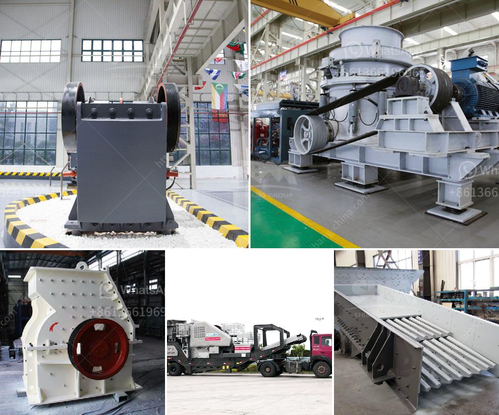

<h3>جهاز كسر الكوارتز الصغير</h3>
جهاز كسر الكوارتز الصغير: عبور الحاجز التكنولوجي الجديد

يعتبر جهاز كسر الكوارتز الصغير من التقنيات الحديثة والمبتكرة التي ظهرت في الآونة الأخيرة، وقد أثار اهتمام الكثيرين نظرًا لمميزاته واستخداماته المعدة للعديد من الصناعات. يستخدم هذا الجهاز التكنولوجي الفائق لتحطيم الكوارتز الصخري وتحويله إلى مواد ذات قيمة عالية.

يتميز جهاز كسر الكوارتز الصغير بحجمه الصغير وقوته العالية، حيث يمكن تنقله بسهولة واستخدامه في العديد من المواقع المختلفة. وبفضل تقنية الأشعة الكهرومغناطيسية التي يستخدمها، يمكنه كسر الكوارتز واستخلاص المواد القيمة منه بدون الحاجة إلى استخدام طرق التعدين التقليدية التي تتسبب في الكثير من الآثار البيئية السلبية.

يعتبر الكوارتز واحدًا من أكثر المواد الصخرية شيوعًا في العالم، إلا أن استخراجه وتحويله إلى مواد مفيدة قد تكون صعبة ومكلفة. إلا أن جهاز كسر الكوارتز الصغير يساهم في تغيير هذا المنظور، حيث يتمكن من كسر الصخور الرملية الصلبة وتحويلها إلى مواد خام قابلة للاستخدام في العديد من الصناعات مثل صناعة الزجاج، والسيراميك، والإلكترونيات، والطاقة الشمسية.

ومن الجوانب المهمة في جهاز كسر الكوارتز الصغير هو تأثيره الإيجابي على البيئة، حيث يقلل من الحاجة إلى التعدين التقليدي الذي يتسبب في تلوث الأراضي والمياه. هذا الجهاز يعتمد على تقنية الموجات الكهرومغناطيسية المحسنة، والتي تعمل على تفتيت الكوارتز بشكل فعال دون الحاجة إلى استخدام المواد الكيميائية الضارة.

من المتوقع أن يشهد جهاز كسر الكوارتز الصغير انتشارًا كبيرًا في السنوات القادمة، وذلك بسبب قدرته على تحقيق مزايا اقتصادية وبيئية واضحة. سوف يساهم هذا الجهاز في تسهيل عملية استخراج المواد الضرورية للعديد من الصناعات دون الحاجة إلى استخدام تقنيات تعدين تقليدية. ومن المتوقع أيضًا أن يؤدي استخدام هذا الجهاز إلى انخفاض تكلفة الإنتاج وتعزيز كفاءة الصناعة.

في النهاية، يمكن القول إن جهاز كسر الكوارتز الصغير هو تقنية مبتكرة وواعدة يمكن أن تغير مفهوم استخراج واستخدام الكوارتز. ومع تطور التكنولوجيا، فمن المتوقع أن يتم تحسين هذا الجهاز بشكل مستمر، مما سيزيد من قدرته على استخراج المزيد من المواد القيمة وتقديمها للعالم بشكل أكثر فعالية واستدامة.
<h3>Contact us</h3><ul><li><strong>Whatsapp:&nbsp;<a href="https://wa.me/8613661969651">+8613661969651</a></strong></li><li><a href="https://swt.shibang-china.com/?git&amp;zhl&amp;جهاز كسر الكوارتز الصغير"><strong>Online Service(chat now)</strong></a></li></ul><h3>Related</h3><ul><li><a href='سعر مصنع كسارة الفك.md'>سعر مصنع كسارة الفك</a></li><li><a href='كسارة تأثير تنزانيا.md'>كسارة تأثير تنزانيا</a></li><li><a href='آلة طحن مطحنة الرمل السيليكا.md'>آلة طحن مطحنة الرمل السيليكا</a></li><li><a href='جزء من مطحنة الأسطوانة.md'>جزء من مطحنة الأسطوانة</a></li><li><a href='حساب سعة كسارة الأسطوانة.md'>حساب سعة كسارة الأسطوانة</a></li></ul>