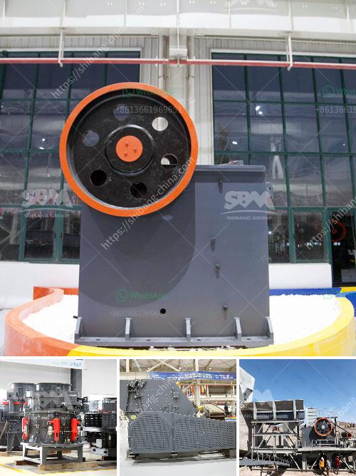

<h3>جوال محطم الحجر الجيري</h3>
جوال محطم الحجر الجيري: منتج فعّال لصناعة البناء والبنى التحتية

يعتبر الحجر الجيري واحدًا من الموارد الطبيعية الغنية بالكالسيوم والمغنيسيوم المستخدمة على نطاق واسع في صناعة البناء والمنشآت الصناعية. ومن أجل استخلاص ومعالجة هذا الحجر بطريقة فعّالة وسريعة تقوم المؤسسات بشراء الجوال المحطم للحجر الجيري، وهو آلة تستخدم في سحق الحجر الجيري إلى أحجام صغيرة مناسبة للاستخدام الصناعي.

يتألف جوال محطم الحجر الجيري من وحدات متعددة تعمل معًا لتحقيق عملية سحق الحجر الجيري. يتم تغذية الحجر الجيري إلى الجوال من الأعلى من خلال مصعد أو ناقل، حيث يتم نقل الحجر الجيري تدريجيًا إلى فتحة الجوال. في الجوال، يتعرض الحجر الجيري للقوة التصادمية التي تعمل على تكسير الحجر إلى أجزاء صغيرة. وتعمل شفرات الجوال على تكسير الحجر الجيري تدريجيًا حتى يتم الحصول على أقطار أصغر من الحجر المحطوم.

تتميز آلة جوال محطم الحجر الجيري بعدة ميزات تساهم في جعلها مفيدة لصناعة البناء والبنى التحتية. أحد الاستخدامات الرئيسية لهذه الآلة هو في صناعة الخرسانة، حيث يتم استخدام الحجر الجيري المسحوق لخلطها مع الأسمنت والرمل والماء لصناعة الخرسانة ذات القوة العالية. بفضل جوال محطم الحجر الجيري، يتمكن المنتجون من الحصول على الأحجام الصغيرة المطلوبة من الحجر الجيري والتي تكفل خلو الخرسانة من أي تجاويف أو شوائب.

بالإضافة إلى ذلك، فإن استخدام الجوال في عملية سحق الحجر الجيري يقلل من تكاليف استخراج الحجر ونقله. فبدلاً من نقل الحجر الجيري بشكل كامل إلى مصانع التكسير، يمكن نقل وحدة الجوال إلى الموقع المحدد حيث يتم استخراج وتكسير الحجر الجيري. هذا يقلل من التكاليف الناتجة عن عمليات النقل الطويلة ويوفر الوقت والجهد.

في الختام، يمكن القول إن جوال محطم الحجر الجيري يعد منتجاً فعّالاً ومهماً في صناعة البناء والبنى التحتية. فبفضل آليته القوية وسرعته في سحق الحجر الجيري، يمكن الاعتماد عليه في توفير الحجارة المحطمة بأحجام صغيرة ونقية، وبالتالي تقليل التكاليف وتحسين نوعية المنتجات النهائية. إن استخدام الجوال يساهم في تعزيز صناعة البناء وتطوير البنية التحتية وتحقيق التنمية المستدامة.
<h3>Contact us</h3><ul><li><strong>Whatsapp:&nbsp;<a href="https://wa.me/8613661969651">+8613661969651</a></strong></li><li><a href="https://swt.shibang-china.com/?git&amp;zhl&amp;جوال محطم الحجر الجيري"><strong>Online Service(chat now)</strong></a></li></ul><h3>Related</h3><ul><li><a href='موردين لمصانع سحق ld slag في الهند.md'>موردين لمصانع سحق ld slag في الهند</a></li><li><a href='كم تكلفة مصنع الكرة؟.md'>كم تكلفة مصنع الكرة؟</a></li><li><a href='تكلفة وحدة طحن الأسمنت tpd كسارة.md'>تكلفة وحدة طحن الأسمنت tpd كسارة</a></li><li><a href='مطحنة رايموند في ماليزيا.md'>مطحنة رايموند في ماليزيا</a></li><li><a href='كسارات مخروط للإيجار في جنوب أفريقيا.md'>كسارات مخروط للإيجار في جنوب أفريقيا</a></li></ul>