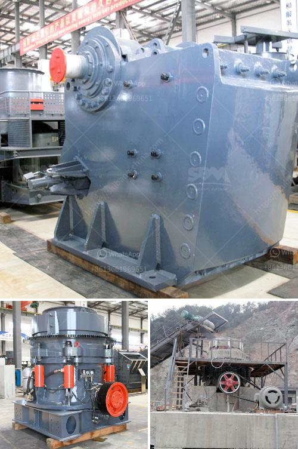

<h3>جول بيلي كسارة حجر مستعملة</h3>
تُعتبر جول بيلي كسارة حجر مستعملة من أبرز الأدوات والمعدات في صناعة التعدين والبناء. تستخدم هذه الكسارة لسحق الصخور والأحجار إلى قطع صغيرة ومناسبة للاستخدام في مشاريع البناء والبنية التحتية.

يتم تقديم جول بيلي كسارة حجر مستعملة بأحجام وإصدارات مختلفة، حيث يمكن العثور على نماذج مناسبة لكل نوع من أنواع الصخور والأحجار. يمتاز هذا النوع من الكسارة بلوحة الفك المتحركة ولوحة الفك الثابتة التي تعمل معًا لسحق المادة بطريقة فعالة وسريعة.

تعتبر الكسارات الحجرية مستعملة من جول بيلي خيارًا اقتصاديًا للغاية، حيث يكون سعرها أقل من الكسارات الجديدة. إذا كنت تبحث عن كسارة حجر مستعملة بجودة عالية وبأسعار معقولة، فإن جول بيلي هي الخيار المثالي.

بالإضافة إلى ذلك، فإن الكسارة المستعملة تعد خيارًا مستدامًا لحماية البيئة وتقليل النفايات. فبدلاً من التخلص من الكسارات القديمة، يمكن إعادة استخدامها وتجديدها للاستخدام في مشاريع البناء المستقبلية. هذا يقلل من الضرر البيئي الذي ينشأ عن استخدام المواد الجديدة في تصنيع الكسارات.

عند شراء جول بيلي كسارة حجر مستعملة، يجب أن يتم ذلك من متخصصين موثوقين وذوي خبرة. يجب فحص وتقييم الكسارة بعناية للتأكد من أنها تعمل بشكل صحيح وتلبي احتياجات المشروع المحدد.

بشكل عام، يُعتبر جول بيلي كسارة حجر مستعملة خيارًا موثوقًا وفعالًا للتعامل مع مشاريع البناء والتعدين. تُوفر هذه الكسارات القوة والأداء اللازمين لتحقيق أقصى استفادة من الصخور والأحجار وتحويلها إلى مواد صالحة للإعادة استخدام.

وباختصار، فإن جول بيلي كسارة حجر مستعملة هي اختيار ممتاز لأي مشروع بناء أو تعدين يتطلب معدات سحق صلبة وموثوقة. تلبي هذه الكسارات المعايير العالية للجودة والأداء، بالإضافة إلى توفيرها للبيئة والاقتصاد في نفس الوقت.
<h3>Contact us</h3><ul><li><strong>Whatsapp:&nbsp;<a href="https://wa.me/8613661969651">+8613661969651</a></strong></li><li><a href="https://swt.shibang-china.com/?git&amp;zhl&amp;جول بيلي كسارة حجر مستعملة"><strong>Online Service(chat now)</strong></a></li></ul><h3>Related</h3><ul><li><a href='مصنع المحجر في قوانغدونغ.md'>مصنع المحجر في قوانغدونغ</a></li><li><a href='أعمال التعدين والاستغلال في جنوب أفريقيا.md'>أعمال التعدين والاستغلال في جنوب أفريقيا</a></li><li><a href='موردين كسارات الفك والمخروط في موكوباني.md'>موردين كسارات الفك والمخروط في موكوباني</a></li><li><a href='كسارة الحجر الجيري المتنقلة.md'>كسارة الحجر الجيري المتنقلة</a></li><li><a href='كسارة الحجر كسارة الحجر.md'>كسارة الحجر كسارة الحجر</a></li></ul>