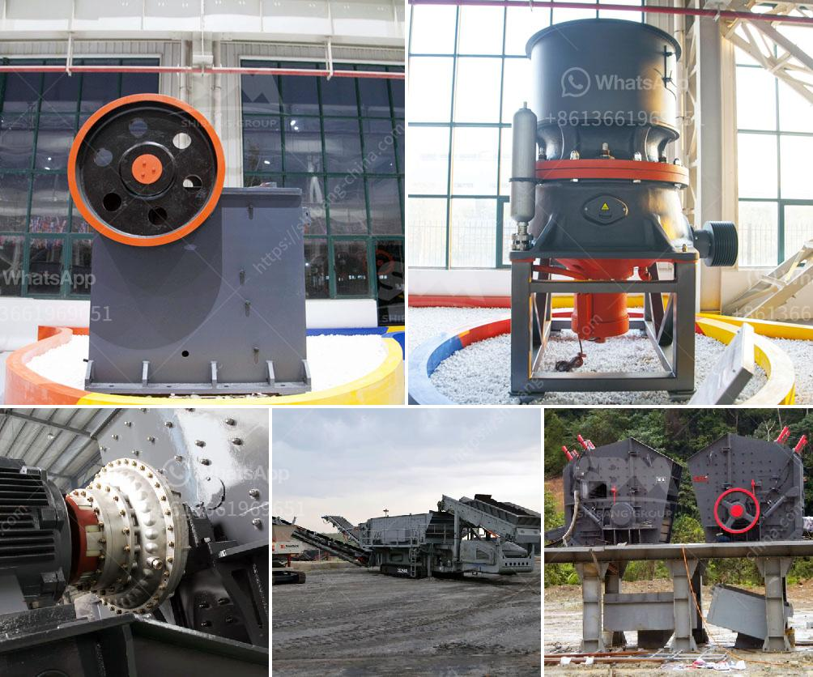

<h3>جول محطم الحجر</h3>
تعتبر عملية تكسير الحجارة من العمليات الهامة في صناعات مختلفة مثل صناعة البناء والطرق والسكك الحديدية. ومن أهم الأدوات المستخدمة في هذه العملية هو جول محطم الحجر أو الكسارة الفكية.

جول محطم الحجر هو جهاز ميكانيكي يعمل على تكسير الحجارة إلى أحجام أصغر. يتكون الجول من قطعتين رئيسيتين: فكين متحركين وثابتين. يقوم الفك المتحرك بالتحرك نحو الفك الثابت والعكس بشكل دوري مستخدماً قوة الضغط. تتم عملية التكسير عن طريق وضع الحجر بين الفكين وتحريك الفك المتحرك لتنفيذ العملية.

يتم استخدام جول محطم الحجر في عملية التكسير لعدة أسباب. أولها هو تحويل الحجر إلى أحجام أصغر تسهل عملية التعامل معه ونقله. وثانياً، يتم استخدام الحجر المكسر في تصنيع الخرسانة والأسفلت وغيرها من المواد الإنشائية. كما أنه يستخدم في صناعات أخرى مثل صناعة المعادن وصناعة الكيماويات.

تتميز كسارة الفك بعدة مزايا. الأولى هي سهولة الاستخدام والتشغيل، حيث يمكن للعمال التحكم في عملية التكسير ببساطة. كما أنها تعمل بكفاءة عالية وقادرة على تحمل الحجارة الصلبة والكبيرة. وبالإضافة إلى ذلك، تتمتع بأطوال عمل قابلة للتعديل بما يتناسب مع احتياجات المشروع.

على الرغم من الفوائد الكبيرة لجول محطم الحجر، إلا أنه يجب اتخاذ بعض الاحتياطات أثناء عملية التكسير. يجب على العمال استخدام ملابس واقية وواقيات العين والأذن لتجنب الإصابة بأي ضرر. كما يجب عليهم تنظيف الجهاز بانتظام وتفحصه لضمان عمله السليم.

في النهاية، فإن جول محطم الحجر يعد من الأدوات الضرورية في عملية تكسير الحجارة. يساهم في تحويل الحجر إلى أحجام أصغر واستخدامه في صناعة مواد البناء. وبفضل مزاياه وقدرته على تحمل أنواع مختلفة من الحجارة، يعتبر جول محطم الحجر حلاً مثالياً وفعالاً لتلبية احتياجات العديد من الصناعات.
<h3>Contact us</h3><ul><li><strong>Whatsapp:&nbsp;<a href="https://wa.me/8613661969651">+8613661969651</a></strong></li><li><a href="https://swt.shibang-china.com/?git&amp;zhl&amp;جول محطم الحجر"><strong>Online Service(chat now)</strong></a></li></ul><h3>Related</h3><ul><li><a href='معدات تعدين في اليابان.md'>معدات تعدين في اليابان</a></li><li><a href='كسارات محمولة في محجر جنوب أفريقيا.md'>كسارات محمولة في محجر جنوب أفريقيا</a></li><li><a href='قائمة مصنعي آلات سحق اليابان.md'>قائمة مصنعي آلات سحق اليابان</a></li><li><a href='كل مصانع التكسير المحاجر.md'>كل مصانع التكسير المحاجر</a></li><li><a href='آلة طحن مسحوق فائقة الدقة.md'>آلة طحن مسحوق فائقة الدقة</a></li></ul>