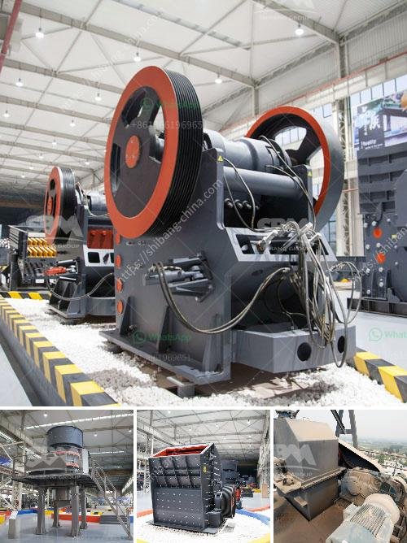

<h3>حجر الحجر الجيري المسحوق بحجم 3/4 بوصة</h3>
يعد حجر الحجر الجيري المسحوق بحجم 3/4 بوصة من أبرز المواد التي تستخدم في الصناعات المختلفة. يتم الحصول على هذا الحجر الجيري عن طريق طحن الصخور الجيرية الخام إلى حجم يتراوح بين 3/4 بوصة (19 مم) إلى أقل من 200 شبكة (75 ميكرون). يتم استخدام هذا الحجر الجيري المسحوق في العديد من التطبيقات المختلفة بسبب خصائصه الفريدة وتوافره الواسع.

أحد التطبيقات الرئيسية لحجر الحجر الجيري المسحوق هو في صناعة البناء والتشييد. يتم استخدامه كمادة أساسية في صناعة الخرسانة والأسفلت والطوب والبلوك والأرصفة والأساسات. يساهم هذا الحجر الجيري في تحسين خواص المواد الإنشائية وزيادة قوتها ومتانتها. كما أنه يعزز مقاومتها للتآكل والتحمل ويساعد في توفير طبقة مستقرة وقوية.

بالإضافة إلى ذلك، يستخدم حجر الحجر الجيري المسحوق في صناعة الصلصال والسيراميك والزجاج. يعتبر هذا الحجر الجيري مادة خام هامة لإنتاج الجبس والكالسيوم والكلسيوم الكلور. فهو يستخدم أيضًا في صناعة المبيدات الحشرية ومواد البناء والدهانات والأصباغ.

إضافة إلى ذلك، يعتبر حجر الحجر الجيري المسحوق مادة أساسية في صناعة الحجر الصناعي. يتم استخدامه في صنع السيراميك والموزاييك والحجر الصناعي المطلي. يتميز بقدرته على تشكيل أشكال مختلفة والحفاظ على الاستقرار والصلابة عند التعرض للحرارة والرطوبة.

في الختام، يعتبر حجر الحجر الجيري المسحوق بحجم 3/4 بوصة مادة متعددة الاستخدامات وفعالة في العديد من الصناعات المختلفة. يتميز بخصائصه الممتازة مثل المتانة والقوة والمقاومة للتآكل، مما يجعله اختيارًا مثاليًا للاستخدام في المشاريع الإنشائية وصناعة الحجر الصناعي وصناعات أخرى كثيرة.
<h3>Contact us</h3><ul><li><strong>Whatsapp:&nbsp;<a href="https://wa.me/8613661969651">+8613661969651</a></strong></li><li><a href="https://swt.shibang-china.com/?git&amp;zhl&amp;حجر الحجر الجيري المسحوق بحجم 34 بوصة"><strong>Online Service(chat now)</strong></a></li></ul><h3>Related</h3><ul><li><a href='كسارات الحجر المهجورة.md'>كسارات الحجر المهجورة</a></li><li><a href='شركة تصنيع لوحات الجبس في سنغافورة.md'>شركة تصنيع لوحات الجبس في سنغافورة</a></li><li><a href='بائعي آلة المحجر المحمولة في نيجيريا.md'>بائعي آلة المحجر المحمولة في نيجيريا</a></li><li><a href='سعر معدات التعدين المستخدمة.md'>سعر معدات التعدين المستخدمة</a></li><li><a href='كيفية بدء منجم المحاجر.md'>كيفية بدء منجم المحاجر</a></li></ul>