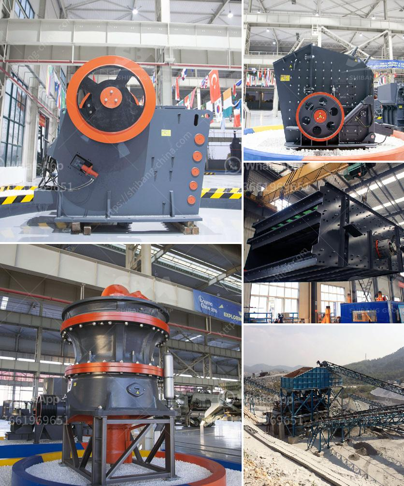

<h3>حجر الكسارة للبيع</h3>
تعد صناعة البناء والتشييد من أهم القطاعات الاقتصادية في جميع أنحاء العالم. ومن أهم مكونات هذه الصناعة حجر الكسارة. حجر الكسارة هو حجر صخري يستخرج من المحاجر ويتم تكسيره وفرزه ليستخدم في مجموعة متنوعة من مشاريع البناء والتشييد.

للبيع حجر الكسارة بمختلف الأحجام والصفات ويتم تحديد السعر وفقًا لمواصفات وجودة الحجر. تتراوح أسعار حجر الكسارة المعروض للبيع بين 200-400 ريال للطن، وقد تختلف هذه الأسعار من منطقة إلى أخرى وبحسب العرض والطلب.

يعتبر حجر الكسارة أحد المواد الأساسية لأعمال البناء والتشييد، فهو يستخدم في تشييد المباني والجدران وطرق الرصف والأرصفة وحتى في صناعة الأسوار الحجرية. يتم تكسير حجر الكسارة إلى أحجام مختلفة ويتم فرزه حسب حجم الحصى المطلوب.

إن استخدام حجر الكسارة يعود إلى آلاف السنين، حيث كان يستخدم في العصور القديمة لبناء الأهرامات والمعابد والأبراج والحوائط. يتم اختيار حجر الكسارة لمرونته في التشكيل وقوته في البناء، بالإضافة إلى مقاومته للتأثيرات الطبيعية مثل العوامل المناخية والتآكل.

توجد العديد من المحاجر حول العالم التي توفر حجر الكسارة، وتمتد صادرات هذه المواد لتشمل المزيد من الدول. من خلال شراء حجر الكسارة المعروض للبيع، يمكن للمشاريع البنائية الحصول على مواد بناء عالية الجودة بأسعار معقولة.

يتم استخدام حجر الكسارة بشكل واسع في مشاريع البناء الكبيرة والصغيرة على حد سواء. إذ يتم استخدامه في تجهيز الخرسانة وتعزيز الطرق وبناء الجسور والأبنية. بالإضافة إلى ذلك، فإن استخدام حجر الكسارة يعتبر بديلاً مستدامًا وصديقًا للبيئة عن المواد الأخرى مثل الطوب والأسمنت.

لا يمكن تجاهل أهمية حجر الكسارة في صناعة البناء والتشييد. إن توفره بأسعار معقولة يساهم في توفير وتيسير المواد اللازمة للمشاريع البنائية. ومع ازدياد الطلب على البنية التحتية والتطور العمراني في العديد من الدول، فإن حجر الكسارة للبيع يعد فرصة مثالية للمستثمرين والشركات في هذا القطاع لتلبية احتياجات السوق وتحقيق أرباح جيدة.

بالنهاية، يمكن القول إن حجر الكسارة للبيع بتلك الأسعار يمثل فرصة مهمة للمستثمرين والمطورين في صناعة البناء والتشييد. يمكن تلبية الطلب المتزايد على هذه المادة المهمة واستخدامها في العديد من المشاريع البنائية، مما يساهم في تطور البنية التحتية وتحسين جودة الحياة في العديد من المجتمعات.
<h3>Contact us</h3><ul><li><strong>Whatsapp:&nbsp;<a href="https://wa.me/8613661969651">+8613661969651</a></strong></li><li><a href="https://swt.shibang-china.com/?git&amp;zhl&amp;حجر الكسارة للبيع"><strong>Online Service(chat now)</strong></a></li></ul><h3>Related</h3><ul><li><a href='عمل المطحنة الكرة بالهندية.md'>عمل المطحنة الكرة بالهندية</a></li><li><a href='تجار في محطم الفحم وآلة طحن في الهند.md'>تجار في محطم الفحم وآلة طحن في الهند</a></li><li><a href='مصنعو كسارات الجيري.md'>مصنعو كسارات الجيري</a></li><li><a href='آلة طحن الطين المستخدمة للبيع.md'>آلة طحن الطين المستخدمة للبيع</a></li><li><a href='كسارات الحجر للبيع في كينيا.md'>كسارات الحجر للبيع في كينيا</a></li></ul>