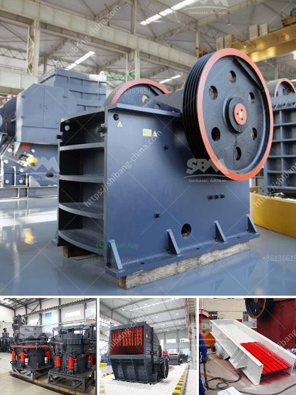

<h3>حجم الشبكة لمطحنة الكرة</h3>
تعتبر مطحنة الكرة واحدة من أشهر الآلات الصناعية التي تستخدم لطحن المواد المختلفة في صناعات مختلفة مثل صناعة الأسمنت والسيراميك والمعادن. تتكون مطاحن الكرة من جزئين رئيسيين، الأول هو الجزء الأفقي الذي يحتوي على أسطوانة تدور بسرعة، والثاني هو الجزء العمودي الذي يحتوي على كرات من الصلب الصغيرة تستخدم لطحن المواد.

يعتبر حجم الشبكة لمطحنة الكرة أحد العوامل الحاسمة التي تؤثر على كفاءة عملية الطحن وجودة المنتج النهائي. يشير حجم الشبكة إلى حجم الفتحات التي يمرر خلالها المواد المطحونة. ويتم قياس حجم الشبكة بالعدد النسبي للفتحات في بوصة ويتم تحديده وفقا لاحتياجات العمليات الصناعية.

عادةً ما يتم استخدام شبكة ذات حجم صغير لمطاحن الكرة عندما يتعلق الأمر بطحن المواد إلى مسحوق ناعم. على سبيل المثال ، يستخدم الأسمنت البورتلاندي عادةً شبكة بحجم 200. يتم تحقيق هذا الحجم الصغير عن طريق استخدام سلسلة من المصافي لفصل المواد المطحونة وضبط حجم الجسيمات وفقًا للمعايير المحددة.

من ناحية أخرى، تستخدم الشبكة ذات حجم كبير للمطاحن الكروية التي تهدف إلى تحقيق طحن سريع وفعال وتأثير قوي على المواد المطحونة. عادةً ما يستخدم مطحنة الكرة الشبكة ذات الحجم الكبير في صناعة السيراميك والطلاء حيث يتم تطبيق الطلاء على الاسطح بسرعة تتطلب حجم شبكة كبير.

باختصار، يعتبر حجم الشبكة لمطاحن الكرة أمرًا حاسمًا لتحقيق النتائج المرجوة. تحديد الشبكة المناسبة يعتمد على عدة عوامل مثل نوع المواد والاستخدام المقصود. يجب أن يتم اختيار الحجم المثالي للشبكة بعناية لضمان الكفاءة والجودة في عملية الطحن.
<h3>Contact us</h3><ul><li><strong>Whatsapp:&nbsp;<a href="https://wa.me/8613661969651">+8613661969651</a></strong></li><li><a href="https://swt.shibang-china.com/?git&amp;zhl&amp;حجم الشبكة لمطحنة الكرة"><strong>Online Service(chat now)</strong></a></li></ul><h3>Related</h3><ul><li><a href='كسارات للإيجار في سينسيناتي.md'>كسارات للإيجار في سينسيناتي</a></li><li><a href='أنواع كسارات الفحم المستخدمة في الصناعة.md'>أنواع كسارات الفحم المستخدمة في الصناعة</a></li><li><a href='كسارة صخور مصنوعة يدوياً.md'>كسارة صخور مصنوعة يدوياً</a></li><li><a href='كسارة صخور صغيرة.md'>كسارة صخور صغيرة</a></li><li><a href='شركة كسارة في دبي.md'>شركة كسارة في دبي</a></li></ul>