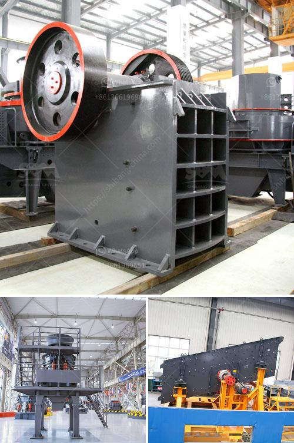

<h3>حجم طحن البنتونيت</h3>
يعتبر البنتونيت من المعادن الهامة التي تستخدم في عدة صناعات. واحدة من الخصائص المهمة للبنتونيت هي حجم الحبيبات التي يتم طحنها.

حجم طحن البنتونيت يتم تعريفه بناءً على حجم الحبيبات المتواجدة في المادة، وهذا يعتبر عاملًا مهمًا يؤثر على الاستخدامات المحتملة للمعدن.

عند طحن البنتونيت، يتم تقسيم الحبيبات إلى حجم محدد، والأحجام الشائعة للبنتونيت المطحون تتراوح بين 200 إلى 400 ميكرومتر. ويجب أن يكون الحجم المحدد وفقًا لمتطلبات التطبيق المرغوب فيه.

عندما يكون حجم الطحن أصغر، يزيد من مساحة السطح النشطة للبنتونيت. وهذا هام لاستخدامات مثل الحماية من التسرب والاستخدامات الصناعية المختلفة. على سبيل المثال، في الحفر النفطي، يتم استخدام البنتونيت المطحون بحجم صغير لمساعدة تثبيت الجدران والحفاظ على استقرار الآبار.

من الجدير بالذكر أن الاستخدام العملي للبنتونيت قد يتطلب حجوم طحن مختلفة حسب الصناعة والاستخدام المرجو. فعلى سبيل المثال، في صناعة الدهانات، يفضل استخدام بنتونيت بحجم طحن أكبر حتى يحافظ على مرونته وقدرته على تكوين مواد ربط جيدة.

بالإضافة إلى ذلك، يؤثر حجم طحن البنتونيت على قوة الترسب وتوزيع الحبيبات في المواد المستخدمة. وهذا يعني أن حجم الحبيبات يمكن أن يؤثر على خصائص البنتونيت مثل قدرته على امتصاص الماء وتكوين الحمأة.

في الختام، يجب النظر في حجم طحن البنتونيت عند اختياره لأي استخدام، ويجب أن يكون وفقًا لمتطلبات التطبيق المرغوب فيه. يمكن تعديل هذا الحجم حسب الحاجة، ويجب أخذه بعين الاعتبار للحصول على آداء مثالي في الصناعات المختلفة.
<h3>Contact us</h3><ul><li><strong>Whatsapp:&nbsp;<a href="https://wa.me/8613661969651">+8613661969651</a></strong></li><li><a href="https://swt.shibang-china.com/?git&amp;zhl&amp;حجم طحن البنتونيت"><strong>Online Service(chat now)</strong></a></li></ul><h3>Related</h3><ul><li><a href='موردين آلة طحن الجبس.md'>موردين آلة طحن الجبس</a></li><li><a href='كيفية غسل الرمل للبناء.md'>كيفية غسل الرمل للبناء</a></li><li><a href='سعر مصنع معالجة الحجر الجيري.md'>سعر مصنع معالجة الحجر الجيري</a></li><li><a href='مصنعين كسارات في روسيا.md'>مصنعين كسارات في روسيا</a></li><li><a href='تركيبة مواد كسارة الفحم.md'>تركيبة مواد كسارة الفحم</a></li></ul>