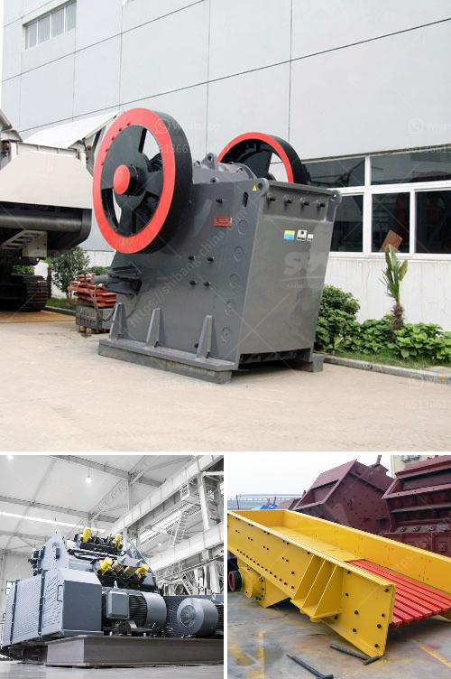

<h3>حجم كرات الطحن في مطحنة الكرة لطحن الكوارتز</h3>
تُستخدم مطاحن الكرة لطحن المواد الخام في عملية التصنيع بشكل واسع في الصناعات المختلفة. ومن بين هذه المواد الخام المستخدمة في مطاحن الكرة يأتي الكوارتز كواحدة من أهم المواد التي يتم طحنها.

تعتبر حجم كرات الطحن في مطاحن الكرة أحد العوامل المؤثرة في عملية طحن الكوارتز. حيث تتوفر الكرات بأحجام مختلفة، ويعتمد اختيار الحجم المناسب على عدة عوامل مهمة.

أحد العوامل الأساسية التي يجب أن نأخذها بعين الاعتبار هي حجم الكرات بالنسبة لحجم الكوارتز المراد طحنه. فعندما يكون حجم الكرة أكبر من حجم الكوارتز، فإن عملية الطحن لن تكون فعالة بشكل كافٍ. قد يتسبب ذلك في تحويل الطاقة المستخدمة في الطحن إلى حرارة بدلاً من إعطاء نتائج طحن جيدة. ومن الناحية المعاكسة، إذا كان حجم الكرة أصغر من حجم الكوارتز، فإنه يمكن أن يؤدي إلى طحن غير متجانس للمادة الخام.

كما أن حجم الكرات يؤثر على سرعة الطحن. بشكل عام، تُستخدم الكرات الأكبر حجماً للحصول على سرعة طحن أكبر، في حين أن الكرات الأصغر حجماً تستخدم للحصول على سرعة طحن أبطأ. يرجى ملاحظة أن هذا ليس قاعدة صارمة، حيث يتوجب توفير توازن بين حجم الكرات وسرعة الطحن بحسب ظروف العمل المحددة.

إضافة إلى ذلك، فإن حجم كرات الطحن يؤثر أيضاً على توزيع حجم الجسيمات المطحونة. فباستخدام الكرات الأكبر، يمكن الحصول على توزيع جسيمات أكبر، في حين أن الكرات الأصغر يمكن أن تؤدي إلى توزيع أدق.

بشكل عام، يمكن القول أنه يجب توفير توازن مثالي بين حجم الكرات وحجم الكوارتز المراد طحنه. ينبغي أيضاً الأخذ في الاعتبار ظروف عمل المطحنة والنتائج المطلوبة. قد يلزم تجربة عدة أحجام مختلفة للوصول إلى أفضل نتائج.

باختيار الحجم المناسب للكرات في مطحنة الكرة لطحن الكوارتز، يمكن تحسين كفاءة الطحن وجودة المنتج النهائي. وتعتبر هذه المعلومات مفيدة أيضاً عند اختيار حجم الكرات في مطاحن الكرة الأخرى التي تستخدم لطحن مواد أخرى بجانب الكوارتز.
<h3>Contact us</h3><ul><li><strong>Whatsapp:&nbsp;<a href="https://wa.me/8613661969651">+8613661969651</a></strong></li><li><a href="https://swt.shibang-china.com/?git&amp;zhl&amp;حجم كرات الطحن في مطحنة الكرة لطحن الكوارتز"><strong>Online Service(chat now)</strong></a></li></ul><h3>Related</h3><ul><li><a href='وحدة طحن الصين.md'>وحدة طحن الصين</a></li><li><a href='كسارة محمولة للبيع.md'>كسارة محمولة للبيع</a></li><li><a href='كسارة الفك المحمولة في غرب أفريقيا تجار.md'>كسارة الفك المحمولة في غرب أفريقيا تجار</a></li><li><a href='معدات تكسير خام الكروم المستخدمة.md'>معدات تكسير خام الكروم المستخدمة</a></li><li><a href='مطحنة الكرة لكلنكر الإسمنت.md'>مطحنة الكرة لكلنكر الإسمنت</a></li></ul>