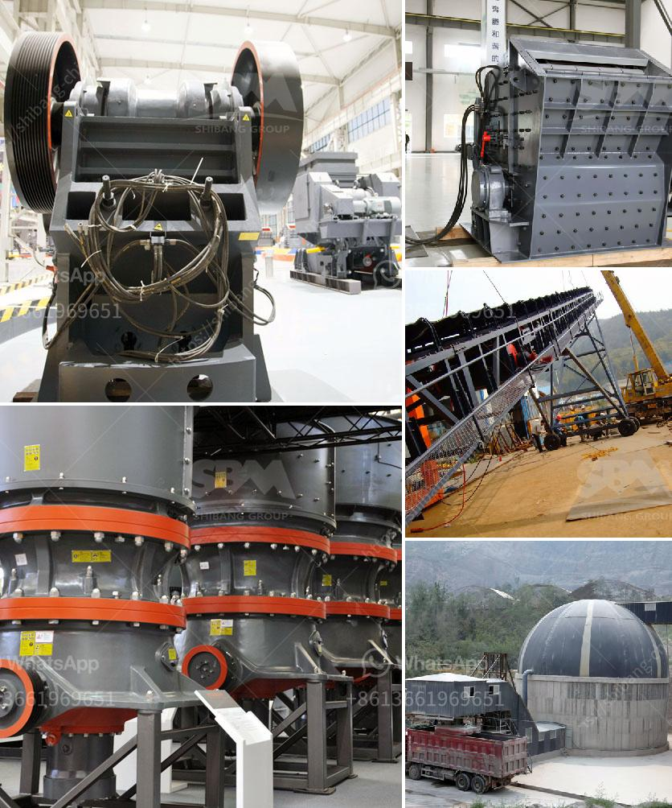

<h3>حجم كسارة الفك pe 600x900</h3>
تُعتبر كسارة الفك PE 600x900 واحدة من أكثر الكسارات استخداماً في مجال صناعة التعدين ومعالجة المواد الصلبة. تتميز هذه الكسارة بحجمها الكبير، وقوة تحطيمها العالية، وكفاءتها الفائقة في تكسير المواد الصلبة إلى أجزاء صغيرة.

تعتبر قدرة هذه الكسارة المستخدمة على التحمل لمدة طويلة من الاستخدام، مع تصميمها الصلب والمتانة، مميزات رئيسية تمكنها من التعامل بسهولة مع أنواع مختلفة من المواد الصلبة مثل الحجارة والخامات المعدنية والفحم والديبسلايت والغرانيت والخرسانة وغيرها.

تتميز كسارة الفك PE 600x900 بحجمها الكبير وهي تعمل بواسطة محرك كهربائي قوي. تأتي الكسارة مزودة بفتحة الفك الثابتة والمتحركة، حيث تقوم الفكوك بالضغط على المادة وتكسيرها وسحقها بينهما. بفضل نظام التشحيم الجيد، فإن الجهاز يعمل بكفاءة عالية وبأداء مستدام.

تستخدم كسارة الفك PE 600x900 على نطاق واسع في العديد من الصناعات مثل التعدين، وصناعة البناء، والبناء، والتشييد، ومصانع تصنيع الرمل، وتدوير النفايات، وغيرها. يمكن استخدامها لتكسير المواد الخام غير القابلة للاشتغال وإعادة تدوير المخلفات الصلبة.

تمنحك هذه الكسارة قدرة تكسير عالية وإنتاجية ممتازة. تتراوح القدرة التقريبية لهذه الكسارة من 50 إلى 120 طن في الساعة، وتعتمد القدرة الفعلية على صلابة ولزوجة المادة المراد تكسيرها.

بالإضافة إلى ذلك، تتميز كسارة الفك PE 600x900 بتوفيرها للطاقة واستهلاكها المنخفض وصيانتها السهلة. تحتوي الكسارة على نظام تحكم هيدروليكي يمكن استخدامه لضبط حجم الفتحة وتحقيق متطلبات مختلفة للتكسير.

في الختام، تُعد كسارة الفك PE 600x900 جهازًا فعالًا وموثوقًا يُستخدم في صناعة التعدين ومعالجة المواد الصلبة. تلبي هذه الكسارة متطلبات الإنتاج العالية والدقة العالية، وتساعد على تحقيق الكفاءة والإنتاجية في عمليات سحق المواد.
<h3>Contact us</h3><ul><li><strong>Whatsapp:&nbsp;<a href="https://wa.me/8613661969651">+8613661969651</a></strong></li><li><a href="https://swt.shibang-china.com/?git&amp;zhl&amp;حجم كسارة الفك pe 600x900"><strong>Online Service(chat now)</strong></a></li></ul><h3>Related</h3><ul><li><a href='سعر كسارة الأسطوانة.md'>سعر كسارة الأسطوانة</a></li><li><a href='حسابات في مطحنة الأسطوانة العمودية.md'>حسابات في مطحنة الأسطوانة العمودية</a></li><li><a href='آلة سحق الدولوميت للبيع في دبي.md'>آلة سحق الدولوميت للبيع في دبي</a></li><li><a href='تستخدم لمطحنة رايموند.md'>تستخدم لمطحنة رايموند</a></li><li><a href='طاحونة مطرقية صغيرة بقطر 10 مم.md'>طاحونة مطرقية صغيرة بقطر 10 مم</a></li></ul>