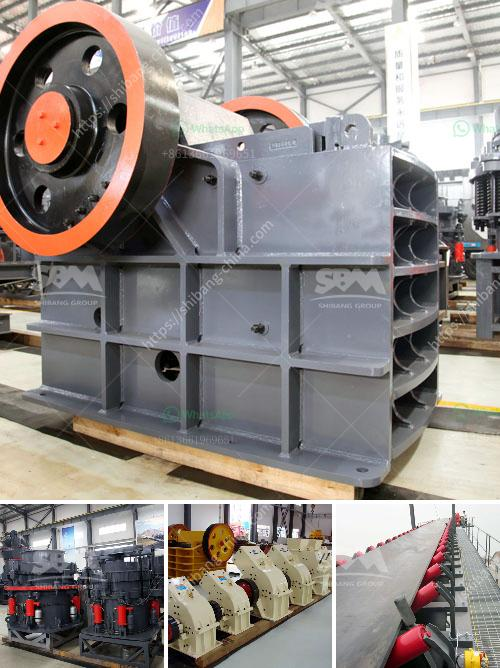

<h3>حجم كسارة الفك</h3>
تعتبر كسارة الفك أحد أهم الآلات المستخدمة في صناعة التعدين والبناء. تستخدم هذه الكسارة لكسر المواد الصلبة والصخور إلى قطع صغيرة قابلة للاستخدام في عمليات البناء والتشييد. واحدة من المعلمات المهمة التي يجب مراعاتها عند اختيار كسارة الفك هو حجمها.

يتراوح حجم كسارة الفك بين 200 و 400 ملم. يشير هذا الحجم إلى امكانية استيعاب الكسارة للمواد التي يصل قطرها إلى 200-400 ملم. يعتبر هذا النطاق من الأحجام مناسبًا للعديد من تطبيقات المواد الصلبة والصخور في مجالات مختلفة.

تفيد كسارة الفك بحجم 200-400 ملم في المشاريع الكبيرة التي تتطلب كمية كبيرة من المواد المكسورة. فمثلاً، في صناعة البناء، قد تتطلب العديد من المشاريع الكبيرة طحن الصخور والحصى إلى الأحجام المناسبة لاستخدامها في خلط الخرسانة.

تأتي كسارة الفك بحجم 200-400 ملم أيضًا في حقيبة مفيدة لعمليات التعدين. يتم استخدام الكسارة في عملية سحق مختلفة لتعدين المعادن مثل الفحم والفوسفات والذهب والفضة والزنك وغيرها. تعمل الكسارة على كسر المعادن الخام إلى قطع صغيرة يمكن استخلاصها ومعالجتها بعد ذلك.

من الجدير بالذكر أن تحسينات تقنية مستمرة تجرى على كسارات الفك بهدف زيادة قدرتها على الكسر وتحسين كفاءتها. يتم العمل على تطوير آليات ومحركات جديدة تجعل الكسارة قادرة على التعامل مع مواد أكثر صلابة وتحمل وزن أكبر. يهدف هذا التطور إلى زيادة كفاءة عمليات الكسر وتحسين جودة المواد المنتجة.

باختصار، فإن كسارة الفك بحجم 200-400 ملم هي أداة مهمة في صناعة التعدين والبناء. تستخدم لكسر المواد الصلبة والصخور إلى قطع صغيرة بهدف استخدامها في عمليات البناء وتعدين المعادن. ومع تحسين تصميم وأداء كسارة الفك، فإنها تصبح أكثر قدرة على التعامل مع المواد الصعبة وتحقق كفاءة عالية في عملية الكسر وتحسين جودة المنتج النهائي.
<h3>Contact us</h3><ul><li><strong>Whatsapp:&nbsp;<a href="https://wa.me/8613661969651">+8613661969651</a></strong></li><li><a href="https://swt.shibang-china.com/?git&amp;zhl&amp;حجم كسارة الفك"><strong>Online Service(chat now)</strong></a></li></ul><h3>Related</h3><ul><li><a href='شركة تصنيع مطاحن المطرقة في ماليزيا.md'>شركة تصنيع مطاحن المطرقة في ماليزيا</a></li><li><a href='كيفية إعداد خطة عمل لمصنع الكسارات.md'>كيفية إعداد خطة عمل لمصنع الكسارات</a></li><li><a href='كسارات الحجر في بيلين.md'>كسارات الحجر في بيلين</a></li><li><a href='كتالوج كسارة الفك بوزولانا.md'>كتالوج كسارة الفك بوزولانا</a></li><li><a href='شركة تصنيع كسارة الحصى.md'>شركة تصنيع كسارة الحصى</a></li></ul>