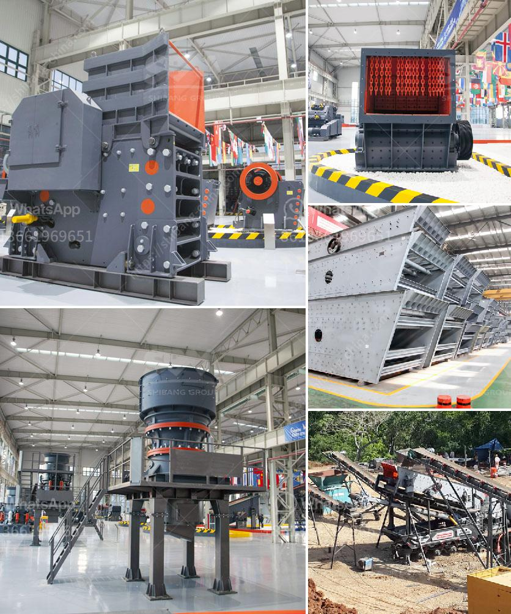

<h3>حجم مدخلات ومخرجات مصنع تكسير الكوارتز</h3>
يعد مصنع تكسير الكوارتز واحدًا من المصانع المهمة في صناعة المواد العازلة والتكنولوجية. يستخدم الكوارتز في تصنيع الزجاج والسيراميك والإلكترونيات والطاقة الشمسية والمواد الكيميائية وغيرها الكثير. لذلك، يتطلب مصنع تكسير الكوارتز حجم مدخلات ومخرجات كبيرة لتلبية احتياجات السوق واحتياجات الصناعات المختلفة.

يبدأ التكسير الأولي للكوارتز بعمليات تجهيز المادة الخام وتفتيتها إلى قطع صغيرة من الحجم المناسب للتكسير اللاحق. يتم ذلك باستخدام المواد الكيميائية أو العمليات الفيزيائية مثل الطحن والفرز. تتطلب هذه العمليات معدات متطورة مثل الكسارات والمطاحن والآلات الفاصلة وأنظمة التحكم المتقدمة.

بعد تجهيز المدخلات، يتم نقلها إلى مرحلة تكسير الكوارتز الفعلية. يتم ذلك عادة في كسارات بارزة من أجل تفتيت الكوارتز إلى جزيئات أصغر ومطابقة للمواصفات المطلوبة. يعتمد حجم المدخلات ومخرجات هذه المرحلة على الاحتياجات المحددة لعملائنا. فعلى سبيل المثال، تعتمد مدخلات مصنع تكسير الكوارتز على الكمية المطلوبة من الكوارتز المكسور وأيضًا على درجة النقاوة المطلوبة. وبناءً على ذلك، يتم ضبط معدات التكسير ونظم التحكم بحيث تتوافق مع هذه الاحتياجات.

بالنسبة للمخرجات، فإن حجمها يتطلب توافر قدرات خطوط الإنتاج الكبيرة. بمجرد تكسير الكوارتز، يتم فرز المنتجات وتصنيفها وفقًا للأحجام المطلوبة. يمكن أن تشمل المخرجات جزيئات الكوارتز المكسورة والركام الناشئ عن هذه العملية. يحتاج مصنع تكسير الكوارتز أيضًا إلى القدرة على إزالة الشوائب والشوائب الأخرى لضمان تحقيق جودة المنتج النهائي وفقًا للمعايير الصناعية والمواصفات المطلوبة.

مع زيادة الطلب على المنتجات المشتقة من الكوارتز وتقدم التكنولوجيا، فإن حجم مدخلات ومخرجات مصنع تكسير الكوارتز يزداد باستمرار. تستمر التطورات في مجال تكنولوجيا التكسير وزيادة الطلب تسهم في تطوير مصانع تكسير الكوارتز ذات القدرات الكبيرة والكفاءة العالية لتلبية الاحتياجات المتزايدة.
<h3>Contact us</h3><ul><li><strong>Whatsapp:&nbsp;<a href="https://wa.me/8613661969651">+8613661969651</a></strong></li><li><a href="https://swt.shibang-china.com/?git&amp;zhl&amp;حجم مدخلات ومخرجات مصنع تكسير الكوارتز"><strong>Online Service(chat now)</strong></a></li></ul><h3>Related</h3><ul><li><a href='معدات تعدين الفحم في جنوب أفريقيا.md'>معدات تعدين الفحم في جنوب أفريقيا</a></li><li><a href='مصنع تصنيع الدولوميت.md'>مصنع تصنيع الدولوميت</a></li><li><a href='مطحنة هامر للأسمنت.md'>مطحنة هامر للأسمنت</a></li><li><a href='شركة تصنيع كسارة الفك في إيطاليا.md'>شركة تصنيع كسارة الفك في إيطاليا</a></li><li><a href='آلة صنع الرمل في كينيا.md'>آلة صنع الرمل في كينيا</a></li></ul>