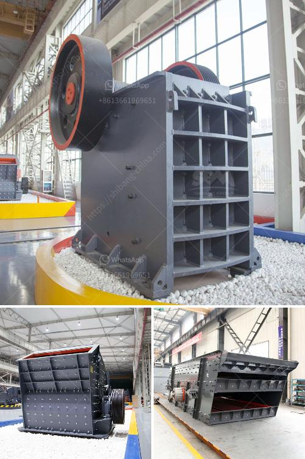

<h3>حجم منتج التغذية لكسارات المخروط</h3>
تعتبر كسارات المخروط من أهم الأدوات التي يتم استخدامها في صناعة التعدين والبناء. فهي تستخدم لسحق المواد الصلبة إلى حجم صغير قابل للتعامل والاستخدام في عمليات البناء والتصنيع الأخرى. واحدة من المعلمات الأساسية التي يجب اهتمامها عند استخدام كسارات المخروط هي حجم المنتج التي تنتجه وتغذيها هذه الكسارات.

تعتمد حجم منتج التغذية لكسارات المخروط على عدة عوامل، بما في ذلك حجم ونوع المواد التي تمرر إلى الكسارة والإعدادات المختلفة التي تضبطها. إعدادات الكسارة هي عملية تهدف إلى تحديد حجم المادة التي ترغب في سحقها والتأكد من تلبية احتياجاتك الخاصة.

حجم الفتحة التي يتم تعديلها في الكسارة هو ما يحدد حجم المنتج النهائي الذي تنتجه. يمكن تعديل هذه الفتحة بواسطة ضبط الربيعات أو الهياكل الهيدروليكية في الكسارة لتغيير حجم الفجوة بين القطعتين المتحركتين في الكسارة. بمجرد تغيير هذه الفجوة، ستتغير أيضًا حجم المواد التي تدخل الكسارة وبالتالي حجم المنتج الذي ستنتجه.

أثناء ضبط حجم المواد في كسارات المخروط، يمكن تحقيق مجموعة واسعة من الأحجام المنتجة باستخدام إعدادات مختلفة. من الأمثلة على بعض الأحجام المشتركة للمواد المنتجة هي 0-5 مم، 5-15 مم، 15-25 مم وهكذا. يعتمد الحجم النهائي المطلوب على الاستخدام المقصود للمادة المسحوقة ومتطلبات العميل المحددة.

تحقيق حجم منتج التغذية المناسبة لكسارات المخروط ضروري للتأكد من حصولك على المواد المنتجة ذات الجودة المطلوبة وفقًا لاحتياجاتك الخاصة. تغيير حجم المنتج المطلوب يمكن أن يتطلب تغييرات في إعدادات الكسارة، مما يتطلب فهمًا عميقًا للعمليات الفنية والانتقال بين المنتجات في صناعة التعدين والبناء.

يجب أن يتم توجيه حجم المنتج المطلوب بواسطة العوامل المحددة لكل تطبيق بالإضافة إلى الاهتمام بالتوازن بين رغبات العميل وإمكانيات الكسارة. بالتالي، يجب على الشركات المصنعة والمشغلين لكسارات المخروط ضبط إعدادات الكسارة بعناية لتحقيق حجم المنتج الأمثل وتلبية احتياجات العملاء بأفضل طريقة ممكنة.

في النهاية، يجب أن يتم اختيار حجم منتج التغذية التي تناسب تطبيقك الخاص بعناية للتأكد من الحصول على منتج نهائي ذو جودة عالية وفعالية أفضل في صناعة التعدين والبناء.
<h3>Contact us</h3><ul><li><strong>Whatsapp:&nbsp;<a href="https://wa.me/8613661969651">+8613661969651</a></strong></li><li><a href="https://swt.shibang-china.com/?git&amp;zhl&amp;حجم منتج التغذية لكسارات المخروط"><strong>Online Service(chat now)</strong></a></li></ul><h3>Related</h3><ul><li><a href='تجميع مصنع التكسير.md'>تجميع مصنع التكسير</a></li><li><a href='عمل كسارة الفك.md'>عمل كسارة الفك</a></li><li><a href='مصنع غسيل الرمال بسعة 50 طن في اليوم.md'>مصنع غسيل الرمال بسعة 50 طن في اليوم</a></li><li><a href='آلات مطحنة في جنوب أفريقيا.md'>آلات مطحنة في جنوب أفريقيا</a></li><li><a href='محطة كسارة في الفلبين.md'>محطة كسارة في الفلبين</a></li></ul>