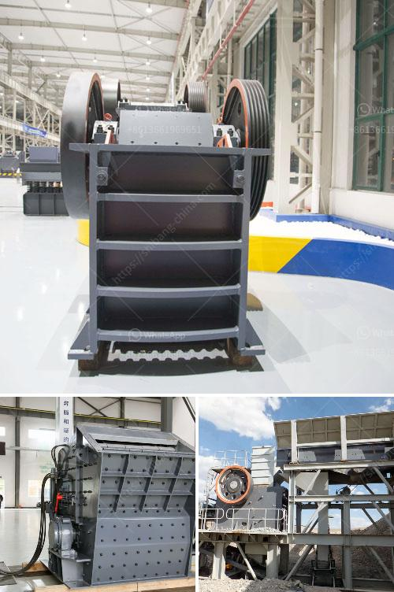

<h3>حجم وقدرة كسارة الفك النموذجية</h3>
تعتبر كسارة الفك النموذجية أحد أهم الأدوات المستخدمة في صناعة التعدين والبناء. تم تصميمها خصيصًا لتكسير المواد الصلبة مثل الصخور والحجارة والخامات المعدنية إلى حجم أصغر قابل للمعالجة.

إن حجم وقدرة كسارة الفك النموذجية تعتمد على العديد من العوامل المختلفة. يتم قياس حجم الكسارة بوحدة الفتحة العمودية، وهي المسافة بين الفكين العلوي والسفلي عند أقصى نقطة فتح الفكين. تختلف أحجام كسارات الفك النموذجية وفقًا لاحتياجات العملاء ومتطلبات المواد التي ستتم معالجتها. وتتراوح أحجامها عادة بين 600 مم و 1500 مم. وعادةً ما يكون كسارة الفك النموذجية بأحجام أكبر تمتاز بقدرة أعلى على معالجة المواد.

يعتمد أداء كسارة الفك النموذجية أيضًا على القدرة التي تتحملها. وتعتبر القدرة المقدرة كمية المواد التي يمكن للكسارة أن تسحقها خلال فترة زمنية محددة. تختلف قدرات الكسارات بناءً على النموذج والسرعة وعوامل أخرى، ولكن تتراوح عادة بين 30 طنًا في الساعة و600 طنًا في الساعة.

بالإضافة إلى الحجم والقدرة، تعتبر كسارة الفك النموذجية ميزة في العديد من الجوانب الأخرى. فهي تتميز ببساطة تصميمها وسهولة استخدامها، وتتضمن نظامًا لتغيير فتحة الفكين للتكيف مع متطلبات معالجة المواد المختلفة. كما تتميز بكفاءة عالية في تكسير المواد وإعادة تدويرها. وهي تعتبر أيضًا منخفضة التكلفة الصيانة مع قدرة عالية على التحمل والمتانة.

في النهاية، فإن حجم وقدرة كسارة الفك النموذجية تلعب دورًا حاسمًا في تحقيق الأداء الأمثل والكفاءة العالية في صناعة التعدين والبناء. يجب على المهندسين والمشترين تحديد تلك العوامل بناءً على المواد التي ستتم معالجتها ومتطلبات الإنتاج الخاصة بهم، مما يسهل الاختيار الأمثل لتلك المعدات ويضمن نجاح أعمالهم.
<h3>Contact us</h3><ul><li><strong>Whatsapp:&nbsp;<a href="https://wa.me/8613661969651">+8613661969651</a></strong></li><li><a href="https://swt.shibang-china.com/?git&amp;zhl&amp;حجم وقدرة كسارة الفك النموذجية"><strong>Online Service(chat now)</strong></a></li></ul><h3>Related</h3><ul><li><a href='شركة تصنيع مطحنة ريموند.md'>شركة تصنيع مطحنة ريموند</a></li><li><a href='مصنع تكسير الحجر الكلي في الصين.md'>مصنع تكسير الحجر الكلي في الصين</a></li><li><a href='كسارة الحجر وشاشة الاهتزاز للبيع.md'>كسارة الحجر وشاشة الاهتزاز للبيع</a></li><li><a href='كسارة الرخام إيطاليا.md'>كسارة الرخام إيطاليا</a></li><li><a href='مطحنة الفحم لطحن الأسطوانة.md'>مطحنة الفحم لطحن الأسطوانة</a></li></ul>