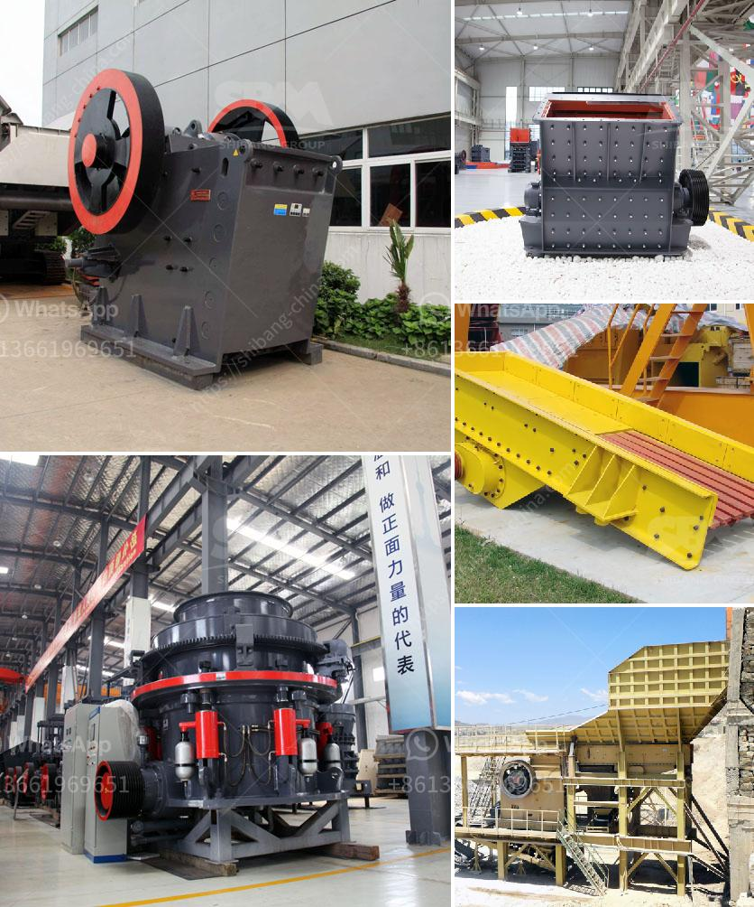

<h3>حدود اهتزاز مطحنة الكرة</h3>
تعتبر مطاحن الكرة ، المعروفة أيضًا باسم مطاحن الكرات الحبيبية ، واحدة من أهم الأجهزة في صناعة الطحن. تستخدم هذه الآلة لطحن المواد الخام إلى جسيمات صغيرة جدًا ، وهي تستخدم على نطاق واسع في مجالات مثل صناعة الأسمنت والمعادن والكيماويات وصناعة البناء وغيرها.

واحدة من المشاكل الرئيسية التي تطرأ عند استخدام مطحنة الكرة هي الاهتزازات غير المرغوبة التي تنشأ أثناء التشغيل. يمكن أن يؤدي الاهتزاز المفرط إلى تأثير سلبي على جودة الطحن وتآكل الآلة ، وقد يزيد من مخاطر الأعطال وفشل المعدات.

للتغلب على مشكلة الاهتزاز في مطحنة الكرة ، يجب تحديد حدود الاهتزاز المقبولة. يعتمد تحديد هذه الحدود على عدة عوامل مثل نوع المواد المطحونة وكمية الإنتاج وسرعة الدوران وحجم الكرات وحالة التوازن للجهاز وغيرها. عمومًا ، يمكن تحقيق تشغيل سلس وضمان استقرار أداء المطحنة عندما تكون الاهتزازات داخل الحدود المسموح بها.

من أجل تقييم مدى الاهتزاز ، يعتمد العديد من المشغلين على استخدام جهاز قياس اهتزازات لقياس الاهتزازات في الوقت الحقيقي. يمكن لهذا الجهاز تحديد القيم المطلوبة للتردد والتسارع والسرعة وفقًا للمعايير المحددة. عندما تتجاوز القراءات القيمة المحددة ، فإنه يلزم اتخاذ تدابير للتحكم في الاهتزازات ومنعها من الوصول إلى مستويات غير مقبولة.

تتضمن الإجراءات التي يمكن اتخاذها للتحكم في الاهتزازات مراقبة سرعة الدوران ، وتوازن الجهاز ، وتقوية الجهاز بواسطة مواد عازلة الاهتزاز ، وتطوير الهياكل المقاومة للتنصيل ، إلخ. بالإضافة إلى ذلك ، يجب ضبط المعلمات التشغيلية بعناية مثل مستوى حمولة المواد وتوازن كرات الطحن وكمية الزيت ودرجة حرارة العمل ، وهذا سيساعد في المحافظة على استقرار الكفاءة والأداء.

في الختام ، تحكم الاهتزاز في مطحنة الكرة يلعب دورًا حاسمًا في تأمين استقرار العملية وجودة الطحن. من خلال تحديد حدود الاهتزازات المقبولة واتخاذ التدابير اللازمة للتحكم في الاهتزازات ، يمكن تحقيق تشغيل سلس ومستقر ، وتقليل التآكل ومخاطر الأعطال في المطحنة.
<h3>Contact us</h3><ul><li><strong>Whatsapp:&nbsp;<a href="https://wa.me/8613661969651">+8613661969651</a></strong></li><li><a href="https://swt.shibang-china.com/?git&amp;zhl&amp;حدود اهتزاز مطحنة الكرة"><strong>Online Service(chat now)</strong></a></li></ul><h3>Related</h3><ul><li><a href='رسم بياني لعملية غسيل الرمال.md'>رسم بياني لعملية غسيل الرمال</a></li><li><a href='كسارة صغيرة متنقلة للحصى.md'>كسارة صغيرة متنقلة للحصى</a></li><li><a href='خطة عمل لإنتاج الطوب.md'>خطة عمل لإنتاج الطوب</a></li><li><a href='عمود المرفق لكسارة الفك.md'>عمود المرفق لكسارة الفك</a></li><li><a href='سعر آلة طاحونة الهامر.md'>سعر آلة طاحونة الهامر</a></li></ul>