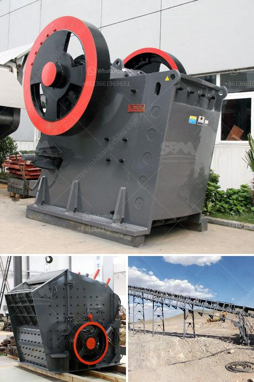

<h3>حساب تصميم مطحنة الكرة</h3>
تعد مطحنة الكرة أحد الأجزاء الرئيسية في عملية طحن المواد الصلبة، وتستخدم على نطاق واسع في العديد من الصناعات مثل صناعة الأسمنت والسيراميك والكيميائية. يكمن الهدف الرئيسي لتصميم مطحنة الكرة في تحقيق أقصى إنتاجية ممكنة مع الحفاظ على كفاءة العمل وجودة المنتج النهائي.

تصميم مطحنة الكرة يتطلب مجموعة من الاعتبارات التقنية التي يجب مراعاتها لتحقيق الأداء المثالي. أولاً وقبل كل شيء، يجب مراعاة حجم المطحنة حيث يجب أن يكون طولها وقطرها متناسبين بحيث يمكنها سحق المواد بشكل فعال دون أن تصبح طويلة أو ثقيلة جداً. يتم تحديد حجم المطحنة بناءً على كمية المواد المراد طحنها بالإضافة إلى المعلومات التقنية الأخرى.

ثانياً، تصميم مطحنة الكرة يتضمن اختيار المواد المناسبة للبناء. ينصح عادةً باستخدام مواد عالية الجودة والصلابة لتحقيق الأداء المثلى والتحمل العالي. يجب أن تتمكن المواد المستخدمة من تحمل التأثيرات الجانبية مثل الاحتكاك والتآكل الناتج عن عملية الطحن.

ثالثاً، أحد العوامل الأساسية في تصميم مطحنة الكرة هو تصميم النظام الهيدروليكي والتحكم في التدفق. يجب أن يتم تصميم النظام بطريقة تضمن توازنًا جيدًا بين معدل التدفق وقوة الضغط لضمان أن المادة المراد طحنها تتلقى الضغط الملائم والتدفق لتحقيق الطحن الفعال.

في الختام، تصميم مطحنة الكرة يعد عملية دقيقة ومعقدة تتطلب المعرفة التقنية والخبرة الكافية لتحقيق النجاح. يتطلب توازنًا مثاليًا بين الحجم والمواد ونظام التحكم لتحقيق أقصى استفادة من هذا الجهاز الرئيسي في عملية الطحن. يعود الاستثمار في تصميم مطحنة الكرة إلى قدرتها على تحقيق الإنتاجية العالية وجودة المنتج النهائي، مما يؤدي في النهاية إلى زيادة الربحية وتلبية احتياجات السوق.
<h3>Contact us</h3><ul><li><strong>Whatsapp:&nbsp;<a href="https://wa.me/8613661969651">+8613661969651</a></strong></li><li><a href="https://swt.shibang-china.com/?git&amp;zhl&amp;حساب تصميم مطحنة الكرة"><strong>Online Service(chat now)</strong></a></li></ul><h3>Related</h3><ul><li><a href='مصنع النحاس للبيع.md'>مصنع النحاس للبيع</a></li><li><a href='كسارات مخروط للإيجار في جنوب أفريقيا.md'>كسارات مخروط للإيجار في جنوب أفريقيا</a></li><li><a href='آلة كسارة البنتونيت.md'>آلة كسارة البنتونيت</a></li><li><a href='كسارة الفك الخرسانية.md'>كسارة الفك الخرسانية</a></li><li><a href='كسارة الصخور 250 طن في الساعة.md'>كسارة الصخور 250 طن في الساعة</a></li></ul>