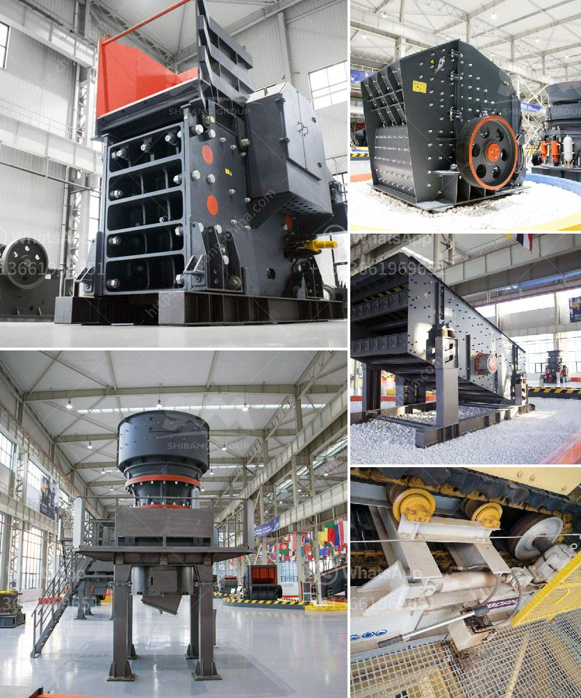

<h3>حساب تكلفة سحق الركام</h3>
يُعد سحق الركام عملية ضرورية لإعادة تدوير المواد البنائية واستخدامها مرة أخرى في مشاريع البناء والهندسة المدنية. تعتبر تكلفة سحق الركام عاملاً هامًا يؤثر على الاقتصادية والاستدامة للمشروع. سأقدم في هذا المقال نظرة عامة عن حساب تكلفة سحق الركام.

تكلفة سحق الركام تتأثر بعدة عوامل، بما في ذلك كمية الركام المراد سحقه وجودته والمسافة بين مصدر الركام وموقع السحق. بالإضافة إلى ذلك، يجب أيضًا مراعاة تكلفة المعدات المستخدمة في عملية السحق والعمالة المطلوبة.

أولًا، يجب تحديد حجم الركام المراد سحقه. وفقًا لحجم الركام، يمكن استخدام معدات سحق مختلفة مثل الكسارات الفكية أو الكسارات الصدمية. يعتمد الاختيار على عوامل مثل القوة التي يمكن أن تتحملها المواد المستخدمة في المشروع المستقبلي والاحتياجات المحددة للركام في المشروع.

ثانيًا، يجب أخذ جودة الركام في الاعتبار. يعتمد ذلك على نوع المواد المعاد تدويرها. بعض المواد قد تحتوي على شوائب كيميائية أو ملوثات قد تؤثر على جودة الركام. قد يتطلب ذلك مزيدًا من المعالجة أو الفرز للحصول على جودة مرغوبة من الركام.

ثالثًا، يجب احتساب المسافة بين مصدر الركام وموقع السحق. تتأثر تكلفة النقل بمسافة السفر. قد يكون من المناسب توفير معدات السحق في موقع الركام نفسه لتقليل تكاليف النقل والوقت.

رابعًا، يجب احتساب تكلفة المعدات والعمالة المطلوبة لعملية السحق. تختلف تكاليف المعدات اعتمادًا على نوع وحجم المعدات المستخدمة، بالإضافة إلى تكاليف الصيانة والتشغيل. يجب أيضًا احتساب تكلفة العمالة المطلوبة لتشغيل وصيانة المعدات وإدارة عملية السحق.

في الختام، يتضمن حساب تكلفة سحق الركام عدة عوامل مختلفة. يجب أخذ هذه العوامل في الاعتبار لتقدير التكلفة بشكل أكثر دقة وتحقيق الاقتصادية والاستدامة في المشروع. تعتبر التكنولوجيا المتقدمة لسحق الركام والتخطيط الجيد أيضًا عوامل مهمة لتقليل التكاليف وزيادة فعالية العملية بشكل عام.
<h3>Contact us</h3><ul><li><strong>Whatsapp:&nbsp;<a href="https://wa.me/8613661969651">+8613661969651</a></strong></li><li><a href="https://swt.shibang-china.com/?git&amp;zhl&amp;حساب تكلفة سحق الركام"><strong>Online Service(chat now)</strong></a></li></ul><h3>Related</h3><ul><li><a href='كرات كربونات الكالسيوم.md'>كرات كربونات الكالسيوم</a></li><li><a href='موردين لمعدات التعدين في جنوب أفريقيا.md'>موردين لمعدات التعدين في جنوب أفريقيا</a></li><li><a href='الفصل المغناطيسي لرمل خام الحديد.md'>الفصل المغناطيسي لرمل خام الحديد</a></li><li><a href='آلات صنع البودرة.md'>آلات صنع البودرة</a></li><li><a href='سحق الكلي ٢٠٠ طن في الساعة بمرحلتين.md'>سحق الكلي ٢٠٠ طن في الساعة بمرحلتين</a></li></ul>