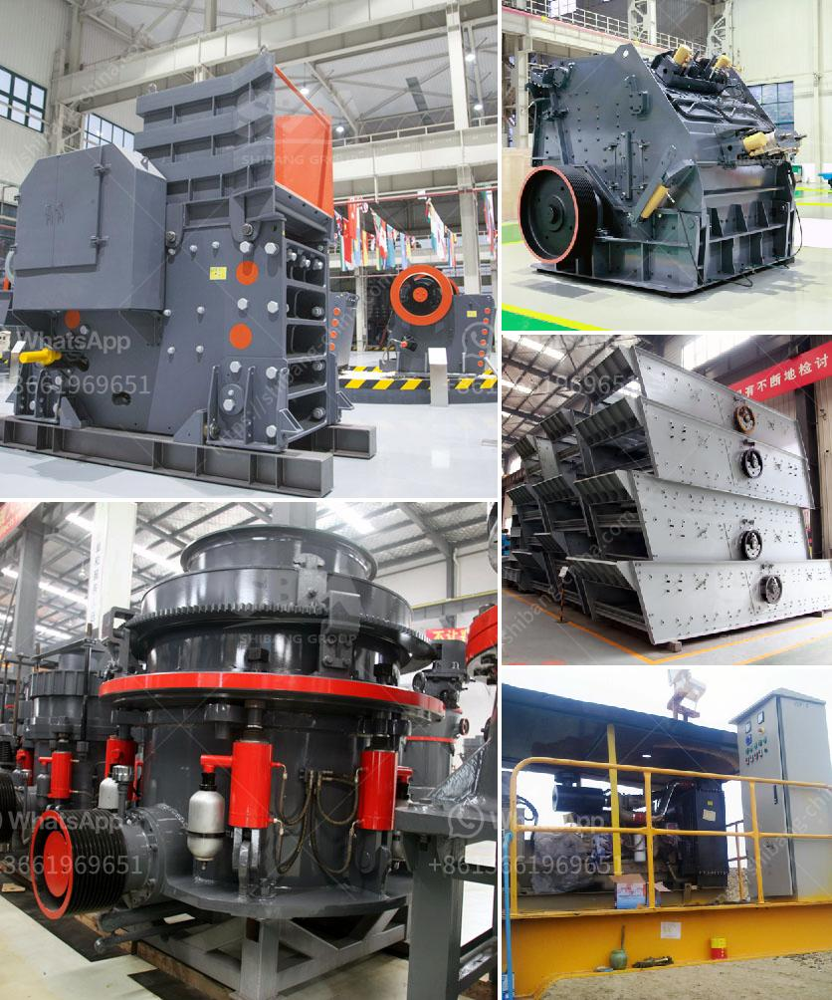

<h3>حساب دورة في الدقيقة التشغيلية لمطحنة الكرة</h3>
تُعد مطحنة الكرة أحد أهم الأجهزة المستخدمة في صناعة الطحن، حيث تستخدم لطحن المواد الصلبة إلى حجم جسيمات أصغر. وتعتبر الدورة في الدقيقة التشغيلية لمطحنة الكرة من العوامل الحاسمة في تحقيق كفاءة عملية الطحن والحصول على نتائج مطلوبة.

تعتمد الدورة في الدقيقة التشغيلية على سرعة دوران أسطوانة المطحنة وتسمى أيضًا "سرعة الطحن". ويتم قياسها بوحدة الدورة في الدقيقة (rpm). يُفضل استخدام قيمة دوران تتراوح بين 200 إلى 400 دورة في الدقيقة للحصول على أداء مثالي في عملية الطحن.

تحديد الدورة في الدقيقة التشغيلية المثلى لمطحنة الكرة يعتمد على عوامل عديدة، بما في ذلك خصائص المادة المراد طحنها وحجم الكرات المطحنة وحمولتها وقطر الأسطوانة وطولها. تُستخدم تجارب تجريبية متعددة في مختبرات البحث والتطوير لتحديد القيمة المناسبة للدورة في الدقيقة التشغيلية لمطحنة الكرة في كل حالة.

عند زيادة الدورة في الدقيقة التشغيلية، يزداد تعرض المادة لتأثير الكرات المطحنة، مما يتسبب في زيادة الطاقة المطلوبة للطحن وتسبب في زيادة حدة الاحتكاك وقدرة التحمل على المواد المطحونة. وعلى الجانب الآخر، عند تقليل الدورة في الدقيقة، يقل التأثير على المادة ويتسبب في تحقيق طحن غير كافٍ وعدم الحصول على الحجم النهائي المطلوب.

عادةً ما يُنصح بزيادة الدورة في الدقيقة التشغيلية لمطحنة الكرة عند طحن المواد الصلبة ذات القوام العالي والتي تتطلب طحنًا أكثر شدة. ويُستخدم بالعكس تقليل الدورة في الدقيقة للمواد الرطبة واللزجة للحفاظ على تشغيل مُستقر ومنع انسداد المطحنة.

باختصار، الدورة في الدقيقة التشغيلية هي عامل حاسم في عملية الطحن بمطحنة الكرة. يجب اختيار قيمة مناسبة لتلبية احتياجات العملية والمادة المطحونة وتحقيق أعلى كفاءة ممكنة. لذا، عند اختيار القيمة المُثلى للدورة في الدقيقة، يتعين النظر في العديد من العوامل المؤثرة وإجراء التجارب اللازمة لتحقيق أفضل النتائج والتحكم في العملية.
<h3>Contact us</h3><ul><li><strong>Whatsapp:&nbsp;<a href="https://wa.me/8613661969651">+8613661969651</a></strong></li><li><a href="https://swt.shibang-china.com/?git&amp;zhl&amp;حساب دورة في الدقيقة التشغيلية لمطحنة الكرة"><strong>Online Service(chat now)</strong></a></li></ul><h3>Related</h3><ul><li><a href='تكلفة وحدة طحن الأسمنت tpd كسارة.md'>تكلفة وحدة طحن الأسمنت tpd كسارة</a></li><li><a href='صانع كسارة في مدينة سيبو.md'>صانع كسارة في مدينة سيبو</a></li><li><a href='معدات طحن صناعية وأسعار معدات الطحن.md'>معدات طحن صناعية وأسعار معدات الطحن</a></li><li><a href='مواد مطحنة الهامر.md'>مواد مطحنة الهامر</a></li><li><a href='مطحنة كرات صغيرة لهنان الصين.md'>مطحنة كرات صغيرة لهنان الصين</a></li></ul>