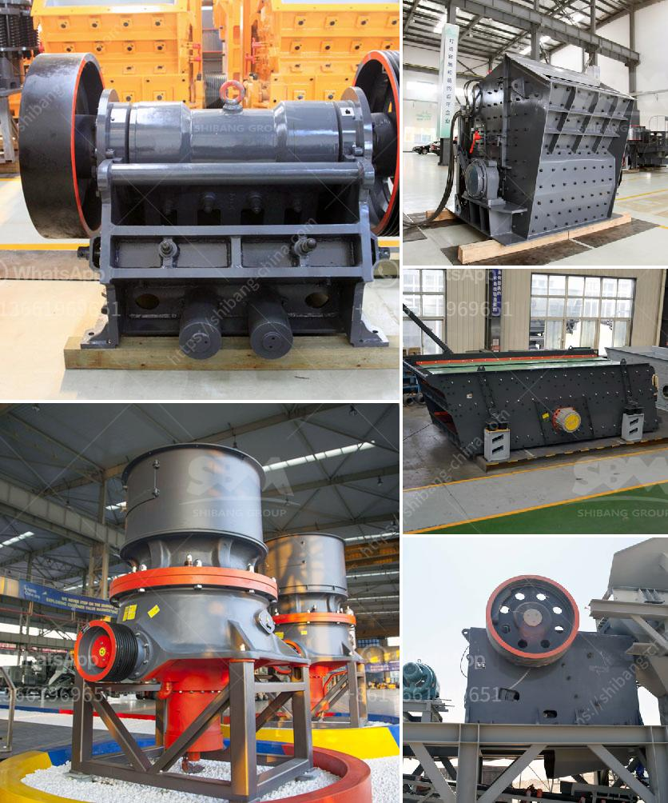

<h3>حساب سعة كسارة الأسطوانة</h3>
تعد كسارة الأسطوانة أحد الأدوات الهامة في صناعة التعدين ومجالات أخرى مثل صناعة البناء والطرق، حيث تستخدم لسحق المواد الخام إلى أجزاء أصغر وتمهيد الطريق لعمليات تصنيع أخرى. ويعد حساب سعة كسارة الأسطوانة من أهم العوامل التي يجب مراعاتها عند اختيار وشراء الكسارة المناسبة، حيث تساعد في تحديد كمية المواد التي يمكن أن تمر عبر الكسارة في وحدة زمنية محددة.

تعتمد سعة كسارة الأسطوانة على عدة عوامل، بدءًا من قطر الأسطوانة نفسها وطولها. فبشكل عام، يمكن القول أن زيادة قطر الأسطوانة يؤدي إلى زيادة سعة الكسارة، حيث يمكن لمواد أكبر الحجم أن تمر فيها بسهولة. أما بالنسبة لطول الأسطوانة، فقد تكون هناك نقطة حدية، حيث يمكن أن يؤدي طول زائد إلى أقل كفاءة وزيادة في استهلاك الطاقة.

بالإضافة إلى القطر والطول، هناك عوامل أخرى يجب أخذها في الاعتبار عند حساب سعة الكسارة الأسطوانة. على سبيل المثال، يمكن لزاوية الميل أن تؤثر في سعة الكسارة، حيث يمكن أن تسمح للمواد بالانزلاق بسهولة في حالة المقصورة. كما يمكن لسرعة الأسطوانة أن تؤثر في سعة الكسارة، حيث تتحكم في كمية المواد التي يمكن أن تمر في وحدة الزمن.

بالاعتماد على هذه العوامل، يمكن حساب سعة كسارة الأسطوانة باتباع الخطوات التالية: 

1. حساب حجم المقصورة بواسطة قطر وطول الأسطوانة وزاوية الميل.

2. حساب سرعة الأسطوانة بواسطة القوة الحصانية والعزم وسرعة الدوران.

3. ضرب حجم المقصورة في سرعة الأسطوانة للحصول على سعة الكسارة.

يجب أن يتم حساب سعة الكسارة بعناية واختيار الأبعاد والمواصفات المناسبة للتطبيق المراد استخدام الكسارة فيه. أيضًا يجب مراعاة المتطلبات البيئية والسلامة وتكاليف الصيانة والتشغيل عند اختيار الكسارة المناسبة للمشروع.

في الختام، تعتبر حساب سعة كسارة الأسطوانة عنصرًا أساسيًا يجب مراعاته لضمان كفاءة عملية السحق وتحقيق الأداء المثلى. ومن المهم القيام بحساب دقيق لسعة الكسارة لتلبية احتياجات المشروع المحددة وتحقيق أفضل نتائج على المدى الطويل.
<h3>Contact us</h3><ul><li><strong>Whatsapp:&nbsp;<a href="https://wa.me/8613661969651">+8613661969651</a></strong></li><li><a href="https://swt.shibang-china.com/?git&amp;zhl&amp;حساب سعة كسارة الأسطوانة"><strong>Online Service(chat now)</strong></a></li></ul><h3>Related</h3><ul><li><a href='موردين مطحنة الأسطوانة الرأسية.md'>موردين مطحنة الأسطوانة الرأسية</a></li><li><a href='كسارات لآلة إعادة التدوير في الإمارات.md'>كسارات لآلة إعادة التدوير في الإمارات</a></li><li><a href='كسارة الكرة.md'>كسارة الكرة</a></li><li><a href='مصانع مطاحن الأسمنت.md'>مصانع مطاحن الأسمنت</a></li><li><a href='تكلفة مصنع لوحات الجبس في الهند.md'>تكلفة مصنع لوحات الجبس في الهند</a></li></ul>