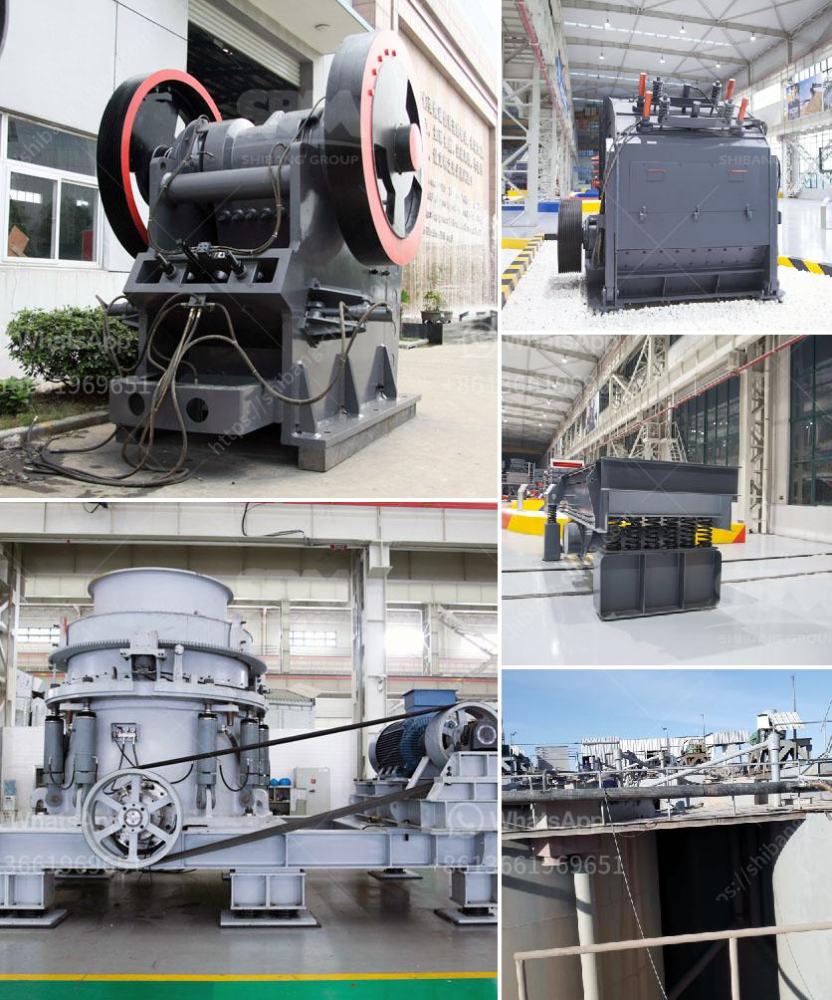

<h3>حساب قطر كرة الطحن لمطحنة الكرة</h3>
تُعد مطاحن الكرة أحد أنواع المعدات المستخدمة في صناعة الطحن، وتعمل على طحن المواد الصلبة إلى قطع صغيرة بواسطة كرات ثقيلة من الصلب المقاوم للتآكل. ولتحقيق أفضل نتائج الطحن في مطحنة الكرة، يجب أن يتم اختيار قطر الكرات المناسب.

يُعد حساب قطر كرة الطحن لمطحنة الكرة عملية هامة لتحقيق الطحن الفعال. يعتمد هذا الحساب على عوامل عديدة، بما في ذلك نوع المادة المراد طحنها وحجمها الأصلي والحجم المطلوب النهائي، فضلاً عن سرعة دوران المطحنة الكروية ومعامل الامتلاء.

عندما يكون لدينا مادة صلبة كبيرة الحجم ونريد تحويلها إلى جسيمات صغيرة، يجب استخدام كرات طحن كبيرة القطر. إذا كانت جسيمات المواد الأولية صغيرة الحجم، فيمكن استخدام كرات طحن ذات قطر صغير. تعتبر العينة وجسيمات الطحن المطلوبة أيضًا عوامل مهمة في تحديد حجم قطر الكرة المناسبة.

علاوة على ذلك، يعتمد حساب قطر الكرة على العوامل الفنية للمطحنة الكروية نفسها. على سبيل المثال، يلعب نسبة الحجم إلى القطر الداخلي للمطحنة في تحديد حجم الكرات المناسبة دورًا هامًا، حيث يجب أن يكون هناك فراغ كافٍ بين الكرات داخل المطحنة لتسهيل حركتها وتدفق المادة الخام.

بعد حساب قطر الكرة المناسب، يجب اختيار الكرات ذات الجودة العالية والصلب المقاوم للتآكل، لأن تآكل الكرات يؤدي إلى تدهور كفاءة الطحن وتجعلها غير صالحة للاستخدام على المدى الطويل.

لخلاصة، حساب قطر كرة الطحن لمطحنة الكرة هو عملية أساسية في صناعة الطحن. يتطلب هذا الحساب معرفة نوع المادة المراد طحنها وحجمها الأصلي والحجم المطلوب النهائي، بالإضافة إلى عوامل التشغيل والمعاملات التقنية للمطحنة الكروية. يجب أن يتم تحديد قطر الكرة بعناية لتحقيق أفضل نتائج الطحن وتجنب أي مشاكل تقنية تؤثر على الكفاءة وجودة الإنتاج.
<h3>Contact us</h3><ul><li><strong>Whatsapp:&nbsp;<a href="https://wa.me/8613661969651">+8613661969651</a></strong></li><li><a href="https://swt.shibang-china.com/?git&amp;zhl&amp;حساب قطر كرة الطحن لمطحنة الكرة"><strong>Online Service(chat now)</strong></a></li></ul><h3>Related</h3><ul><li><a href='وزن آلة كسارة الصخور.md'>وزن آلة كسارة الصخور</a></li><li><a href='مطاحن الكرة لتعدين ٦ × ٦.md'>مطاحن الكرة لتعدين ٦ × ٦</a></li><li><a href='سحق مصنع لخام الحديد.md'>سحق مصنع لخام الحديد</a></li><li><a href='كيفية تحديد سعة سير الناقل.md'>كيفية تحديد سعة سير الناقل</a></li><li><a href='بيع كسارة الحجر.md'>بيع كسارة الحجر</a></li></ul>