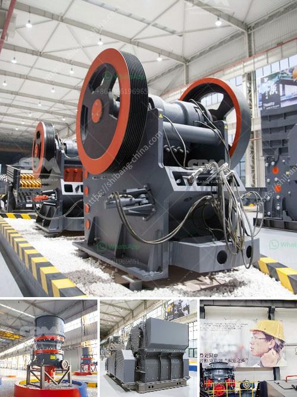

<h3>حساب كسارة الفحم</h3>
تعدّ الكسارات من الأدوات الهامة في عمليات التعدين والبناء، وأحد الأنواع المختلفة للكسارات هي كسارة الفحم. تُستخدم كسارة الفحم لسحق قطع الفحم الخام للحجم المطلوب قبل استخدامه في عمليات التحبير أو الاستخدام الصناعي الآخر.

تتكون كسارة الفحم من بعض العناصر الرئيسية المهمة، مثل الفك المتحرك والثابت، وجهاز الضغط هيدروليكي، والمحرك الكهربائي. تعتمد عملية الكسر على تطبيق قوة ميكانيكية على الفحم الخام الذي يتم تحميله في فتحة الفك. يتم تحريك الفك المتحرك بحيث يمكن تحطيم الفحم بسهولة وجعله يمر عبر فتحة الفك الثابت. يمكن للضغط الهيدروليكي المحكم ضبط حجم المنتجات المفحومة.

في مصانع توليد الطاقة التي تعتمد على الفحم، يتم استخدام كسارات الفحم لسحق الفحم إلى حجم صغير يسهل حرقه في المراجل. وتساعد كسارات الفحم في ضمان توزيع متساوٍ للفحم في النظام ومنع تراكم الفحم في المرجل. بالإضافة إلى ذلك، يؤدّي استخدام كسارات الفحم إلى زيادة كفاءة حرق الفحم وتقليل الانبعاثات الضارة إلى البيئة.

تستخدم كسارات الفحم أيضًا في صناعات أخرى مثل صناعة الحديد والصلب والأسمنت، حيث يتم استخدام الفحم المسحوق كمواد خام أساسية. يتم سحق قطع الفحم الخام الكبيرة باستخدام الكسارات لتحقيق حجم صغير يتناسب مع متطلبات الإنتاج.

بالخلاصة، تحتاج صناعات مختلفة مثل البناء والتعدين وصناعة الحديد والصلب والأسمنت إلى كسارات الفحم لغرض سحق قطع الفحم الخام وتحجيمها وتحسين جودتها. تُعتبر كسارة الفحم أداة حيوية في هذه الصناعات وتسهم في تحسين الكفاءة والإنتاجية.
<h3>Contact us</h3><ul><li><strong>Whatsapp:&nbsp;<a href="https://wa.me/8613661969651">+8613661969651</a></strong></li><li><a href="https://swt.shibang-china.com/?git&amp;zhl&amp;حساب كسارة الفحم"><strong>Online Service(chat now)</strong></a></li></ul><h3>Related</h3><ul><li><a href='آلات معالجة الكاولين للبيع.md'>آلات معالجة الكاولين للبيع</a></li><li><a href='حجم كرات الطحن في مطحنة الكرة لطحن الكوارتز.md'>حجم كرات الطحن في مطحنة الكرة لطحن الكوارتز</a></li><li><a href='مصنع معالجة الذهب آلة كسارة الحجر التركية.md'>مصنع معالجة الذهب آلة كسارة الحجر التركية</a></li><li><a href='تسعير حزام الناقل في ماليزيا.md'>تسعير حزام الناقل في ماليزيا</a></li><li><a href='أحزمة ناقلة الشيفرون في الفلبين.md'>أحزمة ناقلة الشيفرون في الفلبين</a></li></ul>