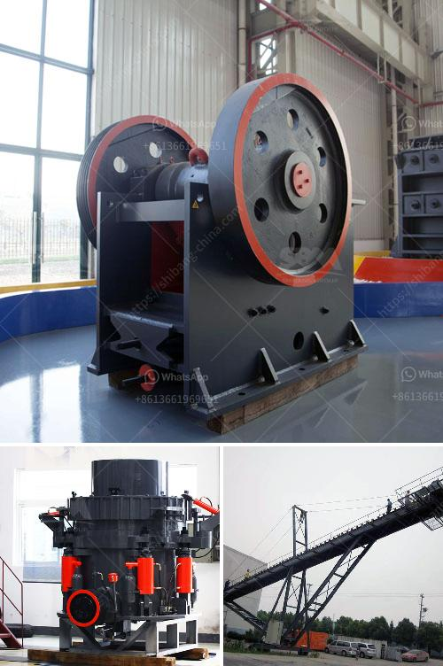

<h3>حسابات تصميم مجفف دوار</h3>
تُستخدم العديد من الصناعات المختلفة مجففات الدوار لتجفيف المواد الصلبة، وهي أجهزة حرارية تُستخدم لتحويل المواد الرطبة إلى مسحوق أو حبيبات جافة. يتميز التصميم الجيد لمجفف الدوار بالقدرة على تحقيق توازن بين سرعة التجفيف وجودة المنتج النهائي مع تقليل تكلفة الطاقة المستهلكة ومتطلبات الصيانة.

تقوم حسابات التصميم لمجفف الدوار على عدة معايير. أولاً، يتطلب الأمر تحديد كمية المادة المراد تجفيفها في الوقت المحدد وكمية المذيب التي ستستخدم. بالإضافة إلى ذلك، يجب معرفة البيانات الفيزيائية للمواد التي تساهم في عملية التجفيف، مثل اللزوجة ودرجة الحرارة والحجم النسبي.

تشمل حسابات التصميم أيضًا المتطلبات الحرارية، حيث يتم تحديد كمية الطاقة الحرارية اللازمة لإزالة الماء المتبقي في المواد. يتم حساب القدرة الحرارية المطلوبة بناءً على كمية الماء التي يجب إزالتها ودرجة حرارة المادة البادئة والوجهة.

بعد ذلك، يتم تصميم المجفف الدوار من حيث حجم الأسطوانة الداخلية للجهاز وسرعة تدويره. يتأثر حجم الأسطوانة بكمية المادة المراد تجفيفها وتأثيرها على معدل نقل الحرارة والذي يؤثر في جودة المنتج النهائي. من ناحية أخرى، تحدد سرعة تدوير المجفف الدوار وفترة المكوث بناءً على نسبة المذيب إلى المادة، حيث أن زيادة سرعة الدوران ستقلل من فترة المكوث وبالتالي ستزيد من كفاءة التجفيف.

في النهاية، يُعتبر تصميم مجفف الدوار عملية هامة ومعقدة تتطلب المعرفة المتخصصة في مجال التصميم والهندسة الحرارية. يجب أخذ العديد من العوامل في الاعتبار أثناء حسابات التصميم مثل كمية المادة المراد تجفيفها، البيانات الفيزيائية للمواد، الحرارة المطلوبة، وعوامل التحكم في السرعة والمكوث. تُستخدم هذه الحسابات للوصول إلى توازن مثالي بين جودة المنتج النهائي وتحسين كفاءة التجفيف وتقليل التكلفة العامة للعملية.
<h3>Contact us</h3><ul><li><strong>Whatsapp:&nbsp;<a href="https://wa.me/8613661969651">+8613661969651</a></strong></li><li><a href="https://swt.shibang-china.com/?git&amp;zhl&amp;حسابات تصميم مجفف دوار"><strong>Online Service(chat now)</strong></a></li></ul><h3>Related</h3><ul><li><a href='أسعار وحدات طحن الكلنكر.md'>أسعار وحدات طحن الكلنكر</a></li><li><a href='عملية الكرة الطحن.md'>عملية الكرة الطحن</a></li><li><a href='مصنع تكسير الدولوميت في بهاروتش.md'>مصنع تكسير الدولوميت في بهاروتش</a></li><li><a href='مصنع آلات كسارة الحجر الماسي في الهند.md'>مصنع آلات كسارة الحجر الماسي في الهند</a></li><li><a href='قائمة أسعار كسارة الحجر بسعة 300 طن في الساعة.md'>قائمة أسعار كسارة الحجر بسعة 300 طن في الساعة</a></li></ul>