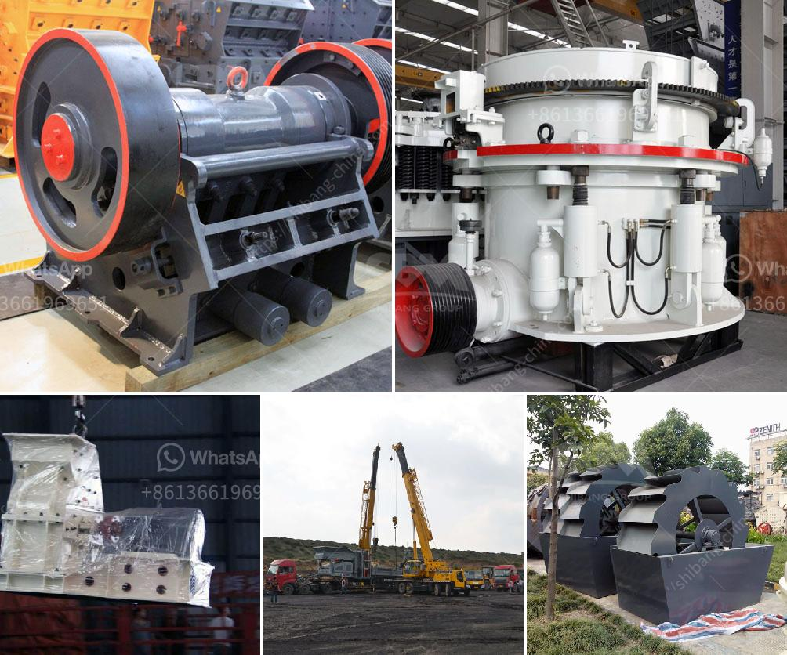

<h3>حسابات في مطحنة الأسطوانة العمودية</h3>
تعتبر مطاحن الأسطوانة العمودية من أحدث التقنيات المستخدمة في صناعة الطحن. تعمل هذه المطاحن على تكسير وطحن المواد الخام مثل الفحم والحجر الجيري والكوك والكلنكر، وتستخدم في إنتاج الأسمنت والمواد اللازمة لصناعة الطابوق والزجاج والأسمدة.

تتميز مطاحن الأسطوانة العمودية بعدة ميزات تجعلها أكثر كفاءة من غيرها من أنواع المطاحن. فهي تعمل بنظام ثلاثي الأبعاد، مما يعني أنها تشتمل على ثلاثة أسطوانات متراصة فوق بعضها البعض. تدور الأسطوانات بسرعة وتقوم بطحن المواد الخام بفضل القوة المحورية المولدة من المحرك المدمج في المطحنة. يتم تغذية المواد الخام من أعلى المطحنة وتمر بين الأسطوانات، حيث تتم طحنها وتنتقل على شكل مسحوق ناعم إلى الجزء السفلي من المطحنة.

إحدى الفوائد الرئيسية لمطاحن الأسطوانة العمودية هو استغلال كامل للمواد الخام. فهي تعمل بكفاءة عالية في طحن المواد الصلبة والهشة، حيث يتم تقليل عملية التكسير إلى أجزاء صغيرة وتحسين تفتت الجسيمات. بالإضافة إلى ذلك، فإن المطاحن العمودية تقلل من استهلاك الطاقة وتحافظ على أداء مستقر ومتوازن طوال فترات التشغيل الطويلة.

تتميز مطاحن الأسطوانة العمودية أيضًا بقدرتها على تكييف الإعدادات والحسابات وفقًا لمتطلبات الإنتاج المختلفة. يمكن تعديل سرعة الأسطوانة وضغط الطحن وتدفق المواد الخام، مما يتيح للمطحنة التكيف مع المتطلبات المحددة. هذه الحسابات تساعد في تحقيق الكفاءة الأمثل للمطحنة وتقليل استهلاك الوقود وزيادة إنتاجية الطحن.

باختصار، تعتبر مطاحن الأسطوانة العمودية حلاً فعالًا في صناعة الطحن. تعمل بكفاءة وتتيح استغلالًا مثاليًا للمواد الخام وتوفر نتائج متفوقة في الطحن. إن تطور هذه التكنولوجيا يساهم في تحسين جودة المنتج النهائي وتقليل تكاليف الإنتاج للصناعات العديدة.
<h3>Contact us</h3><ul><li><strong>Whatsapp:&nbsp;<a href="https://wa.me/8613661969651">+8613661969651</a></strong></li><li><a href="https://swt.shibang-china.com/?git&amp;zhl&amp;حسابات في مطحنة الأسطوانة العمودية"><strong>Online Service(chat now)</strong></a></li></ul><h3>Related</h3><ul><li><a href='كسارات في المملكة العربية السعودية.md'>كسارات في المملكة العربية السعودية</a></li><li><a href='سعر معدات الطحن 250 طن.md'>سعر معدات الطحن 250 طن</a></li><li><a href='كم تكلف تراخيص التعدين على الذهب في نيجيريا.md'>كم تكلف تراخيص التعدين على الذهب في نيجيريا</a></li><li><a href='كسارة الفك في نيبال للبيع.md'>كسارة الفك في نيبال للبيع</a></li><li><a href='مطحنة أسطوانية عمودية للفحم.md'>مطحنة أسطوانية عمودية للفحم</a></li></ul>