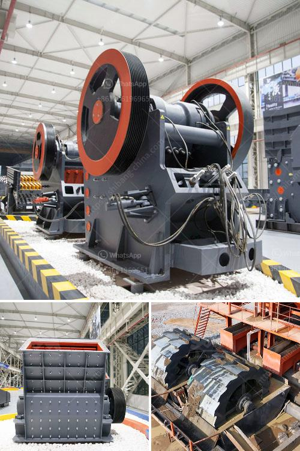

<h3>حفارات مستعملة للبيع في نيجيريا</h3>
تعتبر حفارات المستعملة من الأدوات الهامة في صناعة البناء والحفر، حيث تساعد في تنفيذ المشاريع الكبيرة بكفاءة عالية وتكاليف منخفضة. ومن بين الدول التي تتمتع بسوق قوي لبيع وشراء حفارات المستعملة هي نيجيريا.

نيجيريا، وهي واحدة من أكبر الدول في إفريقيا، تشهد نمواً سريعاً في قطاع البناء والبنية التحتية، مما يؤدي إلى طلب متزايد على معدات الحفر. لذلك، فإن الحفارات المستعملة تعد خيارًا جيدًا واقتصاديًا للشركات والمقاولين في نيجيريا.

توفر الحفارات المستعملة في نيجيريا تشكيلة متنوعة من الموديلات والأحجام والعلامات التجارية. يمكن العثور على حفارات صغيرة الحجم تبدأ من 2 طن وتصل إلى حفارات ثقيلة الحجم تصل إلى 50 طنًا. بالإضافة إلى ذلك، هناك أيضًا خيارات متعددة فيما يتعلق بأنواع المحركات وأنظمة الهيدروليك وعمر الماكينة والاكسسوارات المرافقة.

يمكن للشركات والمقاولين الاستفادة من شراء حفارة مستعملة بسبب تكلفتها المنخفضة مقارنةً بالحفارات الجديدة. بالإضافة إلى ذلك، فإن الحفارات المستعملة قد تكون متاحة بشكل أسرع وبدون فترة انتظار طويلة التي تكون مطلوبة لتجهيز الحفارات الجديدة.

بالطبع، من المهم أن يتعامل المشتريون مع بائعين موثوقين وموثوقين من أجل ضمان الحصول على حفارة مستعملة ذات جودة جيدة. يجب على المشترين التحقق من سجلات صيانة الحفارة، وفحص الحالة الميكانيكية والهيدروليكية والكهربائية للماكينة قبل الشراء. ينصح بإحضار فنيين متخصصين لتقييم الحفارة قبل اتخاذ قرار الشراء.

تتوفر الحفارات المستعملة للبيع في نيجيريا في العديد من المواقع عبر الإنترنت، التي تقدم صورًا وتفاصيل عن الماكينة بما في ذلك السعر والمواصفات. يمكن للمشترين التواصل مع البائعين وترتيب زيارة لفحص الحفارة قبل الشراء.

بشكل عام، تعتبر حفارات المستعملة خيارًا جديرًا بالنظر للشركات والمقاولين في نيجيريا الذين يرغبون في تحقيق الكفاءة وتوفير التكاليف في مشاريع البناء والحفر. فهي تقدم أداءًا موثوقًا وجودة متسقة وفعالية في استخدام الوقود، مما يساهم في تحقيق النجاح والازدهار في هذا القطاع الحيوي في نيجيريا.
<h3>Contact us</h3><ul><li><strong>Whatsapp:&nbsp;<a href="https://wa.me/8613661969651">+8613661969651</a></strong></li><li><a href="https://swt.shibang-china.com/?git&amp;zhl&amp;حفارات مستعملة للبيع في نيجيريا"><strong>Online Service(chat now)</strong></a></li></ul><h3>Related</h3><ul><li><a href='مصنع الإسمنت الصغير المصنوع في الصين.md'>مصنع الإسمنت الصغير المصنوع في الصين</a></li><li><a href='كيفية بدء عمل في مجال صناعة الكتل الخرسانية.md'>كيفية بدء عمل في مجال صناعة الكتل الخرسانية</a></li><li><a href='مطحنة طحن ألمانية.md'>مطحنة طحن ألمانية</a></li><li><a href='مصنعي مطاحن الرايموند في الهند.md'>مصنعي مطاحن الرايموند في الهند</a></li><li><a href='مطحنة رطبة في الصين.md'>مطحنة رطبة في الصين</a></li></ul>