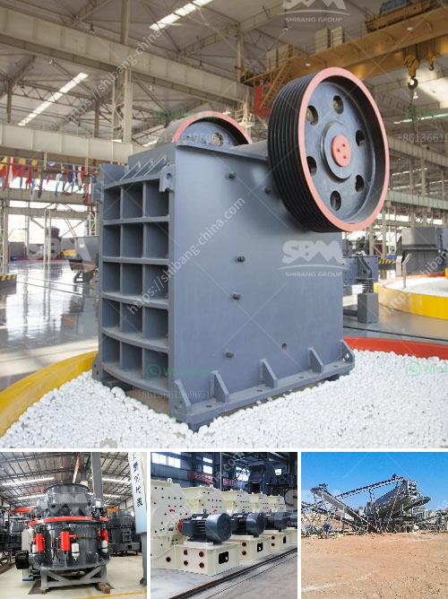

<h3>حول شركة تكسير الفحم في إثيوبيا</h3>
تعتبر تكسير الفحم من الصناعات الحيوية التي تساهم في توفير الطاقة المهمة في العديد من القطاعات الصناعية والتجارية. وتعتبر إثيوبيا واحدة من الدول التي تمتلك احتياطيات ضخمة من الفحم، مما يجعلها موطنًا محتملاً لشركات تكسير الفحم.

تأسست شركة تكسير الفحم في إثيوبيا في عام 2010 بهدف توفير الفحم المكسر للمستهلكين المحليين والاستفادة من الموارد الطبيعية الوفيرة المتاحة في البلاد. تم تشييد مصنع يحتوي على أحدث التقنيات والمعدات لتكسير الفحم بطريقة فعالة وصديقة للبيئة.

تتبع الشركة الممارسات العالمية في مجال حماية البيئة والسلامة، حيث تعمل على تحسين عملياتها للحفاظ على البيئة وتقليل التأثيرات السلبية على المحيط الطبيعي المحيط بها. تم اعتماد نظام متكامل لإدارة الجودة وسلامة العاملين والحفاظ على البيئة وفقًا للمعايير العالمية.

تقوم شركة تكسير الفحم في إثيوبيا بتوظيف فريق عمل مؤهل ومدرب بشكل جيد، حيث يتم اختيار الموظفين بعناية وتدريبهم على آخر التقنيات والمعايير الصناعية. تعمل الشركة على توفير بيئة عمل آمنة ومريحة للموظفين، حيث قد تم تجهيز المصنع بأحدث التقنيات الصناعية لتحسين كفاءة العمل وخفض مستوى الحوادث والإصابات.

تمتلك شركة تكسير الفحم في إثيوبيا عملاء محليين وعالميين، حيث تقدم منتجات ذات جودة عالية وخدمة عملاء ممتازة. يتم تسويق المنتجات في الأسواق المحلية وكذلك التصدير إلى العديد من الدول الأخرى. تعتبر الشركة رائدة في صناعة تكسير الفحم في المنطقة، حيث تتميز بجودة المنتج والمصداقية والتسليم في المواعيد المحددة.

من الجدير بالذكر أن شركة تكسير الفحم في إثيوبيا تساهم بشكل كبير في تحقيق التنمية المستدامة للبلاد، حيث تسهم في توفير فرص العمل للمواطنين وتعزز النشاط الاقتصادي وتسهم في زيادة النمو الاقتصادي المستدام.

وفي الختام، فإن شركة تكسير الفحم في إثيوبيا تعتبر واحدة من أهم الشركات في قطاع الفحم، حيث تعمل على تلبية احتياجات السوق المحلية والعالمية وتحقيق التنمية المستدامة. تعمل الشركة بمعايير عالمية من حيث الجودة والسلامة والحفاظ على البيئة، وتسعى دائمًا إلى تطوير وتحسين أدائها لتكون الشركة الأفضل في مجال تكسير الفحم.
<h3>Contact us</h3><ul><li><strong>Whatsapp:&nbsp;<a href="https://wa.me/8613661969651">+8613661969651</a></strong></li><li><a href="https://swt.shibang-china.com/?git&amp;zhl&amp;حول شركة تكسير الفحم في إثيوبيا"><strong>Online Service(chat now)</strong></a></li></ul><h3>Related</h3><ul><li><a href='قائمة أسعار كسارة الجرانيت.md'>قائمة أسعار كسارة الجرانيت</a></li><li><a href='تكنولوجيا معالجة الطين الصيني.md'>تكنولوجيا معالجة الطين الصيني</a></li><li><a href='غسيل الرمال الصغيرة.md'>غسيل الرمال الصغيرة</a></li><li><a href='معدات خط إنتاج كبريتات المغنيسيوم.md'>معدات خط إنتاج كبريتات المغنيسيوم</a></li><li><a href='مصانع غسيل الذهب للبيع في غانا.md'>مصانع غسيل الذهب للبيع في غانا</a></li></ul>