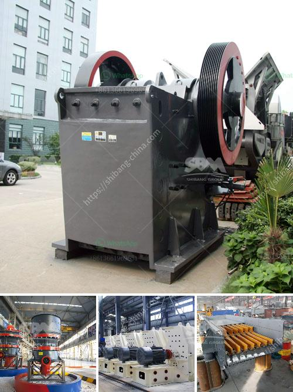

<h3>حول مصنع سحق الصخور</h3>
يعد مصنع سحق الصخور من المصانع الهامة في صناعة البناء والتشييد، حيث يقوم بسحق الصخور الكبيرة وتحويلها إلى جزيئات صغيرة يمكن استخدامها في بناء المباني والطرق والجسور وغيرها من المشاريع الهندسية الكبيرة.

يتكون المصنع من معدات وآلات متعددة تعمل بشكل متسق لتحقيق عملية السحق بشكل فعال وسريع. تشمل هذه المعدات الكسارات، والمطاحن، والغرابيل، والناقلات اللولبية، وكسارات الصدم، وغيرها العديد من الأجهزة اللازمة لتحقيق عملية السحق.

عملية السحق تبدأ بوضع الصخور الكبيرة في الكسارة الأولية، حيث يتم تقليص حجم الصخور بفضل الأسنان الموجودة على الكسارة. يتم تفريغ الصخور المكسورة في المطاحن، حيث يتم طحنها إلى جزيئات صغيرة جدًا. بعد ذلك، يتم فصل الجزيئات المكسورة حسب الحجم المطلوب باستخدام الغرابيل. تنقل الجزيئات ذات الحجم المناسب عبر الناقلات اللولبية إلى الكسارات الثانوية وتكرر نفس العملية لحصول على جزيئات صغيرة أكثر.

يوفر مصنع سحق الصخور مزايا عديدة للمقاولين ومطوري المشاريع الهندسية، حيث يمكنه توفير المواد اللازمة للبناء بكميات كبيرة وبتكلفة منخفضة. كما أنه يحسن من جودة الخرسانة المنتجة ويزيد من المتانة والمتانة العامة للمباني. بالإضافة إلى ذلك، يقلل مصنع سحق الصخور من الحاجة إلى استخراج المواد الطبيعية مما يقلل من تأثير الصناعة على البيئة.

مصانع سحق الصخور تأتي بمختلف القدرات والقدرات المختلفة. يمكن أن تتراوح القدرات من 50 إلى 1000 طن في الساعة، حسب حجم المشروع واحتياجات المقاولين. يتطلب تشغيل هذه المصانع الإلمام بالتكنولوجيا المستخدمة والتعامل الآمن مع الآلات، وبالتالي يحتاج إلى فريق مؤهل ومدرب للعمل فيه.

في الختام، يمكن القول إن مصانع سحق الصخور تلعب دورًا حاسمًا في تلبية احتياجات صناعة البناء والتشييد. تعد هذه المصانع مصدرًا مهمًا للمواد الأساسية للمشاريع الهندسية وتحسين الجودة والكفاءة في البناء.
<h3>Contact us</h3><ul><li><strong>Whatsapp:&nbsp;<a href="https://wa.me/8613661969651">+8613661969651</a></strong></li><li><a href="https://swt.shibang-china.com/?git&amp;zhl&amp;حول مصنع سحق الصخور"><strong>Online Service(chat now)</strong></a></li></ul><h3>Related</h3><ul><li><a href='صناعة سحق الركام في تنزانيا.md'>صناعة سحق الركام في تنزانيا</a></li><li><a href='آلة صنع مسحوق الجبس.md'>آلة صنع مسحوق الجبس</a></li><li><a href='مصنع سحق صغير بسعة 5 طن في الساعة.md'>مصنع سحق صغير بسعة 5 طن في الساعة</a></li><li><a href='أسعار وحدات طحن الكلنكر.md'>أسعار وحدات طحن الكلنكر</a></li><li><a href='عملية تصنيع بروميد الكالسيوم.md'>عملية تصنيع بروميد الكالسيوم</a></li></ul>