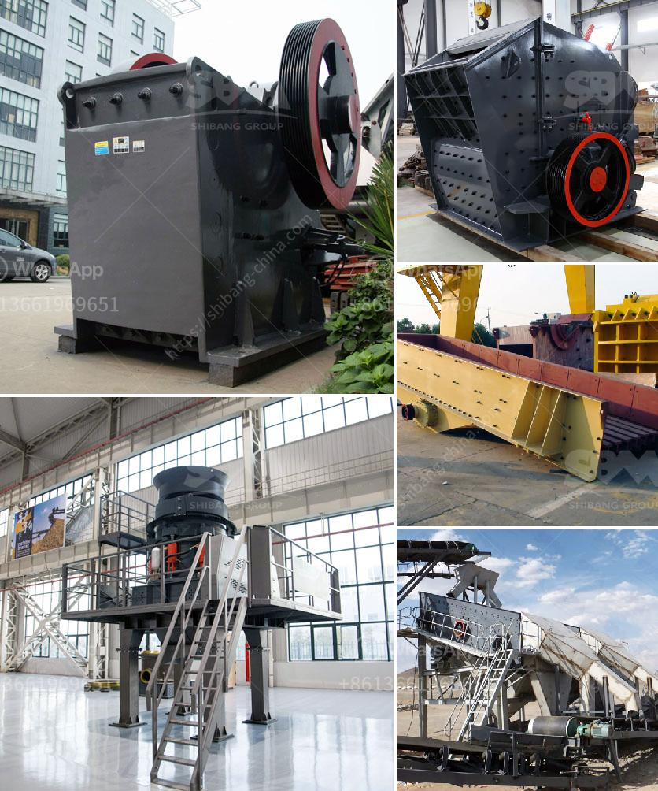

<h3>خدمات آلة التكسير</h3>
تعتبر آلة التكسير أحد الأدوات الهامة في صناعة البناء والتعدين، حيث تستخدم لتحطيم وسحق المواد الخام لإعدادها للتصنيع أو التجهيز اللاحق. تعتبر هذه المعدة ضرورية جدًا في عمليات الحفر والتعدين، وكذلك في صناعة الإسمنت والزجاج والسيراميك والكيماويات وقطاعات أخرى.

يتم استخدام آلة التكسير لتكسير المواد الخام إلى قطع صغيرة أو متوسطة الحجم من أجل تسهيل معالجتها أو استخدامها في عملية التصنيع. تتكون هذه الآلة من أجزاء متعددة مثل الغربال والفك والمطرقة الدوارة والأسطوانة وغيرها، وهي مصممة بشكل يسمح بتكسير جميع أنواع المواد بسهولة وكفاءة.

تعتبر آلة التكسير أحد أنواع المعدات الثقيلة التي يمكن تشغيلها يدويًا أو بواسطة آلية. يبلغ حجم المواد التي يمكن للآلة تكسيرها بشكل فعال وفقًا لنوعها وخصائصها، حيث يمكن لبعض الآلات تكسير المواد بحجم تتراوح بين بضعة سنتيمترات إلى عدة ميليمترات، بينما تتطلب المواد الأخرى تكسيرًا أكثر دقة بحيث يمكن استخدامها في عمليات التصنيع النهائية.

يوجد العديد من أنواع آلات التكسير المتاحة في السوق، وتشمل بعضها الكسارات الفكية والكسارات الصدمية والكسارات المخروطية والكسارات الأسطوانية وغيرها. يتم اختيار نوع الآلة المناسب وفقًا لطبيعة المواد التي تحتاج إلى تكسيرها وحجم المواد النهائي المطلوب.

تُعتبر خدمات آلة التكسير ضرورية لعملية التعدين والبناء بصفة عامة. يتطلب استخدام آلة التكسير خبرة متخصصة لتشغيلها بأمان وفعالية. لذلك، يتعين على الشركات التي توفر هذه الخدمات أن تكون مجهزة بفرق فنية مدربة ومؤهلة، وأن تلتزم بأعلى معايير الجودة والسلامة.

بشكل عام، تعتبر خدمات آلة التكسير أمرًا لا غنى عنه في صناعة البناء والتعدين. فهي توفر وسيلة فعالة لتحطيم المواد الخام، مما يزيد من إمكانية استخدامها في العديد من الصناعات المختلفة. كما تساهم آلة التكسير في زيادة الإنتاجية وتوفير الوقت والجهد في عمليات التصنيع والتجهيز، مما يساعد في تحقيق النمو الاقتصادي والتنمية المستدامة.
<h3>Contact us</h3><ul><li><strong>Whatsapp:&nbsp;<a href="https://wa.me/8613661969651">+8613661969651</a></strong></li><li><a href="https://swt.shibang-china.com/?git&amp;zhl&amp;خدمات آلة التكسير"><strong>Online Service(chat now)</strong></a></li></ul><h3>Related</h3><ul><li><a href='تكلفة سيور النقل.md'>تكلفة سيور النقل</a></li><li><a href='كسارة خام البوتاش.md'>كسارة خام البوتاش</a></li><li><a href='سعر stoner cusher في كينيا.md'>سعر stoner cusher في كينيا</a></li><li><a href='سعة الكسارة المحمولة ٢٠٠ طن في الساعة.md'>سعة الكسارة المحمولة ٢٠٠ طن في الساعة</a></li><li><a href='كل معدة لكل جهاز كسارة فك.md'>كل معدة لكل جهاز كسارة فك</a></li></ul>