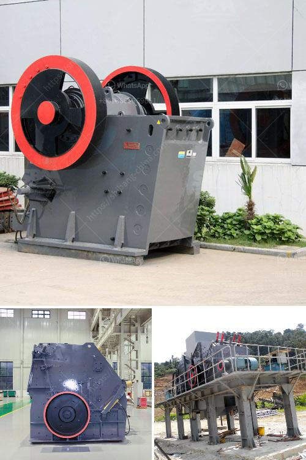

<h3>خدمة تأجير الكسارة والغربال</h3>
تعد خدمة تأجير الكسارة والغربال حلاً فعّالاً لتلبية احتياجات قطاع البناء والتشييد. ففي مشاريع البناء، يعتبر تحطيم الحجارة وفحص الركام من أهم العمليات التي يجب القيام بها. تحتاج معظم المشاريع إلى كسارة لتحويل الصخور الكبيرة إلى مقاسات صغيرة ومناسبة، بالإضافة إلى غربال لفصل المواد الناعمة عن الخشنة. وتتوفر خدمات تأجير الكسارة والغربال لتوفير هذه المعدات بشكل مؤقت وبكلفة معقولة.

من بين أهمية خدمة تأجير الكسارة والغربال هو تقليل التكاليف العامة للمشروع. فبدلاً من شراء المعدات بنفسك، يمكنك استئجارها للفترة التي تحتاجها فقط. يتم توفير المعدات بواسطة مزودي الخدمات الذين يقدمون تصاريح تأجير لفترات قصيرة أو طويلة الأمد. وذلك يعني أنك لن تدفع مبالغ كبيرة مقدمًا أو تتحمل تكاليف الصيانة والتخزين الطويلة الأجل.

من الأمور المهمة التي يوفرها تأجير الكسارة والغربال هي توافر المعدات في الوقت المناسب وبالحجم المناسب للمشروع. ففي بعض الأحيان، يمكن أن يكون لديك مشروع صغير أو مؤقت، ولا يجب عليك شراء معدات ضخمة تكون باهظة التكلفة، ولا يتوافق حجمها مع احتياجات المشروع. من خلال خدمة تأجير الكسارة والغربال، يمكنك الاستفادة من وجود مجموعة متنوعة من المعدات مثل الكسارات المحمولة والغرابيل المتنقلة وغيرها. وبذلك تتمكن من اختيار المعدة التي تلبي احتياجات المشروع بدقة.

بالإضافة إلى ذلك، فإن خدمة تأجير الكسارة والغربال تقدم حلاً سريعًا وملائمًا لمشاريع البناء ذات الحجم الصغير. فبدلاً من تنفيذ مشروع كسارة دائمة وتكلفة البناء والصيانة المرتبطة بها، يمكنك استأجار المعدات المطلوبة للفترة المحددة وفقًا لاحتياجاتك. وعند الانتهاء من المشروع، يمكنك إعادة المعدات إلى المزود وتوفير التكاليف المستقبلية المرتبطة بالتشغيل والصيانة.

باختصار، تعد خدمة تأجير الكسارة والغربال حلاً مثاليًا للأفراد والشركات في قطاع البناء والتشييد. تساعد هذه الخدمة في تقليل التكاليف وتوفير الوقت وتلبية احتياجات التحطيم والغربلة المؤقتة للمشاريع. إذا كنت تعمل على مشروع بناء مؤقت أو صغير، فإن خدمة تأجير الكسارة والغربال هي الخيار الأمثل لك.
<h3>Contact us</h3><ul><li><strong>Whatsapp:&nbsp;<a href="https://wa.me/8613661969651">+8613661969651</a></strong></li><li><a href="https://swt.shibang-china.com/?git&amp;zhl&amp;خدمة تأجير الكسارة والغربال"><strong>Online Service(chat now)</strong></a></li></ul><h3>Related</h3><ul><li><a href='مطاحن الكرة في ماليزيا.md'>مطاحن الكرة في ماليزيا</a></li><li><a href='معدات تعدين النحاس.md'>معدات تعدين النحاس</a></li><li><a href='تكلفة تعدين الفحم في جنوب أفريقيا للطن الواحد.md'>تكلفة تعدين الفحم في جنوب أفريقيا للطن الواحد</a></li><li><a href='سعر كسارة الحجر الأمريكي.md'>سعر كسارة الحجر الأمريكي</a></li><li><a href='سعر مصنع الرمل والحصى في الهند.md'>سعر مصنع الرمل والحصى في الهند</a></li></ul>