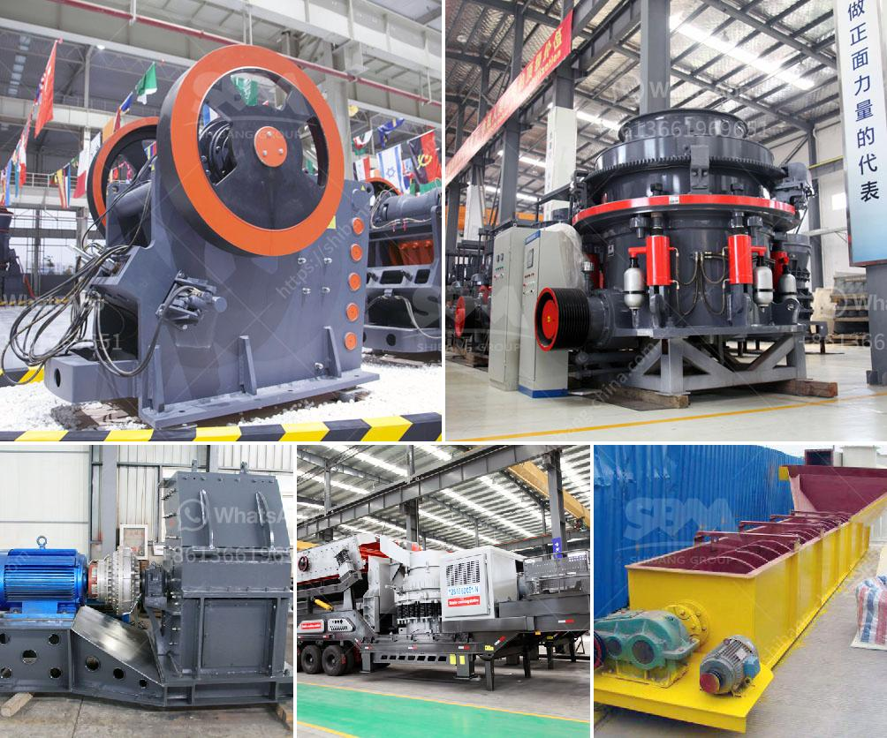

<h3>خط إنتاج الباريت</h3>
خط إنتاج الباريت هو جزء من صناعة تعدين المعادن، حيث يتم استخراج الباريت من الطبقات الجيولوجية الأرضية وتحويله إلى منتجات قابلة للتسويق. يتم استخدام الباريت بشكل رئيسي في صناعة النفط والغاز وفي صناعة الدهانات وألواح الجبصين والبلاستيك والمواد الكيميائية والتشكيلات الزجاجية والمطاطية.

يتألف خط إنتاج الباريت من مجموعة من العمليات التي تهدف إلى تحضير الصخور المستخرجة وتجهيزها للاستخدام. يبدأ العمل بعملية التعدين حيث يتم استخراج الباريت من المناجم باستخدام الحفارات والشاحنات الثقيلة. بعد ذلك، يتم نقل الباريت الخام إلى المصنع.

تبدأ عملية المعالجة بفحص الباريت الخام لتحديد نقاوته وتركيزه. ثم يتم سحق الباريت الخام إلى حجم أصغر باستخدام كسارات الصخور. بعد ذلك، يتم نقل الباريت إلى غربال لفصل الجسيمات الصغيرة والكبيرة. يتم استخدام الغرابيل والمنافذ بأحجام مختلفة للتحكم في حجم الجسيمات.

ثم يتم تنظيف الباريت باستخدام تقنيات التعويم لإزالة الشوائب المعدنية والملوثات الأخرى. تعتمد تقنية التعويم على فرق الكثافة بين الباريت والمواد الأخرى، حيث يتم إضافة مواد كيميائية خاصة إلى الخليط لزيادة قوة الانزلاق والتعويم للباريت.

بعد التعويم، يتم تجفيف الباريت لإزالة الرطوبة المتبقية وتجفيفه بواسطة أفران خاصة. ثم يتم طحن الباريت بواسطة طواحين الكرة للحصول على حجم الجسيمات المطلوب. يتم تصنيف الجسيمات عند هذه النقطة لتحديد حجمها النهائي.

أخيرًا، يتم تعبئة وتغليف الباريت في أكياس أو حاويات جاهزة للنقل والتسويق. يتم تحميل الباريت في الشاحنات أو الحاويات وتوزيعها إلى العملاء المختلفين.

يعتبر خط إنتاج الباريت عملية معقدة وتلتزم بقواعد صارمة لضمان جودة المنتج النهائي. يتم الاعتماد على تكنولوجيا متقدمة ومعدات حديثة لتحقيق أقصى كفاءة وجودة في عملية الإنتاج.

بإتمام خط إنتاج الباريت بنجاح، يتم تقديم منتج نهائي من الباريت الصالح للاستخدام في العديد من الصناعات المختلفة. يوفر الباريت العديد من الخصائص الفريدة مثل الكثافة العالية والقدرة على مقاومة الحرارة والكيماويات، مما يجعله مادة غاية في الاهمية في الصناعة العالمية.
<h3>Contact us</h3><ul><li><strong>Whatsapp:&nbsp;<a href="https://wa.me/8613661969651">+8613661969651</a></strong></li><li><a href="https://swt.shibang-china.com/?git&amp;zhl&amp;خط إنتاج الباريت"><strong>Online Service(chat now)</strong></a></li></ul><h3>Related</h3><ul><li><a href='عملية تعدين الذهب.md'>عملية تعدين الذهب</a></li><li><a href='بدء عمل كسارة الجرانيت.md'>بدء عمل كسارة الجرانيت</a></li><li><a href='موردين لفات الناقل في جنوب أفريقيا.md'>موردين لفات الناقل في جنوب أفريقيا</a></li><li><a href='معدات المحجر المملكة المتحدة.md'>معدات المحجر المملكة المتحدة</a></li><li><a href='سعر فحص الرمل بسعة كبيرة للبيع.md'>سعر فحص الرمل بسعة كبيرة للبيع</a></li></ul>