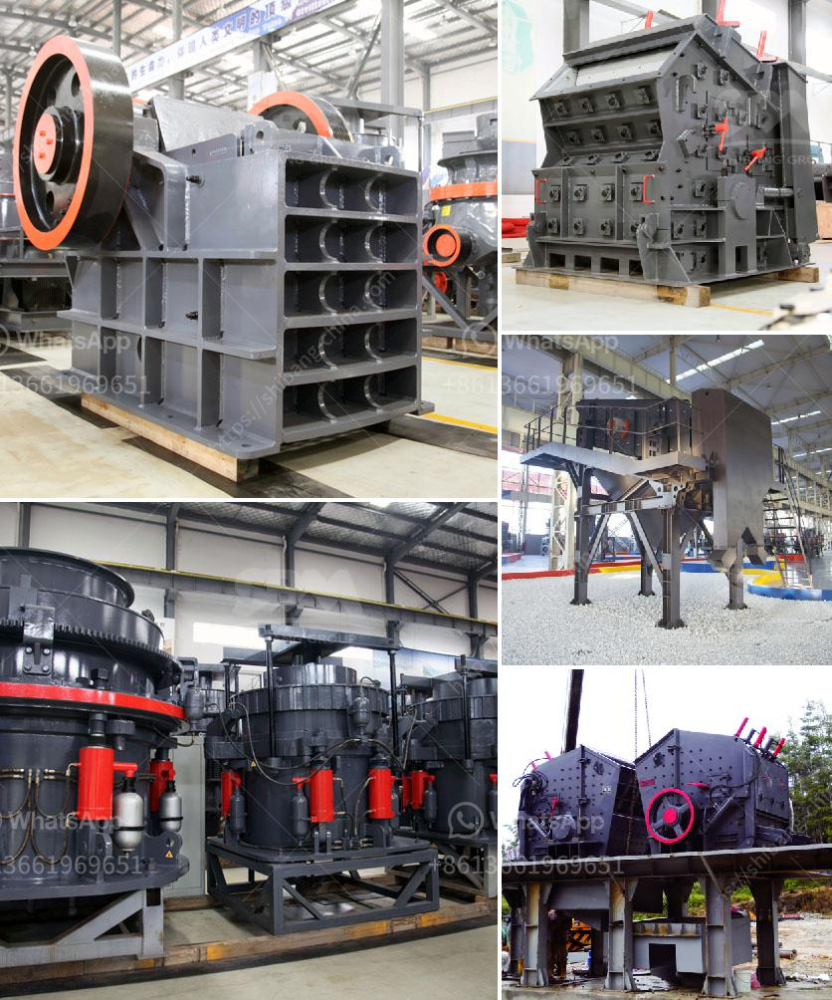

<h3>خط إنتاج البوكسيت</h3>
يعتبر خط إنتاج البوكسيت من أهم العمليات الصناعية في صناعة الألمنيوم. تعتبر البوكسيت هي المادة الخام الرئيسية لإنتاج الألومنيوم وتشكل ما يقرب من 90% من إجمالي الألمنيوم المنتج عالميًا. ولذا، فإن الحصول على تدفق مستمر وفعال للبوكسيت في الإنتاج جوهري لنجاح صناعة الألمنيوم.

يتكون خط إنتاج البوكسيت من عدة مراحل رئيسية. أولاً، يتم استخراج البوكسيت من المناجم. يجب أن تكون هذه العملية متكاملة بشكل كامل في هدفها للحصول على كميات كبيرة ومستدامة من البوكسيت. بعد استخراج البوكسيت، يتم تنقيتها وتنظيفها للتخلص من الشوائب والأتربة والمواد الأخرى غير المرغوب فيها.

بعد ذلك، يتم نقل البوكسيت المنقاة إلى مصنع تكرير البوكسيت. في هذا المصنع، تجرى عملية تكرير البوكسيت للحصول على مادة الألومينا، وهي المادة التي تستخدم في إنتاج الألمنيوم. تشمل عملية التكرير عدة خطوات منها معالجة البوكسيت بالكلوريدات والكاوية لاستخلاص الألومينا.

بعد استخلاص الألومينا، يتم تصنيعها إلى حجم وشكل محدد. ومن ثم، يتم نقلها عبر الأنابيب أو التصاريح إلى مصنع الألمنيوم الذي يقوم بتحويلها إلى الألومنيوم النهائي. هنا، يتم استخدام الألومينا مع مسحوق الفحم في عملية التخفيف الكهربائية للحصول على الألومنيوم السائل.

تكون عملية إنتاج البوكسيت معقدة وتشتمل على العديد من المعدات والآلات المتطورة التي تعمل بكفاءة عالية لاستخراج وتنقية البوكسيت وتحويلها إلى ألومينا. يتطلب إنتاج كميات كبيرة من البوكسيت الالتزام بمعايير الجودة والسلامة العالية لضمان تقديم منتج ذو جودة متميزة وبأقل تكلفة ممكنة.

خط إنتاج البوكسيت يلعب دورًا حيويًا في تزويد صناعة الألمنيوم بالمادة الأساسية لإنتاج الألومنيوم. وبفضل التكنولوجيا المتطورة والعمليات المتكاملة، يمكن لصناعة البوكسيت تلبية الطلب المستمر على الألمنيوم عالي الجودة في الأسواق المحلية والعالمية.
<h3>Contact us</h3><ul><li><strong>Whatsapp:&nbsp;<a href="https://wa.me/8613661969651">+8613661969651</a></strong></li><li><a href="https://swt.shibang-china.com/?git&amp;zhl&amp;خط إنتاج البوكسيت"><strong>Online Service(chat now)</strong></a></li></ul><h3>Related</h3><ul><li><a href='آلة تكسير الحجر صنعت في باكستان.md'>آلة تكسير الحجر صنعت في باكستان</a></li><li><a href='مصنع معالجة الإسمنت.md'>مصنع معالجة الإسمنت</a></li><li><a href='رسم بياني لعملية غسيل الرمال.md'>رسم بياني لعملية غسيل الرمال</a></li><li><a href='مصنع كسارة الحصى بالقرب من مانيلا.md'>مصنع كسارة الحصى بالقرب من مانيلا</a></li><li><a href='خطة عمل كاملة لمصنع تكسير الحجارة.md'>خطة عمل كاملة لمصنع تكسير الحجارة</a></li></ul>