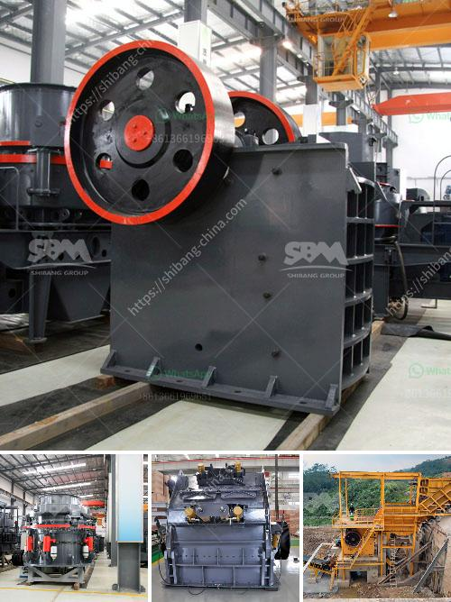

<h3>خط إنتاج التلك</h3>
يعدّ الخط الإنتاجي للتلك من أهم الخطوات في صناعة هذ المادة الرمادية الناعمة المعروفة بخصائصها المتنوعة واستخداماتها المتعددة. يتألف هذا الخط من عدة مراحل ومعدات تهدف إلى تحويل الخامات الأولية إلى مسحوق التلك ذو الجودة العالية الذي يلبي احتياجات المستهلكين.

تتضمن الخامات الأولية لإنتاج التلك الصخور المعدنية مثل الصبر والإيرون والدولوميت. وتبدأ العملية بتفتيت هذه الصخور إلى قطع صغيرة بواسطة آلات التكسير. تُنقل القطع إلى آلة الطحن حيث يتم طحنها إلى حبيبات صغيرة جدًا. ثم تنتقل هذه الحبيبات إلى آلة التجفيف للتخلص من الرطوبة وزيادة نسبة الكربونات في المادة النهائية.

بعد ذلك، يتم تنقية تلك المادة من الشوائب عن طريق استخدام عملية المغناطيسية لإزالة الجسيمات المعدنية، وعملية الغربلة لفصل الحبيبات غير المرغوب فيها. يتم ذلك من خلال تمرير المادة الخام عبر أشباه الصفائح المعدنية المثقوبة التي تفصل الجسيمات حسب الحجم.

بعد التنقية، تمر هذه الحبيبات المنقاة في عملية التجانس حيث يتم خلطها بمواد كيميائية أخرى لتحسين خصائصها الفيزيائية والكيميائية. يتم هنا إضافة مواد مثل الزنك أو البورون لتعزيز الليونة والمرونة، وأيضًا لردع الروائح الكريهة. ويوضع التلك الناتج في ماكينة اللف لتعبئته في أكياس أو حاويات بحسب الطلب.

تعتبر صناعة التلك من الصناعات الهامة والمزدهرة، حيث يجد استخداماتها في مجالات متنوعة مثل صناعة الورق، ومستحضرات التجميل، والأغذية، ومواد التشحيم، والدهانات، والأدوية. الخط الإنتاجي للتلك يلعب دورًا حاسمًا في تلبية احتياجات السوق العالمية لهذه المادة المفيدة والمتعددة الاستخدامات.

باختصار، فإن الخط الإنتاجي للتلك يتألف من عمليات متعددة تشمل التكسير، والطحن، والتجفيف، والتنقية والتجانس، وأخيرًا التعبئة. هذه العمليات تضمن حصولنا على منتج نهائي ذو جودة عالية يستخدم في العديد من الصناعات المختلفة.
<h3>Contact us</h3><ul><li><strong>Whatsapp:&nbsp;<a href="https://wa.me/8613661969651">+8613661969651</a></strong></li><li><a href="https://swt.shibang-china.com/?git&amp;zhl&amp;خط إنتاج التلك"><strong>Online Service(chat now)</strong></a></li></ul><h3>Related</h3><ul><li><a href='مطحنة طحن الحجر من ألمانيا.md'>مطحنة طحن الحجر من ألمانيا</a></li><li><a href='تصنيع آلات السحق في بوليفيا.md'>تصنيع آلات السحق في بوليفيا</a></li><li><a href='تكلفة كسارة الفك 24x36.md'>تكلفة كسارة الفك 24x36</a></li><li><a href='آلة تكسير الصخور.md'>آلة تكسير الصخور</a></li><li><a href='غسالة مواد خام جرايستون مستعملة.md'>غسالة مواد خام جرايستون مستعملة</a></li></ul>