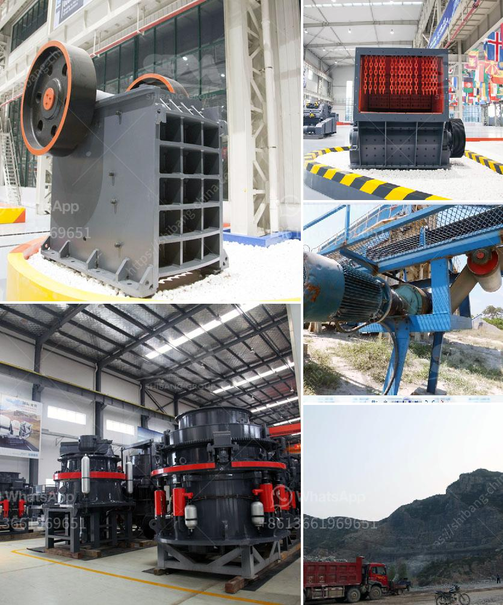

<h3>خط إنتاج الجرانيت</h3>
يُعد الجرانيت أحد أكثر أنواع الصخور الطبيعية شيوعًا واستخدامًا في العديد من التطبيقات البنائية والديكورية. توجد العديد من مناجم الجرانيت حول العالم، ولكن لتلبية طلب السوق المتزايد فإن تطبيق تقنيات الإنتاج الحديثة في خطوط الإنتاج أصبح ضرورة.

يعتبر خط إنتاج الجرانيت من العمليات التحويلية التي تتضمن عدة مراحل، بدءًا من استخراج الصخرة من المنجم وحتى الحصول على منتج نهائي جاهز للاستخدام. تعد عملية استخراج الجرانيت هي المرحلة الأولى وتشمل تفتيت الصخرة الكبيرة باستخدام المطارق الهيدروليكية. ثم يتم نقل الكتل الصخرية الصغيرة إلى الورشة المخصصة للتجهيز.

في المرحلة الثانية، يتم تجهيز قطع الجرانيت الخام بواسطة الآلات المشغلة بالكمبيوتر للحصول على الأشكال والأحجام المطلوبة. يتم استخدام الحجارة الكهرمانية أو الأشرطة الماسية لتسهيل العملية والحصول على قطع نهائية بشكل دقيق.

تلي ذلك المرحلة الثالثة وهي عملية الضخ والتنعيم، والتي تهدف إلى تحسين الملمس النهائي وتلميع الجرانيت. يتم استخدام الطين النانومتري والمواد الكيميائية الأخرى للقضاء على العيوب الظاهرة وتحسين لمعان السطح.

أما المرحلة الرابعة، فتتضمن تقطيع الجرانيت المصقول إلى قطع أصغر حسب المقاس المرغوب. ويراعى في هذه المرحلة الحصول على قطع متساوية الحجم وخالية من التشققات أو الكسور.

ينتهي عملية إنتاج الجرانيت بمرحلة التعبئة والتغليف، حيث يتم وضع القطع في حاويات أو صناديق خشبية محمية لضمان سلامتها وعدم تعرضها للتلف أثناء النقل.

يتطلب خط إنتاج الجرانيت الاستثمار في معدات وآلات متطورة وفريق عمل مدرب على التعامل معها. إلا أنه يمكن أن يكون استثمارًا جيدًا نظرًا للطلب المستمر على هذه الصخرة الجميلة والقوية في صناعة البناء والديكور.

في الختام، فإن خط إنتاج الجرانيت يلعب دورًا مهمًا في تحويل الصخور إلى منتجات نهائية عالية الجودة وجذابة. يساهم في تزويد السوق بالجرانيت المصقول المناسب للاستخدامات المتنوعة، ويعزز عملية البناء والديكور بأشكاله وألوانه المتنوعة.
<h3>Contact us</h3><ul><li><strong>Whatsapp:&nbsp;<a href="https://wa.me/8613661969651">+8613661969651</a></strong></li><li><a href="https://swt.shibang-china.com/?git&amp;zhl&amp;خط إنتاج الجرانيت"><strong>Online Service(chat now)</strong></a></li></ul><h3>Related</h3><ul><li><a href='مصنع تكسير الحصى في جنوب أفريقيا.md'>مصنع تكسير الحصى في جنوب أفريقيا</a></li><li><a href='أفضل وسادات طحن للرخام في باكستان.md'>أفضل وسادات طحن للرخام في باكستان</a></li><li><a href='معدات سحق للإيجار.md'>معدات سحق للإيجار</a></li><li><a href='آلة فحص متنقلة في جنوب أفريقيا.md'>آلة فحص متنقلة في جنوب أفريقيا</a></li><li><a href='كسارة مخروطية صنعت في إيطاليا.md'>كسارة مخروطية صنعت في إيطاليا</a></li></ul>