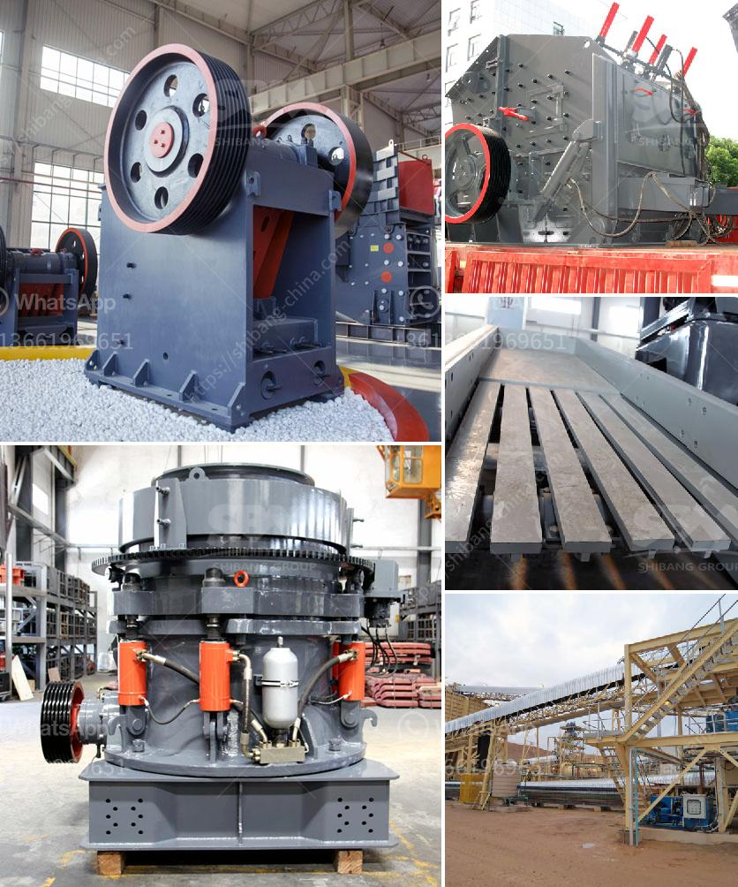

<h3>خط إنتاج الحجر الجيري</h3>
يعتبر الحجر الجيري أحد الموارد الطبيعية الثمينة التي يتم استخدامها في العديد من الصناعات المختلفة. ويتم الحصول على الحجر الجيري عن طريق عمليات التعدين وإنتاجه في خطوط الإنتاج المتخصصة.

خط إنتاج الحجر الجيري هو العملية التي يتم من خلالها استخراج وإنتاج الحجر الجيري من المحاجر، ثم تكسيره وغربلته بطرق مختلفة للحصول على المنتج النهائي المطلوب. تتألف هذه العملية من عدة مراحل تشمل:

1. استخراج الحجر الجيري من المحاجر: يتم استخراج الحجر الجيري من الأرض باستخدام المعدات الثقيلة مثل الكسارات والجرافات. يتم تفجير الصخور الجبلية ونقلها إلى الموقع الخاص بالإنتاج.

2. تكسير وغربلة الحجر الجيري: بعد استخراج الحجر الجيري، يتم تحويله إلى حجم مناسب من خلال عمليات التكسير والغربلة. يتم تمرير الحجر الجيري عبر كسارات متعددة الأدوار لتكسيره إلى قطع صغيرة. ثم يتم إزالة الأتربة والشوائب عن طريق عمليات الغربلة.

3. الطحن والتجفيف: بعد مرحلة التكسير والغربلة، يتم طحن الحجر الجيري في مطاحن خاصة للحصول على مسحوق الحجر الجيري النهائي المطلوب. يتم طحن الحجر بواسطة الطواحين الدوارة والكرات الصلبة المعدنية. بعد ذلك، يتم تجفيف المسحوق لإزالة أي رطوبة قد تكون متبقية.

4. التعبئة والتغليف: يتم تعبئة وتغليف مسحوق الحجر الجيري في أكياس أو حاويات لتسهيل نقله وتخزينه. يعتمد نوع التعبئة والتغليف على طريقة استخدام المنتج النهائي ومتطلبات العميل.

هكذا يتم إنتاج الحجر الجيري من خلال خطوط الإنتاج المختصة، ويجب أن تتم هذه العملية بعناية فائقة لضمان الحصول على منتج نهائي عالي الجودة وذو قيمة تجارية. ولذلك، يجب أن تتم مراقبة الجودة والصيانة الدورية للمعدات والتأكد من احترام المعايير البيئية أثناء عمليات الإنتاج.

باختصار، يعد خط إنتاج الحجر الجيري عملية معقدة ومتطورة تهدف إلى استخراج وتحضير الحجر الجيري بشكل صحيح للاستخدام في الصناعات المختلفة. هذا الخط يتطلب تخصصًا عاليًا في التعدين والتحسينات التقنية للحفاظ على جودة الإنتاج والحد من التأثيرات البيئية السلبية.
<h3>Contact us</h3><ul><li><strong>Whatsapp:&nbsp;<a href="https://wa.me/8613661969651">+8613661969651</a></strong></li><li><a href="https://swt.shibang-china.com/?git&amp;zhl&amp;خط إنتاج الحجر الجيري"><strong>Online Service(chat now)</strong></a></li></ul><h3>Related</h3><ul><li><a href='سعر كسارة الفك في جنوب أفريقيا.md'>سعر كسارة الفك في جنوب أفريقيا</a></li><li><a href='مطحنة محمولة في أستراليا بيرث.md'>مطحنة محمولة في أستراليا بيرث</a></li><li><a href='آلة سحق مكعب الخرسانة.md'>آلة سحق مكعب الخرسانة</a></li><li><a href='صيغة بسيطة لناقل الحزام.md'>صيغة بسيطة لناقل الحزام</a></li><li><a href='جميع نماذج كسارة البازلت.md'>جميع نماذج كسارة البازلت</a></li></ul>