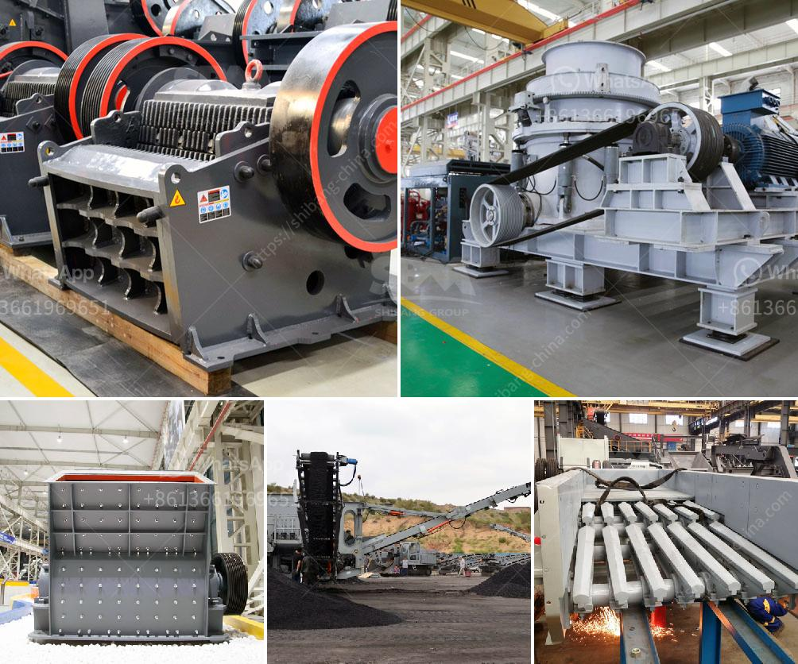

<h3>خط إنتاج الخرسانة الثاني</h3>
يعد خط إنتاج الخرسانة من أهم الخطوات في صناعة البناء والانشاءات. يقوم هذا الخط بتصنيع الخرسانة وإنتاجها بأعلى جودة ممكنة وبأكبر كفاءة. يتكون خط إنتاج الخرسانة من عدة مكونات مهمة تعمل بتناسق لتحقيق الإنتاج الأمثل وتلبية احتياجات السوق.

أحد الخطوات الرئيسية في خط إنتاج الخرسانة هو خط إنتاج الخرسانة الثاني. يتم تنفيذ هذا الخط بعد صب الخرسانة في قوالب وتجهيزها للقطع والتشطيب النهائي للبناء. يتم تجهيز الخرسانة الثاني بواسطة ماكينات وأدوات خاصة تساعد في تشكيل الخرسانة وجعلها جاهزة للاستخدام في البناء.

خط إنتاج الخرسانة الثاني يتضمن عدة عناصر أساسية. أولاً، يتم استخدام آلة تسوية السطح لتصحيح أي عيوب في الخرسانة وتحقيق السطح المستوي المطلوب. ثم يتم استخدام آلة تعبئة الخرسانة لتعبئتها في أكياس أو صناديق لتسهيل عملية النقل والتوزيع.

ثانياً، يتم استخدام آلة قطع الخرسانة لتقطيعها وفقًا للأحجام المطلوبة والمواصفات المحددة. هذه العملية تساعد في تحقيق الدقة والتجانس في الأحجام وتسهل عملية التصنيع.

ثالثًا، يتم استخدام آلة تسطيح الخرسانة لتحقيق السطح المطلوب للخرسانة. يتم استخدام هذه الآلة لتنعيم السطح وإزالة أي انتفاخات أو تجاعيد في الخرسانة، مما يضمن الانتهاء الجيد والجودة العالية للمنتج النهائي.

أخيرًا، يتم تنظيف الخرسانة وتغليفها بواسطة آلة تغليف الخرسانة. يتم ذلك لتأمين الخرسانة وحمايتها من التلف أثناء عملية التخزين والنقل.

باختصار، خط إنتاج الخرسانة الثاني يلعب دورًا حاسمًا في تجهيز الخرسانة للاستخدام في البناء. من خلال استخدام مجموعة متكاملة من الآلات والأدوات المتخصصة، يتم تحقيق إنتاج خرسانة عالية الجودة وفعالة من حيث التكلفة. يساهم هذا الخط في تحسين الأداء العام لعمليات البناء ويعمل على ضمان استخدام الخرسانة في مشاريع البناء بكفاءة عالية وجودة ممتازة.
<h3>Contact us</h3><ul><li><strong>Whatsapp:&nbsp;<a href="https://wa.me/8613661969651">+8613661969651</a></strong></li><li><a href="https://swt.shibang-china.com/?git&amp;zhl&amp;خط إنتاج الخرسانة الثاني"><strong>Online Service(chat now)</strong></a></li></ul><h3>Related</h3><ul><li><a href='عملية كسارة الرمل والحصى في الفلبين.md'>عملية كسارة الرمل والحصى في الفلبين</a></li><li><a href='مطحنة الطحن.md'>مطحنة الطحن</a></li><li><a href='مطحنة رايموند للطحن الدقيق جدا.md'>مطحنة رايموند للطحن الدقيق جدا</a></li><li><a href='مصنع تكسير صغير من الصين.md'>مصنع تكسير صغير من الصين</a></li><li><a href='سعر آلة الكسارة في سريلانكا.md'>سعر آلة الكسارة في سريلانكا</a></li></ul>