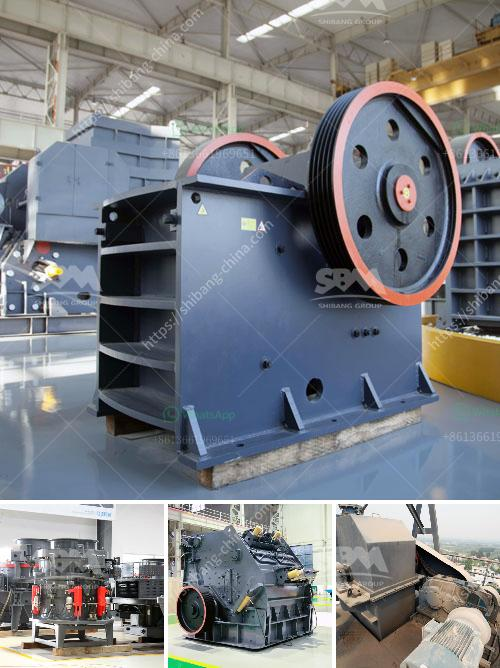

<h3>خط إنتاج الرمل الاصطناعي</h3>
يعتبر الرمل الاصطناعي أحد الموارد الهامة في صناعة البناء والإنشاء، حيث يستخدم في إنتاج الخرسانة، الأسفلت والطوب. ومن أجل تلبية الطلب المتزايد على الرمل الاصطناعي، تم تطوير خط إنتاج خاص به، يقوم بتصنيع الرمل الاصطناعي بكفاءة عالية.

يتكون خط إنتاج الرمل الاصطناعي من عدة مراحل. الخطوة الأولى هي سحق الصخور وتفتيتها إلى قطع صغيرة باستخدام الكسارات. ثم يتم فصل الحصى والرمال الناعمة من الصخور. وبعد ذلك، تمر هذه المواد من خلال آلة الغسيل لإزالة الشوائب والأتربة والطين.

بعد ذلك، يتم تجفيف المواد وإدخالها إلى آلة الغربلة. تقوم آلة الغربلة بفصل الحصى والرمال وفقًا للحجم المطلوب للرمل الاصطناعي. ومن المهم الإشارة إلى أن خط إنتاج الرمل الاصطناعي يستخدم تقنيات متقدمة للتحكم في حجم الحصى والرمال المنتجة، مما يجعلها متوافقة مع المعايير والمواصفات الصناعية.

ثم يتم طحن الحصى والرمال المقطوعة إلى مسحوق دقيق باستخدام آلة الطحن. وبعد ذلك، يتم الانتقال إلى مرحلة صب الرمل الاصطناعي في العبوات أو الحاويات المناسبة. وفي هذه المرحلة، يتم اختبار الرمل الاصطناعي بالتزامن مع عملية التعبئة والتغليف لضمان جودته ومطابقته للمعايير المطلوبة.

خط إنتاج الرمل الاصطناعي مجهز بأحدث التقنيات والمعدات لضمان الجودة والكفاءة. يتم استخدام الآلات القوية والآلات الكهربائية المتطورة في جميع مراحل الإنتاج، مما يساهم في تقليل الأعطال وزيادة الإنتاجية.

باختصار، يعد خط إنتاج الرمل الاصطناعي أحد الوسائل الفعالة لتلبية الطلب المتزايد على الرمل الاصطناعي في صناعة البناء والإنشاء. يتميز بكفاءة عالية وجودة متميزة للمنتج النهائي. يعتبر الاستثمار في هذا الخط من الاستثمارات الناجحة والمربحة في قطاع البناء والإنشاء.
<h3>Contact us</h3><ul><li><strong>Whatsapp:&nbsp;<a href="https://wa.me/8613661969651">+8613661969651</a></strong></li><li><a href="https://swt.shibang-china.com/?git&amp;zhl&amp;خط إنتاج الرمل الاصطناعي"><strong>Online Service(chat now)</strong></a></li></ul><h3>Related</h3><ul><li><a href='كسارة حجر ثانوية للبيع في الفلبين.md'>كسارة حجر ثانوية للبيع في الفلبين</a></li><li><a href='مصنع مطاحن الأسمنت بسعة 100 طن يومياً.md'>مصنع مطاحن الأسمنت بسعة 100 طن يومياً</a></li><li><a href='كسارة للإيجار في نيو جيرسي.md'>كسارة للإيجار في نيو جيرسي</a></li><li><a href='شركة تصنيع مطاحن المطرقة في ماليزيا.md'>شركة تصنيع مطاحن المطرقة في ماليزيا</a></li><li><a href='استفسار حول الكسارة.md'>استفسار حول الكسارة</a></li></ul>