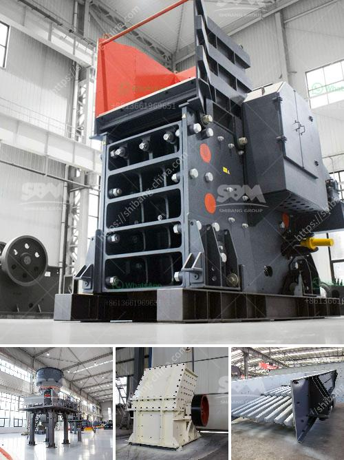

<h3>خط إنتاج الكوارتز</h3>
يتم إنتاج الكوارتز من أحد المعادن الطبيعية الأكثر انتشارًا في قشرة الأرض، وهي المعروفة بالسيليكا. يتم استخدام الكوارتز في العديد من الصناعات بسبب خصائصه المتميزة. يتم استخراج وإنتاج الكوارتز من خلال خط إنتاج متطور يتضمن عدة خطوات أساسية.

الخطوة الأولى في عملية إنتاج الكوارتز هي استخراج الصخور المحتوية على الكوارتز من المناجم. تُفرز الصخور المستخرجة وتنقل إلى وحدة معالجة حيث يتم تكسيرها إلى قطع صغيرة باستخدام المطارق أو الكسارات الفكية. تتم إزالة الشوائب والشوائب الأخرى من الكوارتز باستخدام طرق ميكانيكية مثل غسل الصخور وفرزها حسب الحجم.

بعد ذلك، يتم إجراء عملية معالجة إضافية للكوارتز من أجل تحسين جودتها وخصائصها. يتم فصل المواد العالقة باستخدام طريقة التعويم حيث يتم تعريض الكوارتز للتربة والهواء بحيث يتم جذب الشوائب الدقيقة إلى السطح وإزالتها. تعتمد هذه الطريقة على اختلاف القوى السطحية للمواد المختلفة.

بعد تجهيز الكوارتز بشكل صحيح، يتم إجراء عملية التصنيع حيث يتم تحويل الكوارتز إلى منتجات نهائية قابلة للاستخدام في الصناعات المختلفة. تشمل عملية التصنيع قطع وتلميع الكوارتز وصنع الأشكال المختلفة مثل الألواح والبلاط الكوارتزي وأحواض المطابخ والحمامات، والكونترتوب، والمزيد. يتطلب هذا العمل عملية دقيقة وعناية فائقة لضمان جودة المنتج النهائي.

يتم تصدير خطوات الإنتاج السابقة في شكل قاعدة متكاملة من الآلات والمعدات المتخصصة التي تحتاج إلى فريق من العاملين المهرة والمدربين. عادةً ما يشتمل خط إنتاج الكوارتز على تجهيز وحدة الاستخراج والمعالجة ووحدة التصنيع. يتم تشغيل هذه الوحدات معًا بشكل متكامل لضمان تناسق الجودة وكفاءة الإنتاج.

باستخدام خطوات الإنتاج العالية والتكنولوجيا المتقدمة، يتم إنتاج الكوارتز عالي الجودة الذي يلبي متطلبات الصناعات المختلفة. يتم استخدام الكوارتز في البناء وصناعة السيراميك والصناعات الزجاجية وصناعة الإلكترونيات والأدوات الجراحية والكثير من التطبيقات الأخرى. يعد إنتاج الكوارتز جزءًا أساسيًا من سلسلة العمليات الصناعية التي يتم اتباعها لإنتاج هذه المادة القيمة.
<h3>Contact us</h3><ul><li><strong>Whatsapp:&nbsp;<a href="https://wa.me/8613661969651">+8613661969651</a></strong></li><li><a href="https://swt.shibang-china.com/?git&amp;zhl&amp;خط إنتاج الكوارتز"><strong>Online Service(chat now)</strong></a></li></ul><h3>Related</h3><ul><li><a href='مطاحن الكرة للتعدين في الصين.md'>مطاحن الكرة للتعدين في الصين</a></li><li><a href='سعر كسارة الحجر.md'>سعر كسارة الحجر</a></li><li><a href='أرغب في شراء آلة كسارة البلاستيك.md'>أرغب في شراء آلة كسارة البلاستيك</a></li><li><a href='مصنع غسيل الفحم للبيع في جنوب أفريقيا.md'>مصنع غسيل الفحم للبيع في جنوب أفريقيا</a></li><li><a href='كسارة الحجر للبيع.md'>كسارة الحجر للبيع</a></li></ul>