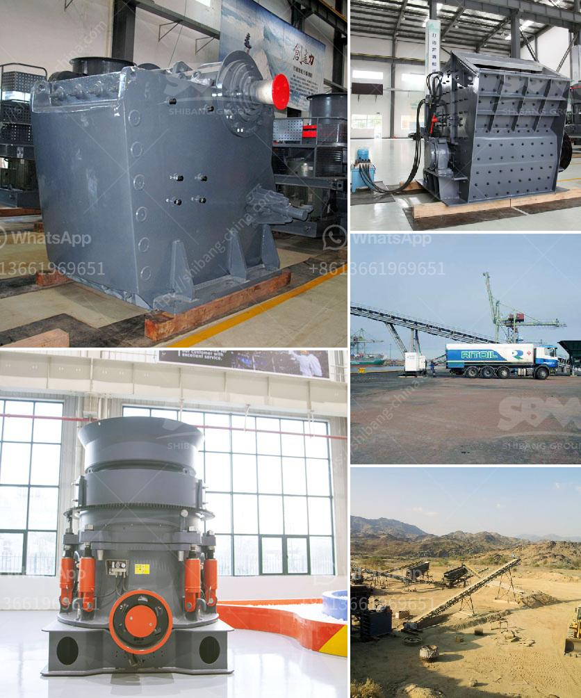

<h3>خط إنتاج خاص لتعدين مسحوق الكوارتز</h3>
يعتبر تعدين مسحوق الكوارتز عملية مهمة في صناعة الزجاج والإلكترونيات والمواد الكيميائية والهندسة المدنية، حيث يستخدم هذا المسحوق في صناعة العديد من المنتجات المستهلكة والتجارية. ولتلبية احتياجات السوق، يجب وجود خط إنتاج خاص لتعدين مسحوق الكوارتز.

يتكون خط إنتاج خاص لتعدين مسحوق الكوارتز من عدة مراحل من أجل الحصول على منتج نهائي عالي الجودة وفقًا للمواصفات المطلوبة. تبدأ هذه المراحل بالتعدين الأولي للكوارتز، حيث يتم استخراج الصخور المحتوية على الكوارتز من مواقع التعدين ونقلها إلى المصنع.

بعد ذلك، يجري تنظيف الصخور المستخرجة وإزالة الرمال والمواد الأخرى الغير مرغوب فيها عن طريق عملية الفصل. تُستخدم في هذه المرحلة آلات الفصل المتقدمة، مثل أجهزة الفرز بالجاذبية أو الغرابيل المتحركة، لفصل الكوارتز عن المواد الأخرى.

ثم يستخدم الكوارتز النقي والمفصول كمادة خام لمرحلة التحطيم والطحن. في هذه المرحلة، يتم تكسير الكوارتز إلى قطع صغيرة باستخدام آلات التكسير والمطاحن المختلفة. يهدف هذا العمل إلى تكسير الكوارتز إلى أحجام أصغر للحصول على مسحوق الكوارتز النهائي.

بعد ذلك، يتم تنقية مسحوق الكوارتز المكسور وإزالة الشوائب الأخرى. تُستخدم في هذه المرحلة عمليات التسخين والتبريد والفصل الكهروستاتيكي لإزالة المعادن الثقيلة والشوائب الأخرى، مما يتركنا مع مسحوق الكوارتز النقي النهائي.

أخيرًا، يتم تغليف مسحوق الكوارتز النهائي وشحنه إلى العملاء. يُعتبر التغليف وسيلة هامة لحماية المسحوق من التلوث والضرر خلال عملية النقل والتخزين. يمكن استخدام أكياس مقاومة للرطوبة والغبار أو حاويات مخصصة لتعبئة وتخزين المسحوق.

باختصار، يتكون خط إنتاج خاص لتعدين مسحوق الكوارتز من عدة مراحل متتالية لضمان الحصول على منتج نهائي عالي الجودة. يتضمن هذا الخط عمليات التعدين الأولية، الفصل والتنظيف، التحطيم والطحن، وتنقية المسحوق، وأخيرًا التغليف والشحن. يهدف هذا الخط إلى تلبية احتياجات السوق وتوفير مسحوق الكوارتز عالي الجودة للعملاء.
<h3>Contact us</h3><ul><li><strong>Whatsapp:&nbsp;<a href="https://wa.me/8613661969651">+8613661969651</a></strong></li><li><a href="https://swt.shibang-china.com/?git&amp;zhl&amp;خط إنتاج خاص لتعدين مسحوق الكوارتز"><strong>Online Service(chat now)</strong></a></li></ul><h3>Related</h3><ul><li><a href='نوع الفك محطم.md'>نوع الفك محطم</a></li><li><a href='كسارات محمولة بمعدل ١٠٠ طن في الساعة.md'>كسارات محمولة بمعدل ١٠٠ طن في الساعة</a></li><li><a href='مستعملة vsi كسارة للبيع في الهند.md'>مستعملة vsi كسارة للبيع في الهند</a></li><li><a href='سعر معدات غسل الفحم.md'>سعر معدات غسل الفحم</a></li><li><a href='احتياطي في مطحنة الكرة.md'>احتياطي في مطحنة الكرة</a></li></ul>