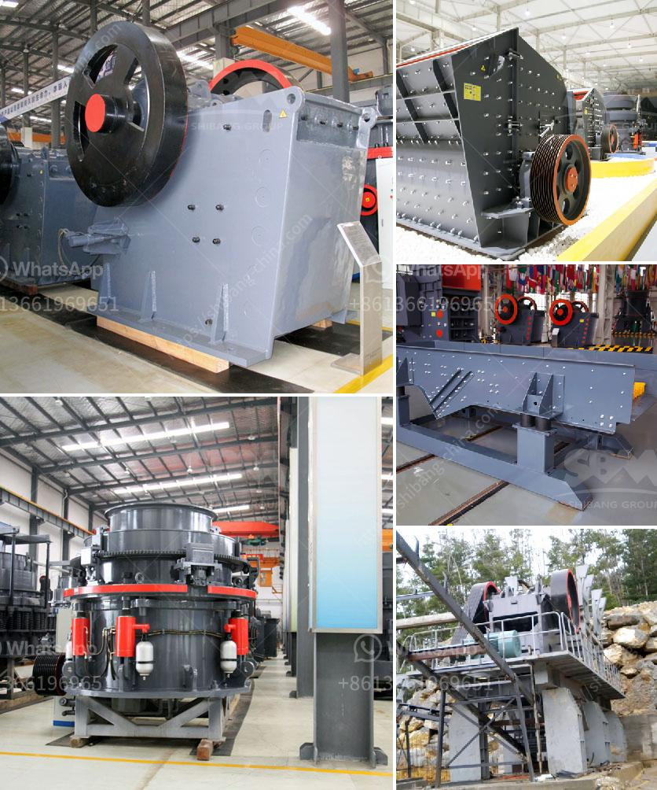

<h3>خط إنتاج رمل السيليكا في ألمانيا</h3>
يُعد خط إنتاج رمل السيليكا في ألمانيا أحد الصناعات الرئيسية والمهمة في قطاع التصنيع. يتم تصنيع رمل السيليكا من الرمال الطبيعية ذات النقاء العالي والتي تحتوي بشكل رئيسي على السيليكا. يُعد رمل السيليكا مادة أساسية في عدة صناعات مثل صناعة الزجاج، السيراميك، الإلكترونيات، وصناعة الطلاء.

يتم إنتاج رمل السيليكا في العديد من المناطق في ألمانيا، ولكن أحد أبرز المناطق لإنتاجه هي منطقة ساكسونيا. تتمتع منطقة ساكسونيا بموارد طبيعية غنية من الرمال التي تحتوي على السيليكا بنسبة عالية. تُستخدم في عملية إنتاج رمل السيليكا تقنيات حديثة ومتطورة لضمان جودة المنتج النهائي.

تبدأ عملية إنتاج رمل السيليكا بتعدين الرمال الطبيعية من المناطق المحلية المخصصة لذلك. يتم جمع الرمال ونقلها إلى موقع إنتاج متخصص. يتم فصل رمل السيليكا عن المواد الأخرى كالصخور والتربة وذلك باستخدام تقنيات عديدة مثل الغربلة والتطهير والتصنيف. تُزال المواد الأخرى عن طريق عملية غربلة المياه والتحكم في درجة حموضة المياه للتخلص من المواد الغير مرغوب فيها.

بعد فصل رمل السيليكا عن المواد الأخرى، يتم تجفيفها بعناية وتنقيتها إضافيا. يتم ذلك بواسطة تقنيات متقدمة تضمن حصول الرمل على درجة عالية من النقاء والنعومة المطلوبة لصناعة المنتجات النهائية. يتم أخذ عينات من رمل السيليكا المجفف لإجراء الفحوصات المخبرية وضمان التوافق مع المعايير الصناعية والجودة المطلوبة.

ثم يتم تعبئة رمل السيليكا النقي في حاويات أو أكياس معبأة بشكل صحيح ومحكمة الإغلاق. يتم عرض المنتج للتوزيع والتصدير إلى العديد من الأسواق العالمية. من المهم أن يتم نقل الرمل بحذر حتى لا يتعرض للتلف أو التلوث، حيث يتطلب رمل السيليكا النقاء العالي لضمان توافقه مع متطلبات الصناعات المختلفة.

بهذه الطريقة، يتم إنتاج رمل السيليكا في ألمانيا بجودة عالية ومعايير صناعية متقدمة. يوفر خط إنتاج رمل السيليكا فرص عمل للعديد من العاملين ويسهم في توفير مكمن ثروة طبيعية في البلاد. يعد رمل السيليكا المنتج النهائي من ألمانيا من أعلى الجودة في العالم، ومنتج ضروري لعدة صناعات، وهو يساهم في النمو الاقتصادي والتنمية المستدامة للبلاد.
<h3>Contact us</h3><ul><li><strong>Whatsapp:&nbsp;<a href="https://wa.me/8613661969651">+8613661969651</a></strong></li><li><a href="https://swt.shibang-china.com/?git&amp;zhl&amp;خط إنتاج رمل السيليكا في ألمانيا"><strong>Online Service(chat now)</strong></a></li></ul><h3>Related</h3><ul><li><a href='مكونات مصنع الحجر الجيري الأولي.md'>مكونات مصنع الحجر الجيري الأولي</a></li><li><a href='شركة مبيعات كسارة الحجر في كينيا.md'>شركة مبيعات كسارة الحجر في كينيا</a></li><li><a href='موردين تكسير الكوارتز في أوروبا.md'>موردين تكسير الكوارتز في أوروبا</a></li><li><a href='بدء عمل كسارة الجرانيت.md'>بدء عمل كسارة الجرانيت</a></li><li><a href='آلة كسارة لصنع الرمل من الحجر.md'>آلة كسارة لصنع الرمل من الحجر</a></li></ul>