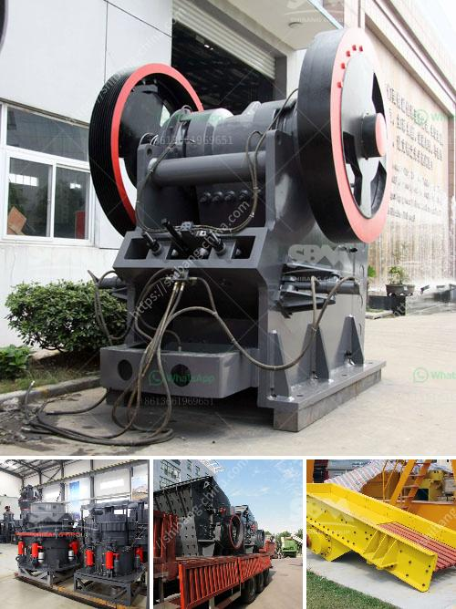

<h3>خط إنتاج رمل السيليكا</h3>
إنتاج رمل السيليكا هو عملية مهمة في صناعة الزجاج والسيراميك والإلكترونيات ومواد البناء. يُعرف رمل السيليكا أيضًا بإسم رمل الكوارتز ويتكون بشكل رئيسي من السيليكا (SiO2).

في عملية إنتاج رمل السيليكا، يتم تخصيص موقع لتعدين الرمال الطبيعية التي تحتوي على السيليكا. يتم استخراج الرمال باستخدام المعدات الثقيلة مثل الجرافات والجرافات الهيدروليكية والشاحنات. تتم إزالة الطبقات العضوية والمواد الغريبة الأخرى من الرمال للحصول على السيليكا النقية.

بعد ذلك، يتم نقل الرمال إلى مصنع معالجة السيليكا حيث تُفرز وتُفصل الشوائب المختلفة بواسطة معدات متخصصة مثل المصافي والغسالات والفواصل المغناطيسية. تُزال الشوائب الغرينية والطينية والشوائب الأخرى للحصول على رمل السيليكا الأنقى.

بعد إزالة الشوائب، يُشكل الرمل النهائي وفقًا للمواصفات ويتم تصنيفه وفقًا لحجم الحبيبات المطلوب. يتم ذلك بواسطة استخدام الغرابيل المختلفة التي تنقسم إلى عدة فصوص للحصول على الاحجام المنتجة المطلوبة.

في نهاية العملية، يتم تعبئة وتخزين رمل السيليكا بشكل آمن في حاويات صالحة للنقل والتخزين. ثم يتم نقلها إلى الشركات المستهلكة بواسطة عبور الشاحنات أو السفن أو القطارات.

وفي النهاية، يجب ذكر أن عملية إنتاج رمل السيليكا تعتمد على الابتكار التكنولوجي والجودة المستدامة. يتطلب الأمر المتابعة المستمرة وضبط الجودة لضمان جودة المنتج العالية والامتثال للمعايير المطلوبة.
<h3>Contact us</h3><ul><li><strong>Whatsapp:&nbsp;<a href="https://wa.me/8613661969651">+8613661969651</a></strong></li><li><a href="https://swt.shibang-china.com/?git&amp;zhl&amp;خط إنتاج رمل السيليكا"><strong>Online Service(chat now)</strong></a></li></ul><h3>Related</h3><ul><li><a href='سعر مصنع الأسمنت على نطاق صغير في الهند.md'>سعر مصنع الأسمنت على نطاق صغير في الهند</a></li><li><a href='أسعار كسارة الحجر.md'>أسعار كسارة الحجر</a></li><li><a href='مصنع معدات تعدين الرخام.md'>مصنع معدات تعدين الرخام</a></li><li><a href='مصنعون لمصانع التكسير المتنقلة.md'>مصنعون لمصانع التكسير المتنقلة</a></li><li><a href='شراء محطة غسيل الفحم في ألمانيا.md'>شراء محطة غسيل الفحم في ألمانيا</a></li></ul>