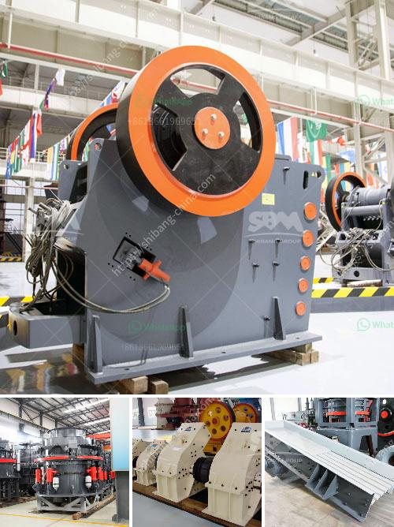

<h3>خط إنتاج سحق الجرانيت</h3>
يعد الجرانيت أحد أنواع الأحجار الطبيعية المشهورة بجماليتها وقوتها، ويتم استخدامه في مجموعة واسعة من التطبيقات مثل التصميمات الداخلية والخارجية وعلى الأرضيات وفي صناعة البناء. ولتلبية الطلب المتزايد على الجرانيت، يتم إنشاء خطوط إنتاج لسحق الجرانيت.

يتكون خط إنتاج سحق الجرانيت من مجموعة متنوعة من المعدات التي تعمل معًا لسحق الجرانيت إلى حجم محدد. تشمل هذه المعدات الكسارات والآلات الطحن والناقلات والمغذيات والغرابيل. يتم استخدام الكسارات الفكية والكسارات المخروطية لتكسير الجرانيت إلى جزيئات صغيرة، ثم يتم طحنه في آلات الطحن للحصول على حجم محدد. بعد ذلك، يتم نقل الجرانيت إلى الغرابيل لفصل الجزيئات حسب الحجم.

يتم تشغيل كل جزء من الخط بواسطة محركات كهربائية ونظام تحكم أوتوماتيكي لضمان الأداء العالي والكفاءة العالية. يتم تصميم الخط بطريقة تتيح سهولة الصيانة وتقليل الوقت الذي يتم استخدامه للصيانة.

تعتبر ميزة الخط الصناعي لسحق الجرانيت هي القدرة على زيادة الإنتاجية وتقليل التكلفة وتحسين جودة المنتج. بفضل استخدام التكنولوجيا المتقدمة والمعدات الحديثة، يمكن أن ينتج الخط كميات كبيرة من الجرانيت بشكل متسق وذلك بتقليل الفاقد وتحقيق توزيع موحد للحجم.

هناك أيضًا مزايا بيئية لاستخدام الخط الصناعي لسحق الجرانيت. يتم استخدام تكنولوجيا المعالجة الفتيلة وتصميم النظام البيئي الذي يقلل من الإنبعاثات الضارة ويحافظ على البيئة المحيطة. كما يتم إدخال أنظمة مراقبة جودة لضمان أن المنتجات تفي بالمعايير والمواصفات المطلوبة.

بشكل عام، فإن خط إنتاج سحق الجرانيت يعزز صناعة التعدين والبناء ويساهم في تلبية الطلب المتزايد على الجرانيت. يؤدي الاستثمار في مثل هذا الخط إلى تحسين الإنتاجية وتعزيز الكفاءة وتوفير الوقت والتكاليف. بالإضافة إلى ذلك، يمكن استخدام الجرانيت المنتج من خلال هذا الخط في مجموعة متنوعة من التطبيقات مما يدعم التنمية الاقتصادية.
<h3>Contact us</h3><ul><li><strong>Whatsapp:&nbsp;<a href="https://wa.me/8613661969651">+8613661969651</a></strong></li><li><a href="https://swt.shibang-china.com/?git&amp;zhl&amp;خط إنتاج سحق الجرانيت"><strong>Online Service(chat now)</strong></a></li></ul><h3>Related</h3><ul><li><a href='تعدين الكاولين في إندونيسيا.md'>تعدين الكاولين في إندونيسيا</a></li><li><a href='مطحنة الكرة لأكسيد الرصاص.md'>مطحنة الكرة لأكسيد الرصاص</a></li><li><a href='مطحنة طحن للكوارتز في الهند.md'>مطحنة طحن للكوارتز في الهند</a></li><li><a href='تجار كسارة الفك المحمولة في كينيا.md'>تجار كسارة الفك المحمولة في كينيا</a></li><li><a href='مصنع المعادن سحق خام البوكسيت.md'>مصنع المعادن سحق خام البوكسيت</a></li></ul>