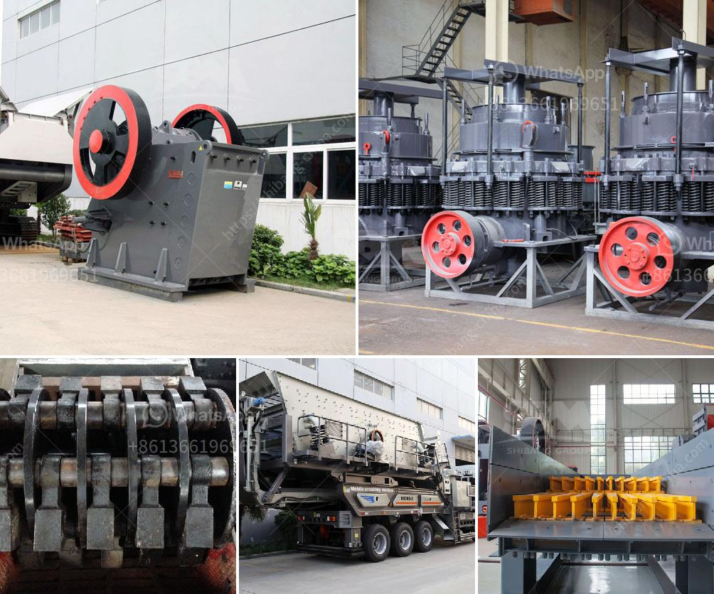

<h3>خط إنتاج طلاء الحجر</h3>
خط إنتاج طلاء الحجر هو عملية صناعية تهدف إلى إنتاج وتصنيع طلاء مستخدم في تلوين الحجر الطبيعي بكفاءة وجودة عالية. يعتبر طلاء الحجر طلاءًا خاصًا تستخدم لتجميل وحماية الأسطح الحجرية في المباني والمساحات الخارجية والداخلية. يتم إنتاجه باستخدام عمليات متعددة تشمل الخلط والتلوين والتجفيف.

بدايةً، يتم جمع المواد الخام اللازمة لإنتاج الطلاء. يتم استخدام المواد الطبيعية مثل الأصباغ المعدنية والبوليمرات والمذيبات والمثبتات. يتم شراؤها من مصادر موثوقة وتخزينها بعناية في المصنع.

ثم يتم خلط المواد الخام معًا وفقًا لتركيبة محددة. يتم استخدام معدات خاصة مثل المضرب الكهربائي لضمان توزيع متساوٍ للمواد الكيميائية. تلتزم الشركات المصنعة بمعايير الجودة والمعايير في جميع مراحل العملية لضمان الحصول على منتج نهائي عالي الجودة.

بعد الخلط، يتم نقل المزيج إلى الخطوة التالية وهي التلوين. يتم استخدام أصباغ معدنية خاصة لتلوين الطلاء ومنحه اللون المناسب. يتم إضافة الأصباغ بتركيزات محددة ويتم خلطها جيدًا حتى يحصل الطلاء على اللون المطلوب.

بعد تلوين الطلاء، يتم نقله إلى مرحلة التجفيف. يتم نقل الطلاء إلى فرن خاص حيث يتم تعريضه لدرجات حرارة عالية لفترة زمنية محددة. هذه العملية تساعد على تجفيف الطلاء وتصلبه وتثبيت الألوان. تعتمد درجة حرارة ومدة التجفيف على نوع الطلاء والأصباغ المستخدمة.

بعد التجفيف، يتم اختبار الطلاء للتأكد من جودته ومطابقته للمواصفات المطلوبة. يتم اختبار اللون واللمعان والمرونة ومقاومة التآكل والمقاومة للعوامل الجوية. يمكن إجراء اختبارات أخرى أيضًا حسب الحاجة.

في النهاية، يتم تعبئة الطلاء في حاويات أو عبوات مخصصة ويتم تسميتها وتاريخها. يجب تخزين الطلاء في مستودعات مظلمة وجافة وباردة للحفاظ على جودته لفترة أطول.

يجب على الشركات المصنعة الالتزام بالمعايير البيئية واتخاذ إجراءات للحد من التأثير البيئي لعملية إنتاج طلاء الحجر. يمكن أن تشمل هذه الإجراءات إعادة التدوير والتصريف الآمن للنفايات وتطبيق معايير صارمة للتلوث.

باستخدام خط إنتاج طلاء الحجر الحديثة، يمكن للشركات المصنعة تلبية الطلب المتزايد على طلاء الحجر عالي الجودة وتوفير المنتجات المبتكرة لعملائها. الجودة والاستدامة هما السمات الأساسية لعملية إنتاج طلاء الحجر الفعالة والناجحة.
<h3>Contact us</h3><ul><li><strong>Whatsapp:&nbsp;<a href="https://wa.me/8613661969651">+8613661969651</a></strong></li><li><a href="https://swt.shibang-china.com/?git&amp;zhl&amp;خط إنتاج طلاء الحجر"><strong>Online Service(chat now)</strong></a></li></ul><h3>Related</h3><ul><li><a href='مصنع زينيث للسحق.md'>مصنع زينيث للسحق</a></li><li><a href='آلة مسحوق الحجر الجيري.md'>آلة مسحوق الحجر الجيري</a></li><li><a href='معدات تعدين في اليابان.md'>معدات تعدين في اليابان</a></li><li><a href='تقنيات معالجة الطين.md'>تقنيات معالجة الطين</a></li><li><a href='شركة تصنيع آلات الكسارة في زامبيا.md'>شركة تصنيع آلات الكسارة في زامبيا</a></li></ul>