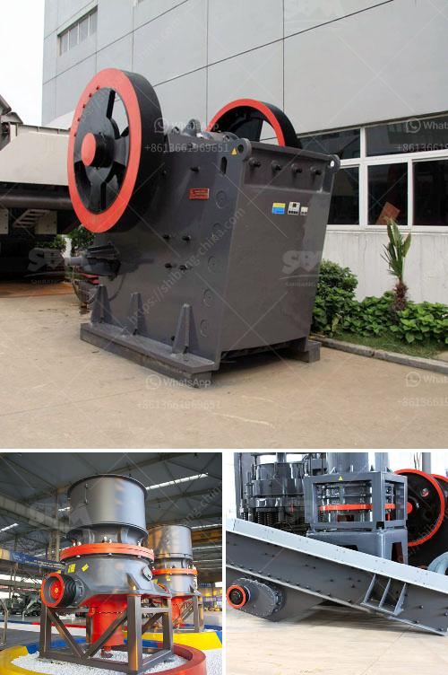

<h3>خط إنتاج مسحوق الجبس الرسم التخطيطي</h3>
خط إنتاج مسحوق الجبس هو عبارة عن سلسلة من العمليات التي تهدف إلى تحويل الجبس الخام إلى مسحوق الجبس النهائي. يتم استخدام مسحوق الجبس في مجموعة متنوعة من التطبيقات الصناعية والبنائية، بما في ذلك صناعة الأسمنت، وإنتاج الجص، والطلاء، والحشو، والدهانات، وإنتاج الورق.

يتضمن خط إنتاج مسحوق الجبس عدة مراحل مختلفة، وفقًا للرسم التخطيطي التالي:

1. تكسير الجبس: تبدأ عملية الإنتاج بتكسير الجبس الخام إلى قطع صغيرة باستخدام كسارة. هنا يتم تدمير الجبس إلى حجم مناسب للاستفادة منه في المراحل اللاحقة.

2. جهاز الطحن: بعد تكسير الجبس، يتم نقله إلى جهاز الطحن حيث يتم طحنه إلى حجم أصغر. وهنا يكون الهدف هو الحصول على مسحوق ناعم وموحد.

3. فرز وتصنيف المسحوق: بعد الطحن، يتم نقل المسحوق إلى جهاز الفرز والتصنيف حيث يتم فصل المسحوق حسب الحجم. تستخدم شبكات تصفية للسيطرة على حجم الجسيمات وفصل المسحوق بمقاسات معينة.

4. تجفيف المسحوق: بعد تصنيف المسحوق، يتم تجفيفه في جهاز تجفيف خاص. يتم استخدام الحرارة لإزالة الرطوبة المحتملة من المسحوق وتحويله إلى حالة جافة جاهزة للاستخدام.

5. التعبئة والتغليف: بعد عملية التجفيف، يتم تعبئة المسحوق الجاف في أكياس أو حاويات مقاسات محددة. يتم التأكد من القياسات الدقيقة لتلبية متطلبات العملاء وضمان الجودة.

تعتبر هذه العمليات الأساسية في خط إنتاج مسحوق الجبس، ويمكن أن يختلف ترتيبها وتفاصيلها وفقًا للتقنيات والمعدات المستخدمة. يعتمد أيضًا حجم وطاقة الإنتاج المطلوبة على ترتيب المراحل ونوع المعدات المستخدمة.

باختصار، يتطلب إنتاج مسحوق الجبس الرسم التخطيطي والقدرة الفنية لتنفيذ هذه العمليات المختلفة. هذا الإجراء يساهم في توفير مسحوق الجبس النهائي عالي الجودة ومطابق لاحتياجات السوق.
<h3>Contact us</h3><ul><li><strong>Whatsapp:&nbsp;<a href="https://wa.me/8613661969651">+8613661969651</a></strong></li><li><a href="https://swt.shibang-china.com/?git&amp;zhl&amp;خط إنتاج مسحوق الجبس الرسم التخطيطي"><strong>Online Service(chat now)</strong></a></li></ul><h3>Related</h3><ul><li><a href='آلة طحن الكلنكر الإسمنتية.md'>آلة طحن الكلنكر الإسمنتية</a></li><li><a href='خط إنتاج مواد الجص الخام مع التعبئة.md'>خط إنتاج مواد الجص الخام مع التعبئة</a></li><li><a href='كسارة الحجر في إثيوبيا.md'>كسارة الحجر في إثيوبيا</a></li><li><a href='كسارة فك محمولة مستعملة في إسبانيا.md'>كسارة فك محمولة مستعملة في إسبانيا</a></li><li><a href='سعر كسارة المختبر المستخدمة.md'>سعر كسارة المختبر المستخدمة</a></li></ul>