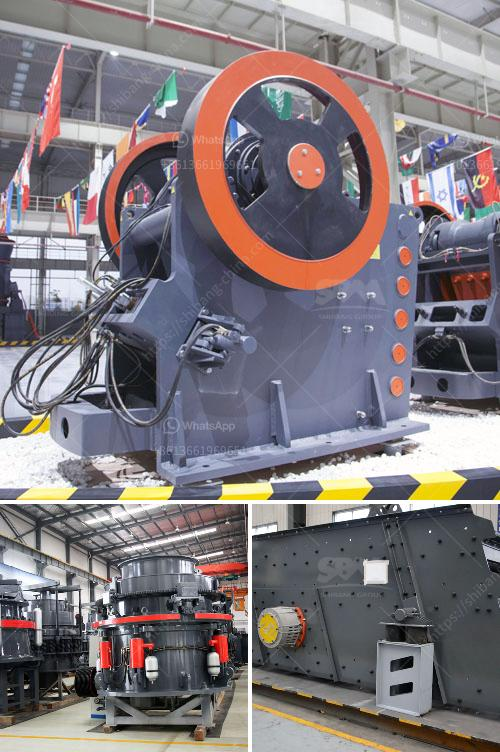

<h3>خط إنتاج مسحوق الجبس بمقياس صغير</h3>
يعتبر مسحوق الجبس من المواد الهامة والشائعة التي يتم استخدامها في مجموعة متنوعة من التطبيقات الصناعية والبنائية. يستخدم هذا المسحوق في صناعة الأسمنت، وإنتاج صفائح الجبس، وتجفيف المواد، وإنتاج الجبس المطاط وغيرها من المنتجات. ولتلبية الطلب المتزايد على مسحوق الجبس، يتم إنشاء خطوط إنتاج خاصة لإنتاجه على نطاق صغير.

يتألف خط إنتاج مسحوق الجبس الصغير من عدة مراحل. تبدأ عملية إنتاج المسحوق بتجهيز خام الجبس، حيث يجب سحقه وطحنه بحيث يكون حجمه صغيرًا ومناسبًا لتحويله إلى مسحوق جبس. يتم إزالة الشوائب والأجسام الغريبة الأخرى من الجبس عن طريق الغربلة والفرز. بعد ذلك، يتم تغذية الجبس النقي في آلة طحن لسحقه إلى مسحوق دقيق.

بعد سحق الجبس، يتم استخدام آلة الطحن لطحنه إلى حجم الجسيمات المطلوب. يتم استخدام نظام الطحن الخاص لتحقيق حجم جسيم محدد، وذلك من خلال استخدام طاحونة الكرات أو طاحونة الأسطوانة. توفر هذه الآلات مستوى عالٍ من الدقة في طحن الجبس، وتعتبر مناسبة لعمليات الإنتاج على نطاق صغير.

بعد عملية الطحن، يتم تجفيف المسحوق باستخدام مجففات خاصة. يوفر هذا التجفيف درجة الرطوبة المناسبة في المسحوق للحصول على جودة عالية واستقرار في العملية الصناعية التالية. يتم التحكم بشكل دقيق في درجة حرارة التجفيف وسرعة تدفق الهواء، من أجل تحقيق الجفاف المثالي للمسحوق.

أخيراً، يتم إعباءة وتعبئة المسحوق في أكياس صغيرة جاهزة للتسويق. تستخدم ماكينات التعبئة الآلية لتحقيق سرعة وكفاءة في عملية التعبئة. تتميز هذه الآلات بالدقة في قياس وتغليف المسحوق، وبالتالي تمنح المنتج النهائي تغليفًا سليمًا وجذابًا.

يعتبر خط إنتاج مسحوق الجبس بمقياس صغير فعالًا واستثمارًا مربحًا للشركات الناشئة والأعمال الصغيرة. يتيح هذا النوع من الخطوط تلبية الطلب على مسحوق الجبس بكميات صغيرة وبجودة عالية. كما أنه يوفر فرصة لتطوير صناعة محلية تنتج هذه المادة الأساسية في البلدان التي تفتقر إلى مصادر الجبس الطبيعية.
<h3>Contact us</h3><ul><li><strong>Whatsapp:&nbsp;<a href="https://wa.me/8613661969651">+8613661969651</a></strong></li><li><a href="https://swt.shibang-china.com/?git&amp;zhl&amp;خط إنتاج مسحوق الجبس بمقياس صغير"><strong>Online Service(chat now)</strong></a></li></ul><h3>Related</h3><ul><li><a href='معدات مصنع الإسمنت اللازمة.md'>معدات مصنع الإسمنت اللازمة</a></li><li><a href='سعر مطحنة الكرة.md'>سعر مطحنة الكرة</a></li><li><a href='معدات زراعية للبيع بأسعار مناسبة.md'>معدات زراعية للبيع بأسعار مناسبة</a></li><li><a href='كسارة الكرة.md'>كسارة الكرة</a></li><li><a href='مورد سير ناقل في الصين.md'>مورد سير ناقل في الصين</a></li></ul>