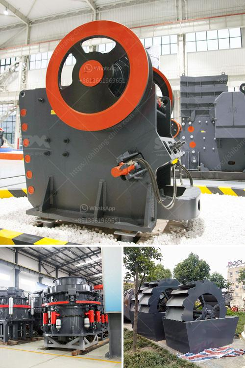

<h3>خط إنتاج مسحوق الجبس منتجون في ألمانيا</h3>
يعتبر مسحوق الجبس أحد المواد الأساسية في صناعة البناء والتشييد. يتم استخدامه في تصنيع الجدران الجبسية والسقوف الجبسية والتشطيب الداخلي والعديد من التطبيقات الأخرى. تعد ألمانيا واحدة من البلدان الرائدة في إنتاج مسحوق الجبس عالي الجودة.

يتم إنتاج مسحوق الجبس في خطوات متعددة. يبدأ الأمر بتكسير الجبس الخام إلى قطع صغيرة باستخدام آلات الكسر المخصصة. يتم طحن هذه القطع إلى مسحوق ناعم في آلة الطحن. يتم تجفيف المسحوق في فرن خاص بدرجة حرارة مضبوطة لضمان إزالة الرطوبة بشكل كامل. بعد ذلك، يتم تغليف المسحوق في أكياس أو أكياس صغيرة جاهزة للبيع.

يمتاز خط إنتاج مسحوق الجبس في ألمانيا بالدقة والدقة في كل خطوة من الإنتاج. يتم استخدام أحدث التقنيات والآلات لضمان المواصفات المطلوبة. يتم أيضًا فحص المسحوق المنتج بشكل منتظم لضمان الجودة والمطابقة للمعايير الصناعية.

بفضل جودة مسحوق الجبس المنتج في ألمانيا، يتم قبوله واستخدامه على نطاق واسع في السوق العالمية. يتم تصديره إلى العديد من البلدان لاستخدامه في مشاريع البناء المختلفة. وبفضل الارتفاع الكبير في الإنتاج، يتم تلبية الطلب المتنامي بسهولة دون أي تأخير.

إن إنتاج مسحوق الجبس في ألمانيا يشكل مورد هام لقطاع البناء. يساهم في تقدم صناعة البناء وتطويرها. كما يوفر فرص عمل للعديد من العاملين في هذا القطاع. يعزز هذا القطاع الاقتصاد ويساهم في ازدهار الصناعة في ألمانيا

في النهاية، يمثل إنتاج مسحوق الجبس في ألمانيا أحد الصناعات الرئيسية والمزدهرة في البلاد. يتميز هذا الخط الإنتاج بالجودة العالية والدقة، مما يضمن استخدامه على نطاق واسع في البناء ويساهم في التطور الاقتصادي لألمانيا.
<h3>Contact us</h3><ul><li><strong>Whatsapp:&nbsp;<a href="https://wa.me/8613661969651">+8613661969651</a></strong></li><li><a href="https://swt.shibang-china.com/?git&amp;zhl&amp;خط إنتاج مسحوق الجبس منتجون في ألمانيا"><strong>Online Service(chat now)</strong></a></li></ul><h3>Related</h3><ul><li><a href='شركة تبيع آلة تكسير الخرسانة.md'>شركة تبيع آلة تكسير الخرسانة</a></li><li><a href='سعر معدات الطحن 250 طن.md'>سعر معدات الطحن 250 طن</a></li><li><a href='مصنع غسيل الذهب المتنقل.md'>مصنع غسيل الذهب المتنقل</a></li><li><a href='كسارة الحجر في الفلبين للبيع.md'>كسارة الحجر في الفلبين للبيع</a></li><li><a href='كسارة فك محمولة 30 × 42 للبيع.md'>كسارة فك محمولة 30 × 42 للبيع</a></li></ul>