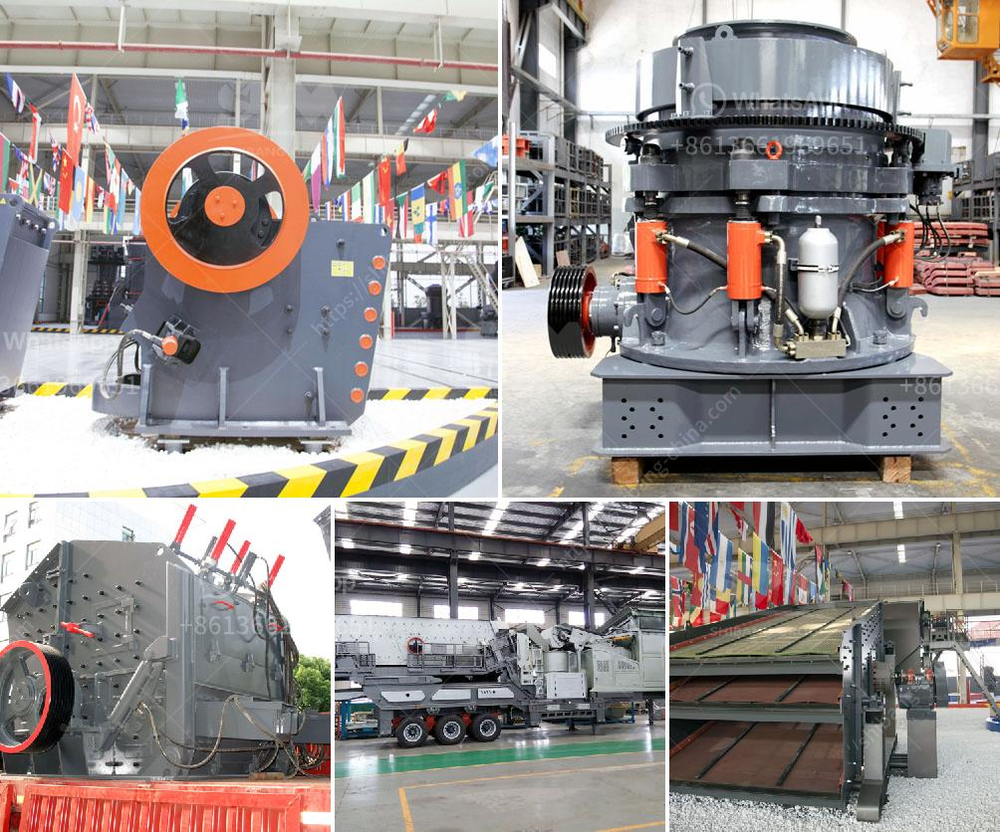

<h3>خط إنتاج مسحوق الجبس</h3>
خط إنتاج مسحوق الجبس هو عملية تصنيع تستخدم لإنتاج مسحوق الجبس النقي من الخامات الطبيعية التي تحتوي على جبس. يتم استخدام مسحوق الجبس في عدة صناعات مثل صناعة البناء والأسمنت والزجاج والطلاء والطلاء والصناعات الكيميائية.

يتألف خط إنتاج مسحوق الجبس عادة من عدة مراحل. أولاً وقبل كل شيء ، يتم جمع خام الجبس الطبيعي من منحدرات الجبال أو المناجم. يتم طحن الجبس الخام لتصبح حجمًا صغيرًا ويتم فصل الشوائب باستخدام العديد من المعدات مثل الفاصل المغناطيسي والمصافي والفرازات.

ثم يتم تجفيف الجبس المحكوم لإزالة أي رطوبة قد تكون موجودة. هذا يتم عادة باستخدام عمليات التجفيف بالحرارة أو التجفيف بالهواء الساخن. بعد التجفيف ، يتم نقل الجبس إلى محطة طحن حيث يتم طحنه بواسطة المطاحن الكروية العمودية أو مطاحن الأسطوانة.

تزود معدات خط إنتاج مسحوق الجبس عادة بالمطاحن العمودية ، الكسارات الفكية ، القاطعات ، الرافعات الجبلية ، الآلات الصفائحية ومجموعة من المعدات الأخرى التي تستخدم لنقل ومعالجة الجبس. يتم ضبط حجم الجسيمات وجودتها في عملية الطحن بحيث ينتج الجبس مسحوقًا نقيًا ومتجانسًا.

بعد عملية الطحن ، يتم تعبئة المسحوق النهائي في أكياس أو حاويات للتسليم إلى العملاء. الجودة والتكنولوجيا المستخدمة في خط إنتاج مسحوق الجبس تؤثر مباشرة على جودة المنتج النهائي. لذلك ، شركات إنتاج مسحوق الجبس تهتم بشكل كبير بتحسين العمليات وتبني تقنيات ومعدات حديثة لضمان الجودة والكفاءة.

بصفة عامة ، يعد خط إنتاج مسحوق الجبس عملية تصنيع تستخدم تكنولوجيا متقدمة لإنتاج مسحوق جبس نقي وعالي الجودة. يلعب مسحوق الجبس دورًا حيويًا في العديد من الصناعات ويستخدم لتحسين الخواص المادية والكيميائية للمواد المختلفة. يلعب إنتاج مسحوق الجبس دورًا هامًا في تطوير البنية التحتية والإسكان والبناء المستدام.
<h3>Contact us</h3><ul><li><strong>Whatsapp:&nbsp;<a href="https://wa.me/8613661969651">+8613661969651</a></strong></li><li><a href="https://swt.shibang-china.com/?git&amp;zhl&amp;خط إنتاج مسحوق الجبس"><strong>Online Service(chat now)</strong></a></li></ul><h3>Related</h3><ul><li><a href='سعر كسارة الأسطوانة.md'>سعر كسارة الأسطوانة</a></li><li><a href='تاجر شاشة اهتزاز في الفلبين.md'>تاجر شاشة اهتزاز في الفلبين</a></li><li><a href='مطحنة أسمنت صغيرة مستعملة في الإمارات.md'>مطحنة أسمنت صغيرة مستعملة في الإمارات</a></li><li><a href='شركات تصنيع الكسارات في ماليزيا.md'>شركات تصنيع الكسارات في ماليزيا</a></li><li><a href='كسارة الحجر بوزولانا 100 طن في الساعة.md'>كسارة الحجر بوزولانا 100 طن في الساعة</a></li></ul>